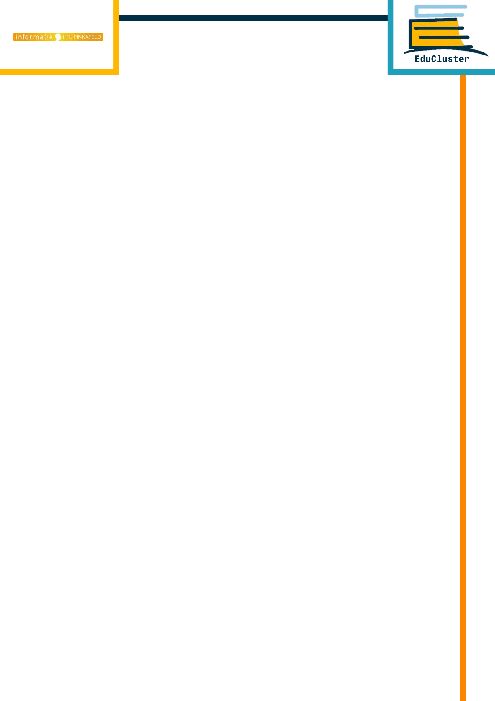

:lang: de
:hyphens: de
:pdf-theme: theme/theme.yml
:page-background-image: 

:doctype: book
:toc: preamble
:toc-title: Inhaltsverzeichnis

// TODO Projektausführung Überblick

// TODO Eidesstattliche Erklärung

[discrete]
== Kurzfassung
Das Ziel der vorliegenden Diplomarbeit ist, ein System zu schaffen, um Lerngruppenbildung und damit verbundene Raumreservierungen effizienter zu gestalten. Es soll eine funktionale Erweiterung von WebUntis in Verbindung mit Microsoft Teams geschaffen werden. Erzielt wird die Vereinheitlichung der genutzten Plattformen zur Organisation von Lerninhalten und Datenaustausch. Zudem soll für die Schüler/innen eine Möglichkeit geschaffen werden, selbstständig Lernräume für Lerneinheiten zu buchen.

In der HTL Pinkafeld findet zurzeit die Raumreservierung exklusiv durch das Lehr- und Administrationspersonal statt. Darüber hinaus wird eine breite Palette an Plattformen zur Datenbereitsstellung eingesetzt, wie beispielsweise WebUntis, LMS, Microsoft Teams, Google Docs und das Klassenlaufwerk. Diese Auswahl an Werkzeugen mündet in Unübersichtlichkeit für die Schülerschaft beim Lernen. Dazu entsteht eine Schwierigkeit im Unterricht für Lehrkräfte im Anlegen und Organisieren der Klasse.

Hier kommt EduCluster ins Spiel. Mittels Clusterbildung ermöglicht die Web-Applikation eine einfache und übersichtliche Erstellung von Lerngruppen mitsamt Raumreservierung. Ein Cluster stellt in EduCluster die Lerngruppe dar, welche nach der Erstellung Termine anlegen, Räume reservieren und, falls er öffentlich ist, über eine Suche von weiteren Mitschüler/innen gefunden werden kann. Nutzende können beliebig solche Cluster erstellen oder ihnen beitreten. Durch das Erstellen können diese zukünftig als Clusteradministrierende handeln und die Administrationsrolle an andere Mitglieder erteilen. Zur Organisation dieses Clusters werden WebUntis zur Raumreservierung als auch Microsoft Teams zum Abhalten von Remote Lerneinheiten und zur Datenorganisation herangezogen, welche über die genannten Funktionalitäten
EduCluster zur Verfügung stehen.

<<<

[discrete]
== Abstract
The goal of the following thesis is the conception of a system that improves upon extant learning group formation and room reservation capabilities. A functional extension of WebUntis is to be implemented in such a way as to incorporate a direct connection to Microsoft Teams. This way a standardization of the extant platforms for organization and exchange of educational content may be realized. Enabling students to independently organise learning units and if necessary reserve rooms for these occasions is a further goal to be realized within the scope of this thesis.

Presently, room reservation is a functionality exclusively reserved for teachers and administrative staff within HTL Pinkafeld. Furthermore, educational content is made available across a wide range of platforms such as WebUntis, LMS, Microsoft Teams, Google Docs and the class-segmented digital storage provided by the school itself. This large diversity of tools culminates in confusion for students and teachers alike.

This is where EduCluster steps in. The web application enables the simple creation of Clusters and includes room reservation functionality. A Cluster represents a collective of students in EduCluster that acts as a unit on the platform and may plan learning units and reserve rooms. Additionally, public Clusters may be found by other students looking to join one on the dedicated search page. Users may create or join any number of said Clusters. If a user creates a Cluster, they are automatically promoted to administrators and may confer this role upon other members. The organisation of a Cluster is achieved through an integration of WebUntis for the room reservation functionality and of Microsoft Teams for the possibility of remote learning units as well for the capability of organising educational content.

The organisation of a Cluster is achieved through an integration of WebUntis for the room reservation functionality and of Microsoft Teams for the possibility of remote learning units as well for the capability of organising educational content.

<<<

[discrete]
== Vorwort
Im Rahmen des sechsten Semesters begann die Suche nach einem Diplomarbeitsthema. Als das Projektteam von einer Idee zur nächsten durchiterierte, trat Prof. Dipl.-Inf. David Zach an das Projektteam heran. Er präsentierte eine Idee, die gleichzeitig das Monopol auf Raumreservierung von den Lerhenden ablösen als auch eine zentralisierte Verwaltung von Lerninhalten erschaffen würde.

Das Projektteam war in kürzer Zeit davon überzeugt und beschloss, die Herausforderung trotz hoher Komplexität anzunehmen. Es folgte eine Auseinandersetzung mit dem Thema, die sich mit der Konzeption und Planung überlappte und schließlich im siebten Semester endete. Die Implementierungsphase folgte kurz darauf und forderte jedes einzelne Mitglied heraus. Während dieser Zeit wurde viel gelernt. Ebenso wurden vor allem Dank der technischen Unterstützung von Prof. Dipl.-Inf. David Zach als auch der fachlichen Unterstützung von Prof. Mag. Heinz Bundschuh viele Hürden überwunden. Das Projektteam hat immer zusammengehalten und traf schwierige Entscheidungen, um die Sauberkeit der bestehenden Codebasis sowie die Qualität des Endproduktes zu erhalten. Es wurde stets darauf geachtet, eine möglichst erweiterbare Applikation zu entwicklen, um den Anforderungen des Auftragsgebers, wie von Prof. Dipl.-Inf. David Zach kommuniziert, gerecht zu werden.

Alle bewältigten Herausforderungen des Projekts, von Projektantrag bis hin zur technischen
Umsetzung eines jeden Einzelnen, werden auf den nun folgenden Seiten vom gesamten Team
im Detail erklärt.

<<<

:sectnums:
:sectnumlevels: 6

== Einleitung
// TODO
Mit dieser Diplomarbeit wird unserem Auftraggeber eine funktionierende Web-Applikation zur Verfügung gestellt. Um dessen Funktionalität zu gewährleisten, ist eine Datenbank entworfen sowie eine "WebUntis" API angebunden.

Nach wochenlanger Konzeptionsphasen wurde die Datenbank entworfen. Um die Vorteile einer Web-Applikation voll ausnutzen zu können, hat sich das Projektteam für "Supabase" entschieden. Diese Umgebung ist eine bewährte Datenbankumgebung für Web-Applikationen. Im nächsten Zug ist die tatsächliche Web-Applikation entstanden. Mittels Datenbankabfragen kommuniziert diese Applikation mit Supabase, um gewünschte Daten oder Änderungen dieser zu erreichen. Weiters ist eine WebUntis API angebunden, welche es EduCluster erlaubt, aktuelle Stundenplan- und Rauminformationen abzurufen.

In den folgenden Kapiteln sind der Projektantrag, die Vorstudie sowie die einzelnen individuellen Teile eines jeden Teammitglieds angeführt. Diese individuellen Teile stellen sich aus einer übersichtlichen Einleitung, der persönlichen Evaluierung und die technische Umsetzung des betroffenen Teammitglieds. Zudem reflektiert das Teammitglied über die eigene Arbeit in der abschließenden Reflexion. Am Ende dieses Dokumentes ist eine Zusammenfassung, in welcher der Ablauf wie die Erfolge, Hindernisse und Fehlschläge angeführt werden.

<<<

include::projektantrag.adoc[]

<<<

include::vorstudie.adoc[]

<<<

include::individueller-teil-lara.adoc[]

<<<

include::individueller-teil-christoph.adoc[]

<<<

include::individueller-teil-raymond.adoc[]

<<<

// TODO Zusammenfassung - what?

// TODO Abbildungsverzeichnis

// TODO Tabellenverzeichnis

// TODO Quellenverzeichnis

// TODO Anhang (Begleitprotokolle, Stundennachweise, )

:sectnums!:
