:sectnums:
:sectnumlevels: 5
:toc-title: Inhaltsverzeichnis
:table-caption: Tabelle
:figure-caption: Abbildung
:lang: de
:backend: pdf
:doctype: book
:pdf-page-layout: :portrait
// :pdf-page-margin-right: 2in
:page-right-margin: 2in
:page-background-image: image:Styling/Styling2-1.png[]
:title-page-background-image: none
//TODO: alle Benotungen korrigieren
//TODO: Korrekturlesen lassen
//TODO: Gendern
//TODO: alle verweise auf bild und dergleichen anpassen
//TODO: styling
//TODO: zusammenführen
//TODO: Stundenlisten anpassen
//TODO: abgerufen am anpassen
//TODO: Stundenübersicht und persönliches fazit

== Individueller Teil Lara Kammerer
Im folgenden Kapitel werden Datenbanken evaluiert, die gewählte Datenbank modelliert und erzeugt und Requirements Engineering Arbeiten erläutert. Für das Requirements Engineering wird näher auf die Nutzung des Management-Tools und die Erstellung der einzelnen Tasks eingegangen.

=== Evaluierung der Datenbank
In diesem Abschnitt wird die zu nutzende Datenbank evaluiert. Es wird hierfür zunächst die SOLL-Situation dargestellt und im Anschluss die Datenbank Systeme evaluiert. Zuletzt wird noch die gewählte Datenbank selbst modelliert.

==== Beschreibung der SOLL-Situation
Die gewählte Datenbank muss folgende Anforderungen des Projektes EduCluster erfüllen:

* die nötigen Zugriffsberechtigungen auf die Datenbank müssen gegeben sein
* die Kosten der Datenbank müssen sich auf ein Minimum reduzieren
* die Tabellengrößen müssen eine bestimmte Flexibilität anbieten
* die Datenbank muss eine Mindestgeschwindigkeit anbieten
* die Datenbank wird für bestimmte Funktionalitäten Trigger anbieten müssen – damit muss diese Funktionalität angeboten werden

==== Evaluierung der Datenbank
Im Anschluss findet die Evaluierung der Datenbank statt. Als Erstes wird der Evaluierungsgegenstand erklärt und im Anschluss die Evaluierung selbst durchgeführt. Diese hingegen kann in die Vorstellung der in Betracht gezogenen Datenbank-Systeme, die Anforderungen an die geplante Datenbank, sowie die Bewertung der einzelnen Datenbank anhand der genannten Anforderungen aufgeteilt werden. Zuletzt wird noch das Ergebnis aus erfolgter Evaluierung übersichtlich dargestellt.

===== Evaluierungsgegenstand
Die anschließend erfolgende Evaluierung behandelt das zu wählende Datenbank-System für die Diplomarbeit EduCluster.

===== Definition: Datenbank
"Eine Datenbank ist eine organisierte Sammlung von strukturierten Informationen oder Daten, die typischerweise elektronisch in einem Computersystem gespeichert sind."footnote:[https://www.oracle.com/de/database/what-is-database/, abgerufen am 20.10.2022]
In Datenbanken werden große Mengen an Daten nach einer vorgegebenen Struktur gespeichert. Während relationale Datenbanken (SQL-Datenbanken, SQL = Structured Query Language) sich für die Speicherung strikt an das vorgegebene Schema halten, kann bei NoSQL-Datenbanken (Not Only SQL) die Speicherung der Daten ebenso in beliebiger Form stattfinden. Die Daten selbst werden in SQL nach klar zuvor definierten Tabellen gespeichert. In NoSQL hingegen werden einzelne Dokumente, die die gebrauchten Informationen enthalten festgehalten, wodurch sich bei NoSQL mehr Freiheiten in der Speicherung ergeben, welche jedoch mit einer erschwerten Abfrage einhergehen.

===== Stakeholder der Evaluierung
Hier werden die zum Projekt zugehörigen Stakeholder vorgestellt und deren Bedeutung für das Projekt selbst dargestellt.

[.underline]_Auftraggeber: HTL Pinkafeld_

Der Auftraggeber, die HTL Pinkafeld, stellt für die Datenbank eine hohe Bedeutung dar. Er erwartet sich von ihr möglichst geringe Kosten und eine hohe Zuverlässigkeit, da das Projekt im Anschluss in der Praxis Verwendung finden soll. Das Projekt muss von der Schule selbst betrieben werden, weshalb der Aufwand durch das Hosting gering gehalten werden muss. Der Schutz der schuleigenen Daten hat zudem oberste Priorität. Die Schule selbst hat ebenfalls die Möglichkeit angeboten, das Projekt vor Ort in der Schule zu hosten, was dem Datenschutz sehr entgegenkommen würde.
Zusammenfassend erwartet der Auftraggeber eine Datenbank bzw. ein zugehöriges Hosting, das den Datenschutz einhält, die Kosten gering hält bzw. auf Null reduziert, eine hohe Zuverlässigkeit und einen geringen Wartungsaufwand bietet.

[.underline]_Projektteam: EduCluster_

Das Projektteam EduCluster stellt für das Projekt, und somit auch die Datenbank, eine mittlere Bedeutung dar. Es plant die Zugriffe auf die Datenbank mit dem Datenbank-Client Prisma durchzuführen, weshalb es wichtig ist, die Kompatibilität damit zu gewährleisten. Ebenso wird für das Projekt die Funktionalität für Trigger benötigt, um eine automatische Erstellung von History-Tabellen zu ermöglichen.

[.underline]_Zukünftige Benutzer: Schüler und Personal der HTL Pinkafeld_

Die zukünftigen Benutzer, die Schüler der HTL Pinkafeld, stellen für das Projekt die größte Bedeutung dar. Für die Nutzung der Webapplikation stellt die Datenbank bzw. der Zugriff auf die Datenbank eine zentrale Stelle dar. Die Speicherung der Daten zu den Nutzern selbst, ebenso die Identifikation der Cluster in MS Teams und der Termine in sowohl MS Teams als auch WebUntis geschieht über die lokale Datenbank.
Die Strategie, die vom Projektteam hier verfolgt werden muss, äußert sich durch die Sicherstellung einer stabilen Verbindung zur Datenbank, wodurch eine zuverlässige Speicherung der UserID, sowie ClusterID und TerminID aus MS Teams ebenso wie der UserName als auch die Raumnamen und TerminIDs erst möglich wird.

Administrationsarbeiten:

Für zukünftige Administrationsarbeiten muss eine Möglichkeit vorhanden sein, über Datenbankabfragen in bereits erstellte History Tabellen zu sehen, um bei Bedarf alte Stände wiederherzustellen oder zu analysieren, welcher Nutzer bestimmte Handlungen vorgenommen hat. Ebenso ist es wichtig, mit wenig Aufwand Cluster oder Termine zu löschen oder Schüler aus Clustern zu entfernen, sollten diese aufgrund von Diskrepanzen unter den Schülern bzw. mit Unterrichtseinheiten kollidieren.

Als möglicher Konflikt kann hier die Option für Triggern genannt werden. Es muss also für genannte History Tabellen eine Datenbank mit der Funktionalität für Trigger sein. Diese Bedingung wird als K.O.-Kriterium behandelt. Zudem muss der zukünftige Systemadministrator grundlegende SQL Kenntnisse aufweisen, um die History Tabellen abfragen zu können. Die Datenbank muss hingegen genügend Platz aufweisen, um diese History Tabellen zusätzlich aufbewahren zu können.

Die Strategie für die Datenbank muss somit das Einbauen von Triggern zur Erstellung von Historytabellen beinhalten, welche in späterer Folge von Systemadministratoren mit einfachen SELECT-Anweisungen abgefragt werden können.

[.underline]_Zukünftige Entwickler: Personal oder Maturanten der HTL Pinkafeld_

Zukünftige Entwickler haben für die Wahl der Datenbank nur eine mittlere Bedeutung. Ihre Erwartung an die Datenbank wird ein leichter Zugang sein. Die Datenbank soll somit übersichtlich gestaltet sein, die Trigger und History abfragbar sein und ebenso soll ein klarer Aufbau der Datenbank über ein ER-Diagramm ersichtlich sein.

Als Konflikt kann hier eine schlechte Dokumentation der Datenbank oder ein schlechter Aufbau der Schreib- und Lesezugriffe identifiziert werden.

Die Strategie des Projektteams wird eine klare Darstellung der Datenbank über das ER-Modell sein. Zudem müssen die Zugriffe auf die Datenbank klar definiert und dokumentiert werden.

[.underline]_Betreuungslehrer: Prof. Dipl.-Inf. David Zach_

Der Betreuungslehrer hat für die Wahl der Datenbank nur eine sehr geringe Bedeutung. Er wirkt trotzdem ebenfalls ein, da er mit seiner Expertise dem Projektteam zur Seite stehen kann. Er erwartet sich ebenfalls eine klare Definition der Datenbank.

Konflikte können hier als eine geringe Erreichbarkeit und nicht Einhalten ausgemachter Termine identifiziert werden.

Die Strategie des Projektteams muss sich daher durch regelmäßige Absprachen mit dem Lehrpersonal auszeichnen.

===== Zieldefinition
Im Anschluss werden hier die zur näheren Auswahl herangezogenen Datenbanken beschlossen und diese gewählten Datenbanken näher bezüglich der Anforderungen aus dem Projekt EduCluster evaluiert, um die am besten geeignete Datenbank für das Projekt zu finden.

===== Hosting - On Premise / Cloud
Das Hosting einer Datenbank kann auf zwei verschiedene Weisen funktionieren: On Premise oder in einer Cloud.

Mit _On Premise_ ist das Hosting auf eigenen lokalen Servern gemeint. Im Gegensatz zum Cloud-Hosting wird hier einmalig eine Lizenz erworben und damit die entsprechende Software lokal installiert. Sie bietet mehr Freiraum in Gestaltung der Software. Zudem kann sie unbegrenzt genutzt werden.

Beim _Hosting in der Cloud_ wird ein Server mit entsprechender Software angemietet. Die einmaligen Lizenzerwerbskosten entfallen dadurch, jedoch muss hier für die gesamte Nutzungsdauer ein Entgelt entrichtet werden.footnote:[Vgl. https://www.otris.de/wiki/vertragsmanagement/on-premises/#:~:text=Die%20Bezeichnung%20On%2DPremises%20(oder,in%20den%20eigenen%20R%C3%A4umlichkeiten%E2%80%9C)., abgerufen am 20.10.2022]

Für das Projekt EduCluster kommt hier noch die Komponente des Datenschutzes hinzu - eine lokale Lösung kann hier durch die Eigenüberwachung einen größeren Schutz bieten als eine Cloud-Lösung. Die HTL Pinkafeld hat eine On-Premise-Variante angeboten, jedoch kann diese in dem Projekt noch nicht ausgeführt werden, da die Freigabe für das lokale Hosting für die Implementierung zu spät stattgefunden hätte. Daher wird hierauf vorerst verzichtet. Für den tatsächlichen Betrieb der Applikation wird diese aber voraussichtlich auf den lokalen Server der HTL Pinkafeld umgebogen.

===== NoSQL / SQL
Datenbanken werden grob in zwei Arten eingeteilt - sequenzielle Datenbanken (SQL) und NoSQL-Datenbanken (Not Only SQL). Beide bieten Vor- und Nachteile gegenüber der Anderen.

_Sequenzielle Datenbanken_ werden über SQL (englisch: Structured Query Language) gesteuert. Das Hauptziel von SQL-Datenbanken war es, Daten strukturiert zu speichern, um den benötigten Speicherplatz zu verringern. Um das zu verwirklichen, agieren diese Datenbanken nach einem fixen Schema von Tabellen, nach dem sämtliche Daten gespeichert sind. Die Spalten einzelner Tabellen, auch Attribute genannt, sind über sogenannte 'Constraints' (deutsch: Einschränkungen) eingeschränkt bzw. die Tabellen miteinander verbunden.
Beispiele für sequenzielle Datenbanken sind Oracle DB, SQL Server, MySQL Server und PostgreSQL.footnote:SQL[Vgl. https://www.testgorilla.com/blog/sql-vs-nosql/?utm_term=&utm_campaign=Performance_Max_AU_NZ&utm_source=adwords&utm_medium=ppc&hsa_acc=4932434860&hsa_cam=14324002500&hsa_grp=&hsa_ad=&hsa_src=x&hsa_tgt=&hsa_kw=&hsa_mt=&hsa_net=adwords&hsa_ver=3&gclid=CjwKCAiArNOeBhAHEiwAze_nKEzLO7L6DYefoDbIt5HPTRpH8gwMVB6WV5jV8sTjFTtB1dTrGlH9xRoC7HUQAvD_BwE, abgerufen am 30.01.2023]

_NoSQL-Datenbanken_ hingegen fordern keine strukturierte Speicherung. Daten können somit wahllos in Tabellen gespeichert werden. Das Tabellenschema ist hier agil, die Form der einzelnen Einträge kann somit je Tabelle variieren. Die einzelnen Datensätze werden also sogenannte Dokumente gespeichert, in Form von JSON-, XML- oder anderen Fileformaten. Beispiele hierfür sind MongoDB und MariaDB.footnote:SQL[]

Das Projekt EduCluster kann gut durch ein vorgegebenes Schema dargestellt werden und wird sich in dieser Form nicht weiter verändern. Die Notwendigkeit zum agilen Tabellenschema stellt sich daher nicht. Da das Projektteam sich aber bereits mit dem Aufbau und Handling von SQL-Datenbanken auskennt, für NoSQL-Datenbanken aber ein großer Einarbeitungsaufwand nötig wäre, wurde bereits voraus entschieden, dass die Ressource des Zeitaufwands für andere Bereiche besser investiert ist. Damit kann die Auswahl der Datenbanken auf relationale eingeschränkt werden. Zum Vergleich stehen somit:

* Oracle Database
* SQL Server
* MySQL Server
* PostgreSQL

==== Evaluierung
Im nächsten Abschnitt erfolgt die Evaluierung der Datenbanksysteme selbst. Dazu werden zunächst die einzelnen Datenbanken näher vorgestellt, im Anschluss die Anforderungen an die gewählte Datenbank in Bezug auf das Projekt EduCluster genannt und die Wichtigkeit bestimmt und zuletzt noch beurteilt nach Erfüllung der Anforderungen.

Die Beurteilung erfolgt nach einem System ähnlich dem Schulsystem, jedoch mit drei Abstufungen: Die Note 1 stellt die bestmögliche Erfüllung der Kriterien das, die Note 3 hingegen die schlechteste, die Note 2 bezeichnet ein minimal erfülltes Kriterium (ausreichend für das Projekt), jedoch nicht optimal.

Zunächst werden jedoch noch die K.O.-Kriterien betrachtet, bevor an die endgültige Bewertung begonnen wird.

===== K.O.-Kriterien
Das erste festgelegte K.O.-Kriterium für das Projekt EdCluster sind die Kosten für die Datenbank. Da das System zukünftig von der HTL Pinkafeld übernommen werden soll, darf das Projekt - somit auch die Datenbank - keine zusätzlichen Kosten erzeugen. Die Datenbanken werden somit auf die kostenlosen Versionen eingeschränkt:

* Oracle Database XE
* SQL Server Express
* MySQL Community Server
* PostgreSQL

Zudem müssen ausreichend Zugriffsmöglichkeiten vorhanden sein. Es müssen Mehrfachzugriffe von einem Nutzer zu Tausenden gleichzeitig durchführbar sein. Die Auswahl der kostenlosen Datenbankanbieter erfüllt das zur Gänze, somit muss hier keine weitere Einschränkung erfolgen.

Zuletzt muss es eine Datenbankprogrammiersprache geben, da Trigger geplant sind, um vor Änderungen in der Datenbank alte Stände in sogenannte History-Tabellen zu sichern.
Diese Bedingungen werden von allen Anbietern erfüllt, somit können für die weitere Evaluierung alle Datenbanken in Betracht gezogen werden.

[.underline]_Oracle Database XE_

Oracle SQL Express (Oracle Database XE) ist eine kostenlose Datenbank von Oracle. Sie stellt damit eine gute Option für kleinere Projekte mit einem limitierten Budget bei bereits vorhandener Erfahrung mit Oracle Datenbanken dar, wenn es nicht nötig ist, maximal möglichen Support zu erhalten.footnote:Oracle[Vgl. https://www.oracle.com/database/technologies/appdev/xe.html, abgerufen am 11.02.2022]

[.underline]_SQL Server Express_

SQL Server Express ist Microsofts kostenlose Datenbankvariante. Sie weist eine hohe Skalierbarkeit auf und kann bei Bedarf mit wenig Aufwand auf eine der kostenpflichtigen Varianten upgegradet werden.footnote:MSSQL[Vgl. https://neovera.com/sql-server-express-use/, abgerufen am 11.02.2022]

[.underline]_MySQL Community Server_

MySQL Community Server ist die kostenlose Version der von Oracle entwickelten MySQL Datenbank. Sie weist eine ebenso große Skalierbarkeit auf und kann auch jederzeit auf eine der kostenpflichtigen Varianten upgegradet werden.footnote:MySQL[Vgl. https://dev.mysql.com/downloads/mysql/, abgerufen am 14.02.2023]

[.underline]_PostgreSQL_

PostgreSQL, auch PostgreS genannt, ist im Gegensatz zu den anderen Datenbanken bereits in der Vollversion kostenlos nutzbar. Es zeichnet sich durch seine Zuverlässigkeit, Datenintegrität und den großen Funktionsumfang aus. footnote:PostgreSQL[Vgl. https://www.postgresql.org/about/, abgerufen am 11.02.2022]

===== Anforderungen an die Datenbank
Die Datenbanken müssen als Nächstes bezogen auf die wichtigsten Punkte für das Projekt EduCluster untersucht und bewertet werden. Die einzelnen Punkte, die für die Evaluierung von Wert sind:

* Kosten - K.O.-Kriterium
* Funktionsumfang der Datenbank - K.O.-Kriterium
* Größeneinschränkungen der Tabellen - mittel wichtig
* Zugriffseinschränkungen: Anzahl der Anmeldungen je Nutzer zur selben Zeit - wichtig
* Maximal verfügbarer Arbeitsspeicher - mittel wichtig
* Einarbeitungsaufwand - wenig wichtig

[.underline]_Kosten_

Die Kosten der Datenbank sind, wie bereits gesagt ein [.underline]#*K.O.-Kriterium*#, da die HTL Pinkafeld das fertige Projekt kostenlos betreiben möchte. Die Auswahl nach diesem Kriterium wurde bereits durchgeführt. Alle der Datenbanken erfüllen somit dieses Kriterium zur Gänze, bei einigen jedoch unter Einschränkung der Einsatzmöglichkeiten.

[.underline]_Funktionsumfang der Datenbank_

Ebenso ist eine Möglichkeit zur Erstellung von Triggern für das Projekt Pflicht und somit ein weiteres [.underline]#*K.O.-Kriterium*#. Die Datenbanken wurden nach diesem Kriterium ebenso bereits ausgewählt, weshalb sämtliche Datenbanken die Bedingung erfüllen.

[.underline]_Größeneinschränkungen der Tabellen_

Die Größeneinschränkungen der Tabellen sind für das Projekt EduCluster von mittlerem Wert, da mit momentanem Plan keine außergewöhnlich großen Datenmengen erwartet werden. Sollte das Projekt jedoch in späterer Folge auf weitere Schuleinrichtungen ausgeweitet werden, wird die Größe der Datenbank eine wichtigere Rolle spielen. Aufgrund der geringen Wichtigkeit für den derzeitigen Plan wird die Anforderung auf 25% gewertet.

// TODO David! Schwellenwert (unter 10gb)
Es kann eine benötigte Datenbankgröße mit ..GB angenommen werden. In Zukunft kann es aber nützlich sein, eine Datenbank ohne Größeneinschränkungen zu haben für etwaige Erweiterungen des Projekts. Hat eine Datenbank somit keine Größeneinschränkungen in der Tabellengröße, kann diese somit mit der Bestnote 1 bewertet werden. Erfüllt sie die benötigte Datenbankgröße, könnte bei einer Erweiterung jedoch zu Problemen in der Größe führen, kann sie mit einer Note 2 beurteilt werden. Bei unzureichender Größe nach derzeitiger Schätzung muss die Datenbank mit einer 3 bewertet werden und direkt ausscheiden.

[.underline]_Zugriffseinschränkungen - Anzahl der zur selben Zeit angemeldeten Nutzer_

Die gleichzeitig angemeldeten Nutzer auf der Datenbank bleibt selbst zu Höchstanspruchszeiten unter 10, da sich einzig die Entwickler und Tester des Systems einzeln anmelden. Sämtliche Nutzer von EduCluster greifen auf die Datenbank zu jeder Zeit ausschließlich durch den Nutzer EduCluster auf die Datenbank zu. Durch die geringe Anzahl der benötigten Nutzer kann dieses Kriterium mit einer sehr geringen Relevanz für das Projekt abgeschätzt werden und bewertet somit nur 40%.

Entsprechend der Bewertung zur Größeneinschränkung der Tabellen kann hier ein Schwellenwert von 10 Nutzern zur selben Zeit genannt werden. Somit werden sämtliche Datenbanken mit einer Nutzeranzahl von über 100 Nutzern mit der Bestnote 1 bewertet, jene, die den Schwellenwert von 10 Nutzern übersteigen mit einer 2 und alle die sich darunter befinden mit einer 3.

[.underline]_Maximal verfügbarerArbeitsspeicher_

Weiters wird noch ein ausreichender Arbeitsspeicher benötigt, der sich ebenfalls bei zu starken Einschränkungen auf die Geschwindigkeit der Transaktionen auswirken kann. Da diese Einschränkungen jedoch die Funktionalitäten des Projektes EduCluster aufgrund einer zu erwartenden mittleren Auslastung voraussichtlich nicht betreffen kann diese Anforderung mit 25% bewertet werden.

Für den Arbeitsspeicher kann ein Schwellenwert von 2 GB bestimmt werden. Sämtliche Datenbanken mit geringerem verfügbaren RAM können somit mit einer 3, Datenbanken bis zu einer verfügbaren RAM-Größe von bis zu 10 GB mit einer 2 und sämtliche Datenbanken mit größerem verfügbaren Arbeitsspeicher mit der Bestnote 1 bewertet werden.

[.underline]_Einarbeitungsaufwand_

Zuletzt kann noch der Einarbeitungsaufwand genannt werden, der benötigt wird, um sich in die gewählte Datenbank einzuarbeiten. Da sich dieses Kriterium jedoch ausschließlich auf den Zeitaufwand für die Umsetzung des Projektes auswirkt, auf den Erfolg des Projektes jedoch nicht, wird es nur mit 10% gewichtet.

Es kann hier die Unterscheidung festgelegt werden zwischen

* dem Projektteam bereits bekannten Datenbanken, die durch den geringsten Einarbeitsungsaufwand mit der Bestnote bewertet werden können
* weiteren SQL-Datenbanken, die durch die ähnliche Funktionsweise zu den bereits bekannten (da diese alles SQL Datenbanken sind) nur geringen Aufwand benötigen mit der Note 2 bewertet werden können und
* NoSQL-Datenbanken, die durch die neuartige Funktionsweise den größten Aufwand benötigen und somit nur mit der Note 3 bewertet werden können

unterschieden werden.

===== Beurteilung
Zur Beurteilung werden nun sämtliche Datenbanken einzeln herangezogen und bewertet. Es wird eine an die Schulform angelehnte Benotung verwendet, jedoch mit nur drei Noten. Eine _1_ wird für eine bestmöglich erfüllte Anforderung vergeben. Eine ungenügende Erfüllung der gewünschten Anforderungen hingegen wird mit einer _3_ benotet. Die Vergabe einer _2_ erfolgt für eine Mindesterfüllung der Anforderungen, wenn also die Anforderungen so weit erfüllt werden, um das Projekt durchführen zu können, jedoch nicht optimal.
Sollte die Anforderung somit eine Bedingung sein, die entweder optimal erfüllt werden kann oder gar nicht, jedoch niemals nicht optimal erfüllt, dann lässt die Anforderung nur eine 1 oder 3 als Benotung zu.

[.underline]_Größeneinschränkungen der Tabellen_

_Oracle Database XE_ bietet eine maximale Datenbankgröße von 12 GB, weshalb es die Anforderung zum jetzigen Zeitpunkt erfüllt. Daher kann es mit einer 2 benotet werden.footnote:Oracle[]

_SQL Server Express_ bietet eine maximale Datenbankgröße von 10 GB. Ebenso wie die Oracle Database XE erfüllt sie damit nur die momentanen Anforderungen und wird damit ebenfalls mit einer 2 benotet.footnote:MSSQL[]

_MySQL Community Server_ erfährt in der Größe keine Einschränkungen und kann somit mit der Bestnote 1 bewertet werden.footnote:[Vgl. https://dev.mysql.com/doc/refman/8.0/en/table-size-limit.html, abgerufen am 15.02.2023]

_PostgreSQL_ unterliegt ebenso keinen Größeneinschränkungen, da es eine Open Source Datenbank ist und somit die Vollversion kostenlos genutzt werden kann. Die Benotung fällt hier mit der Bestnote 1 aus.footnote:PostgreSQLData[Vgl. https://www.postgresql.org/docs/current/limits.html, abgerufen am 14.02.2023]

[.underline]_Zugriffseinschränkungen - Anzahl der zur selben Zeit angemeldeten Nutzer_

_Oracle Database XE_ kann hier mit einer gleichzeitig angemeldeten Nutzeranzahl von 1528 punkten und erreicht somit die Bestnote 1.footnote:[Vgl. https://vladmihalcea.com/maximum-database-connections/, abgerufen am 13.03.2023]

_SQL Server Express_ lässt sogar 32.767 Nutzer zur gleichen Zeit zu und erhält
 somit ebenfalls die Bestnote 1.footnote:[Vgl. https://learn.microsoft.com/en-us/sql/database-engine/configure-windows/configure-the-user-connections-server-configuration-option?view=sql-server-ver16, abgerufen am 15.02.2023]

_MySQL Community Server_ schränkt hier auf 38 simultane Zugriffe je Nutzer ein. Das Problem kann jedoch leicht umgangen werden, indem je Prozedur (also zum Beispiel für das Auslesen, das Aktualisieren und das Erstellen der Lerngruppen) je ein Nutzer verwendet wird, wodurch die Zugriffsbeschränkungen als praktisch uneingeschränkt gelten. Die Bewertung kann hier also mit einer 2 für die benötigte Umgehung der Zugriffsbeschränkungen benotet werden.footnote:[Vgl. https://www.infomaniak.com/en/support/faq/471/mysql-maximum-number-of-simultaneous-connections, abgerufen am 23.02.2023]

_PostgreSQL_ hat hier ein Default-Limit von 100 Nutzern, kann bei Bedarf aber unbegrenzt erhöht werden. Somit erhält auch PostgreSQL die Bestnote 1.footnote:[Vgl. https://help.compose.com/docs/postgresql-connection-limits, abgerufen am 15.02.2023]

[.underline]_Maximal verfügbarer Arbeitsspeicher_

_Oracle Database XE_ bietet einen maximalen Arbeitsspeicher von 2 GB, was somit in eine Note von 2 resultiert.footnote:Oracle[]

_SQL Server Express_ ist mit einem maximalen Arbeitsspeicher von 2 GB ausgestattet. Es wird somit eine Note von 2 vergeben.footnote:[Vgl.https://support.estos.de/de/procall-enterprise/einschraenkungen-beim-einsatz-von-microsoft-sql-server-express, abgerufen am 17.02.2023]

_MySQL Community Server_ nutzt bis zu 2 GB RAM wodurch sich die Note 2 ergibt.footnote:[Vgl. https://kinsta.com/knowledgebase/mysql-community-server/#key-things-to-know-about-mysql-community-server, abgerufen am 12.03.2023]

_PostgreSQL_ ist per Default auf 4 MB gesetzt, kann jedoch bei Bedarf auf bis zu 2147 GB gesetzt werden. Deshalb kann hier die Bestnote 1 vergeben werden.footnote:[Vgl. https://postgresqlco.nf/doc/en/param/work_mem/, abgerufen am 17.02.2023]

[.underline]_Einarbeitsungsaufwand_

_Oracle Database XE_ ist eine der bereits für das Projektteam bekannten Datenbanken und kann somit mit der Bestnote 1 bewertet werden.

_SQL Server Express_ ist ebenso eine der für Teile des Projektteams bereits bekannten Datenbanken und kann somit ebenfalls mit der Bestnote 1 ausgezeichnet werden.

_MySQL Community Server_ ist dem Projektteam bisher noch nicht bekannt, jedoch eine SQL Datenbank und kann daher mit einer Note 2 bewertet werden.

_PostgreSQL_ ist dem Projektteam ebenfalls noch nicht bekannt und bekommt somit als weitere unbekannte SQL-Datenbank eine Note 2.

[.underline]_Ergebnis_

Nach den Einzelbewertungen ergibt sich folgendes Ergebnis:

[%EvaluierungErgebnisse,cols=6*]
.Evaluierung Tabelle
|===
|Anforderung |Tabellen- größen |Gleichzeitig angemeldete Nutzer |Verfügbarer Arbeits- speicher | Einarbeitungs- aufwand |Ergebnis
|Wertung |25% |40% |25% |10% |100%
|Oracle Database XE |2 |1 |2 |1 |1,5
|SQL Server Express |2 |1 |2 |1 |1,5
|MySQL Community Server |1 |2 |2 |2 |1,75
|PostgreSQL |1 |1 |1 |2 |1,1
|===

//TODO! Tabellenbeschriftung Anpassen bei Zusammensetzen der Files
Wie in Tabelle 1 ersichtlich ist, eignet sich für das Projekt eine PostgreSQL Datenbank am besten. Diese wird zunächst gehostet auf Supabase und kann in späterer Folge, vor Inbetriebnahme der Webapplikation und somit vor Speicherung sensibler Daten auf einen lokalen Schulserver transferiert werden.

=== Datenmodellierung / Technische Umsetzung
Es wurde aufgrund der Auswahl in der Evaluierung auf Supabase eine Datenbank angelegt. Hier wird nun dargestellt, wie die Daten hierzu modelliert und erstellt wurden.

==== Vorgehen
Nach der Entscheidung für eine Datenbank muss für diese die Modellierung der Daten erfolgen. Hierfür müssen Überlegungen zum Aufbau der Daten, der Aufteilung in die Tabellen als auch deren Beziehungen getroffen werden. Zu diesen Überlegungen zählt ebenso auch die Normalisierung der Daten, um ein relationales Datensystem zu erzeugen.

Zunächst wird hier beschrieben, wie die Datenbank in Supabase angelegt wurde, anschließend wird auf die Modellierung der Daten mitsamt sämtlicher miteinbezogener Faktoren eingegangen und zuletzt wird das Anlegen der Tabellen und Befüllen mit Testdaten für die Entwicklung und das Testing gezeigt.

==== Erstellen der Datenbank
Es folgt eine Reihe von Bildern, die die Erstellung der Datenbank auf Supabase zeigen.

//TODO! alle Verweise auf Bilder bei zusammenführen anpassen!
Zunächst wird in Figure 1 gezeigt, welche Informationen supabase benötigt, um eine Datenbank anzulegen. Wie hier dargestellt werden ein Organisationsname, ein Datenbankname, ein Passwort für den Zugriff, die Region, in der die Datenbank genutzt wird, ebenso wie die Version, die genutzt werden soll gefordert.

.Erstellung Datenbank
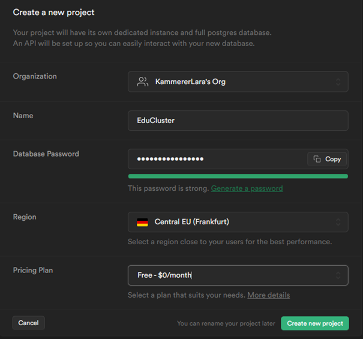

Figure 2 zeigt als Nächstes die generierten API Keys und Datenbank URL.

.API Keys und Project Configuration
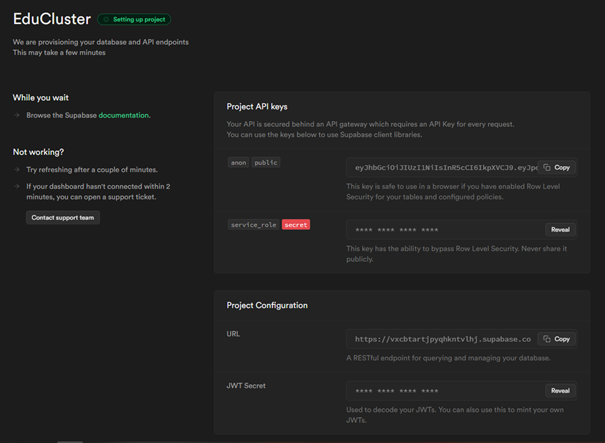

In Figure 3 wird als Nächstes die Einstiegsseite zur neu angelegten Datenbank angezeigt. Von hier aus können der Table Editor, SQL Editor oder auch die Authentication Einstellungen betreten werden.

.Ansicht neue Datenbank
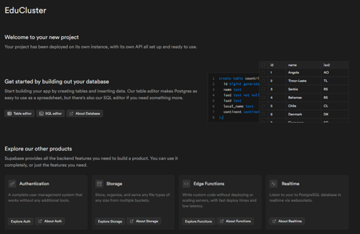

In Figure 4 wird der Table Editor gezeigt. Hier kann durch Betätigen des New Table-Buttons eine Tabelle händisch in der GUI erzeugt werden.

.Übersicht Table Editor
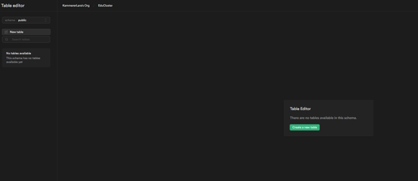

Figure 5 stellt das Erstellen der Tabelle über die GUI dar. Hier kann ein Tabellenname, Beschreibung als auch die einzelnen Spalten mit deren Eigenschaften eingegeben werden.

.Create New Table in GUI
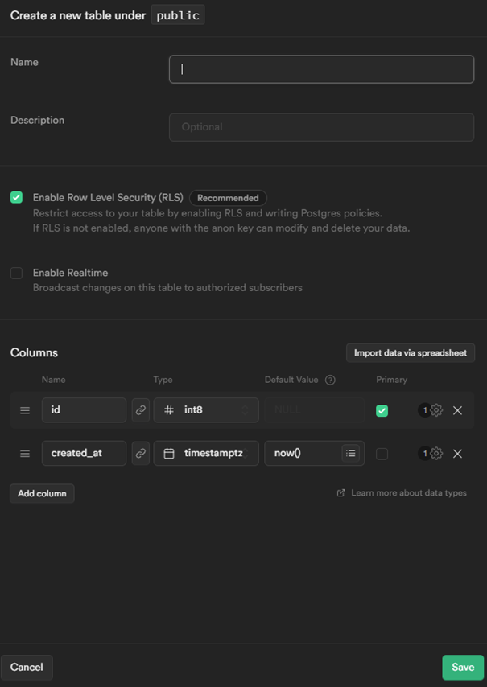

In Figure 6 wurde gerade eine Beispieltabelle erstellt. Als Beispiel wurde hier die Tabelle cluster herangezogen, welche in weiterer Folge in der Testdatenbank verwendet wurden.

.Erstellen Beispieltabelle in GUI
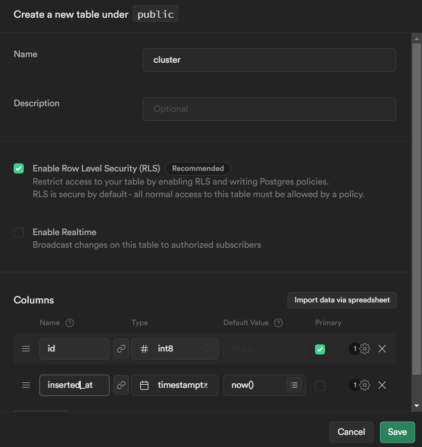

Zuletzt zeigt Figure 7 noch die fertige Testdatentabelle mit Testinhalten.

.Fertige Beispieltabelle mit Inhalten
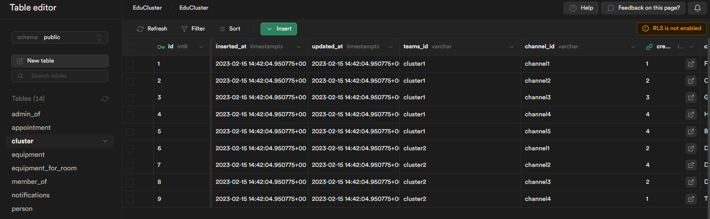

==== Modellierung der Datenbank
Zunächst musste ein ER-Modell zur geplanten Datenbank erstellt werden.
Um das Modell zu erstellen, musste auf viele einzelne Einflussfaktoren eingegangen werden, die als Nächstes behandelt werden.

===== Benötigte Tabellen
Hier werden die benötigten Daten für das Projekt EduCluster gesammelt und in einzelne Tabellen aufgeteilt.

[.underline]_Benötigte Daten_

_Userdaten:_ Zu den Nutzern müssen zumindest bekannt sein:

* eine PersonID (int8): zur Identifikation des Nutzers. Die PersonID dient als Primärschlüssel und muss somit UNIQUE und NOT NULL sein.
* ein Username (varchar): zur Individualisierung des eigenen Nutzerkontos. Der Name wird per Default aus dem UntisUsernamen übernommen, kann jedoch vom Nutzer selbst in seinen privaten Einstellungen angepasst werden. Der Username darf jedoch nicht leer sein und muss daher NOT NULL sein.
* der Untis Username (varchar): zu Identifikation des Untis Kontos, das mit dem Nutzerkonto verbunden ist. Um die Identifikation sicherzustellen, muss der Untis Username UNIQUE und NOT NULL sein. Befüllt wird er direkt beim ersten Login und somit Erstellen des Nutzers durch den Usernamen aus dem Login (die Untis Logindaten werden benötigt zum Login in EduCluster).
* die Teams E-Mail-Adresse (varchar): zur Identifikation des verbundenen MS Teams Kontos, zum zuverlässigen Hinzufügen und Entfernen der Nutzer zu Channels. Für die eindeutige Identifikation muss die Teams E-Mail-Adresse UNIQUE sein. Bei erstmaligem Login eines Nutzers wird zunächst der Nutzer selbst in die Datenbank geladen, die Teams E-Mail-Adresse jedoch freigehalten. Nach einem anschließenden Check, ob die Adresse befüllt ist, wird der Nutzer automatisch an ein Microsoft Login weitergeleitet. Bei einem erfolgreichen Login wird die E-Mail-Adresse direkt in die Datenbank eingetragen und mit dem Nutzer verknüpft. Sobald die Adresse erst einmal eingetragen ist, kann sie nur noch vom Administrator abgeändert oder entfernt werden.
* isSysadmin (boolean): zur Feststellung, ob der Nutzer als Admin agieren darf. Der Wert ist NOT NULL, ist aber per Default false.

_Clusterdaten:_ Analog den Userdaten müssen über die Cluster ebenso bekannt sein:

* eine ClusterID (int8): zu eindeutigen Identifikation des Clusters im System. Die ClusterID dient analog der PersonID als Primärschlüssel des Clusters und muss somit ebenfalls UNIQUE und NOT NULL sein.
* eine Clusterbezeichnung (varchar): zur Identifikation für Nutzer über den Gruppennamen. Der Name muss von dem Ersteller des Clusters beim Erstellvorgang eingegeben werden und darf nicht leer gelassen werden. Er dient in späterer Folge ebenfalls zur Identifikation für Nutzer, da Namen leichter zu merken sind als Ziffern. Durch die unbedingte und eindeutige Eingabe des Namen muss dieser Wert ebenfalls UNIQUE und NOT NULL sein.
* eine Beschreibung (Text): um den Nutzen des Clusters/der Lerngruppe zu beschreiben. Die Beschreibung kann ebenso beim Erstellen eines Clusters mit eingegeben werden und dient dazu, eine kurze Übersicht zu geben, wozu das Cluster hauptsächlich genutzt wird. Sie kann im Gegensatz zum Namen jedoch frei gelassen werden und kann zusätzlich auch bei mehreren Clustern gleich sein.
* eine TeamsID (varchar): zur Identifikation des zugehörigen Teams in MS Teams. Cluster werden Channels in MS Teams zugeordnet. Da jedoch je Cluster maximal 20 Channels erzeugt werden können, ist die Angabe des Teams, in dem sich der Channel befindet zusätzlich notwendig. Durch die Anzahl von bis zu 20 Clustern je Team kann dieser Wert nicht unique sein, NOT NULL ist aber eine wichtige Bedingung, da sonst das Cluster nicht eindeutig zu seinem Channel zugeordnet werden kann.
* eine ChannelID (varchar): zur Identifikation des zugehörigen Channels in MS Teams. Die ChannelID stellt nun die eindeutige Zuordnung der Cluster zum Channel dar. Einzeln müssen die Channels nicht Unique sein, jedoch in Verbindung (zusammengesetzt) mit der TeamsID muss die ChannelID UNIQUE sein. Die ChannelID selbst muss alleine zusätzlich noch NOT NULL sein.
* die creatorID (int8): zur Zuordnung des Erstellers des Clusters. Die CreatorID wird automatisch vom System gesetzt beim Erstellen des Clusters und kann damit niemals null sein. Da jedoch in späterer Folge bim Anzeigen des Clusters davon ausgegangen wird, dass es einen Creator dazu gibt, muss durch ein NOT NULL sichergestellt werden, dass diese niemals herausgelöscht wird.
* isPrivate (boolean): um festzustellen, ob der Cluster geschlossen geführt wird, oder nicht. Der Wert isPrivate soll anzeigen, ob ein Cluster geschlossen oder offen geführt wird. Bei einem true kann das Cluster nicht über die Clustersuche bzw. Terminsuche gefunden werden. Nutzer können dadurch nur dem Cluster durch eine Einladung eines Clusteradministrators beitreten. Der Wert ist per Default auf false gesetzt, damit das Cluster jederzeit über die Cluster- oder Terminsuche gefunden werden kann. Dieser Wert muss somit NOT NULL sein.

_Raumdaten:_ Zu den Räumen müssen folgende Werte bekannt sein:

* der Raumname (varchar): zur eindeutigen Identifikation des Raumes für die Nutzer als auch das System. Der Raumname entspricht den Bezeichnungen an den Türen im Schulgebäude. Er fungiert hier als PRIMARY KEY und muss somit UNIQUE und NOT NULL sein. In späterer Folge kann angedacht werden, diese Daten aus WebUntis auszulesen, damit würden sämtliche Raumnamen synchronisiert werden.
* die UntisID (varchar): zur Identifikation des Raumes in WebUntis. Dieser Wert soll die Verbindung zum Raum in WebUntis herstellen, dass bei einer Buchung des Raumes, der Raum in WebUntis ebenso reserviert wird. Es ist damit unbedingt nötig, dass die UntisID UNIQUE und NOT NULL ist, um als eindeutiger Fremdschlüssel zu agieren.
* die Platzanzahl (int8): zur Angabe der Raumgröße. Für die Reservierung von Räumen wird oft eine bestimmte Raumgröße benötigt. Für eine Größenangabe kann die Sitzplatzzahl herangezogen werden. Sie wird damit als NOT NULL bewertet.
* isActive (boolean): zur Angabe, ob der Raum für die Reservierungen verwendet werden kann. Es gibt in der Schule Räume, die nicht zur freien Buchung bereitstehen, wie zum Beispiel die Cisco-Labore aufgrund der Ausstattung. Da aber bei späterer Folge die Räume direkt aus WebUntis synchronisiert werden sollen, muss eine Möglichkeit geschaffen werden, diese als inaktiv zu setzen, damit diese nicht bei Reservierungen gebucht werden können.

_Termindaten:_ Zu den Terminen müssen zudem bekannt sein:

* eine TerminID (int8): zur eindeutigen Identifikation des Termins. Die ID muss dazu als PRIMARY KEY der Tabelle fungieren und muss somit UNIQUE und auch NOT NULL sein.
* die TeamsID (varchar): zur Zuordnung zum Termin in MS Teams. Zu den Terminen sollen automatisch immer nur die Mitglieder des Clusters eingeladen werden. Damit diese aber den Termin selbst sehen können, muss eine eindeutige Verbindung bestehen. Die TeamsID muss damit UNIQUE sein. Ebenso muss es für jeden geplanten Termin einen zugehörigen Termin in MS Teams geben, weshalb dieser Wert zusätzlich auch NOT NULL sein muss.
* die UntisID (varchar): zur Zuordnung zum Termin in WebUntis. Analog der TeamsID muss auch die UntisID eindeutig zuordenbar sein (UNIQUE). Sie ist jedoch nicht unbedingt nötig, falls ein Termin roomless abgehalten werden soll.
* die Terminbezeichnung (varchar): zur Kurzbeschreibung des Termins. Die Terminbezeichnung ist unerlässlich für den Wiedererkennungswert für die Mitglieder des Clusters. Er muss damit NOT NULL sein.
* die Terminbeschreibung (Text): zur genaueren Beschreibung der behandelten Themen. Die Terminbeschreibung ist optional und darf auch in mehreren Terminen gleich ausfallen.
* ein BeginnDatum mit Zeit (timestamptz): zur Buchung und Terminerstellung in WebUntis und MS Teams. Jeder Termin muss einen Anfangszeitpunkt und Endzeitpunkt haben. Diese werden hier als timestamptz ausgeführt, um sowohl das Datum als auch die Uhrzeit integriert zu haben. Ab der Startzeit wird gegebenenfalls der Klassenraum reserviert und bei Erreichen des Zeitpunkts automatisch auch der bereits zuvor erstellte Termin in MS Teams gestartet. Das BeginnDatum muss somit NOT NULL sein. Da aber mehrere Termine zur selben Zeit starten können ist es nicht sinnvoll, diesen unique zu machen.
* ein EndDatum mit Zeit (timestamptz): zur Buchung und Terminerstellung in WebUntis und MS Teams. Das EndDatum verhält sich analog dem BeginnDatum. Es ist damit nicht unique, aber NOT NULL.
* der Raumname (varchar): zur Raumzuordnung, falls der Termin vor Ort abgehalten werden soll. Da der Termin aber auch roomless abgehalten werden kann, kann dieser wert auch null sein. Er kann hingegen nicht zur selben Zeit zweimal belegt werden. Diese Bedingung muss jedoch vom System übernommen werden, da das im Vergleich nur mit erhöhtem Aufwand in der Datenbank angewendet werden kann.
* die ClusterID (int8): zur Zuordnung zum veranstaltenden Cluster. Es muss immer ein Cluster zu einem Termin angegeben sein, da die Mitglieder zum MS Teams Termin hinzugefügt werden müssen. Die ClusterID ist somit NOT NULL. Es können jedoch mehrere Termine vom selben Cluster geplant sein, weshalb ein unique-Wert hier fehl am Platz wäre.
* den Ersteller des Termins (int8): um die Erstellung des Termins gegebenenfalls nachvollziehen zu können. Der Ersteller ist eine zusätzliche Information. Er wird jedoch automatisch vom System befüllt und kann damit nie leer bleiben (NOT NULL).

_Katalogwerte:_ Es müssen Katalogwerte zu verschiedenen Gebieten angelegt werden, damit diese Werte in späterer Folge vom Administrator angepasst werden können. Es soll dazu Werte geben zu:

* Raumdaten: die oben genannten Raumdaten sollen als Katalogwerte veränderbar sein. Ebenso müssen die Raumgröße und die vorhandene Raumausstattung in der Administration anpassbar sein, sodass die Räume bei entsprechenden Angaben gefunden werden.
* Raumgrößen:
Es müssen für die Raumsuche vorgegebene Raumgrößenbereiche durch ein Drop-Down Menü je nach benötigter Raumgröße auswählbar sein. Voreingestellt werden hierfür Größenbereiche von 1-10, 11-20, 21-30 und über 30 Sitzplätze. Da diese aber in späterer Folge unkompliziert anpassbar sein sollen, werden diese in eine sogenannte Katalogwerte-Tabelle gespeichert, die im Administrationsmenü angepasst werden können.
* Raumausstattung:
Die Raumausstattung muss analog den Raumgrößen in einem Drop-Down bei der Raumsuche auswählbar sein. Sie muss ebenfalls in der Administration anpassbar sein. In der Testdatenbank werden vorerst ein Beamer mit jeweiligem Anschluss (z.B. HDMI, VGA), eine Tafel oder ein Whiteboard angelegt.
* Schulfächer:
Es müssen sämtliche Unterrichtsfächer in der Datenbank angelegt werden, die dann im Anschluss über AutoComplete-Felder als Tags an Termine angehängt werden können. Da sich jedoch auch die Fächer als auch deren Bezeichnungen ständig ändern, müssen diese somit ebenfalls in der Administration anpassbar sein.
* Themengebiete mit Bezug auf die Schulfächer:
Zusätzlich zu den Unterrichtsfächern werden auch die einzelnen Themengebiete benötigt, um in einem genaueren Ausmaß die besprochenen Bereiche anführen zu können. Dadruch kann in weiterer Folge von anderen Mitschülern besser erkannt, und auch gefiltert werden, in welchen Bereichen sie momentan Hilfe bräuchten oder einfach selbst lernen müssen. Diese Themen müssen somit ebenfalls über ein AutoComplete-Feld ausgewählt werden können, dass exakt die Bezeichnungen gefiltert werden können. Da sich diese Themengebiete aber analog den Unterrichtsfächern stets ändern, muss diese Auswahl auch von einem Administrator bearbeitet werden können. Deshalb werden diese Informationen auch in eine eigene Tabelle in die Datenbank gespeichert.
* Unterrichtszeiten:
Ebenso muss es möglich zu fix vorgegebenen Uhrzeiten Räume zu buchen bzw. nach Lernzeit zu diesen Uhrzeiten zu suchen, da WebUntis ausschließlich die Unterrichtsstunden zum Buchen eines Raumes zulässt. Diese Unterrichtszeiten können sich jedoch auch ändern und müssen daher ebenso in der Administration bearbeitbar sein. Sie werden daher auch in eine Katalogtabelle in die Datenbank gespeichert.

===== Modellierung der Beziehungen
Hier werden nun sämtliche möglichen Beziehungen erklärt und im Anschluss alle Beziehungen der Datenbank für EduCluster näher erläutert.

[.underline]_Mögliche Beziehungen_

_1 zu 1-Beziehung_ sind Beziehungen zwischen zwei einzelnen Elementen. Es wird hier immer genau ein Element der ersten Tabelle genau einem Element der zweiten Tabelle zugeordnet. Ein Beispiel hierfür ist in einem Schulsystem eine Klasse mit dem zugehörigen Klassensprecher. Ein Schüler kann maximal von einer Klasse Klassensprecher sein, ebenso wie jede Klasse immer genau einen Klassensprecher haben wird. In der Datenbank wirkt sich das aus, indem in einer der beiden Tabellen eine eindeutige Identifizierung des zugehörigen anderen Elements als sogenannten Foreign Key intergiert wird. Der Foreign Key muss sich dabei immer auf eine UNIQUE oder PRIMARY KEY Spalte beziehen. In diesem Fall kann _in einer selbstgewählten Tabelle der Foreign Key zur anderen Tabelle_ stehen.

_1 zu N-Beziehung_ sind Beziehungen zwischen mehreren gleichen Elementen zu einem anderen. Gemeint ist hier ein Element einer Tabelle, das in Verbindung zu mehreren Elementen einer anderen Tabelle steht. Bezogen auf das oben genannte Schulbeispiel kann hier die Klasse mit ihren Schülern genannt werden. Es wird hier jeder Schüler immer genau einer Klasse zugeordnet, die Klasse hingegen kann auch mehrere Schüler haben. Hier muss der oben genannte _Foreign Key unbedingt in der Tabelle der vielen Elemente_ stehen, da hiermit nur auf eine Klasse verwiesen wird und nicht die erste Normalisierungsstufe verletzt wird, da bei der Klasse sonst viele Schüler in einem Feld stehen müssten.

_N zu M-Beziehung_ sind Beziehungen zwischen mehreren einer Art zu mehreren möglichen einer anderen Art. Es können also mehrere Elemente der ersten Tabelle mit mehreren Tabellen der zweiten verbunden sein. Im Schulbeispiel entspricht dieses Szenario den Schülern, die mehrere Unterrichtsfächer besuchen und umgekehrt die Fächer, die von mehreren Schülern besucht werden. In der Datenbank muss für diese Beziehung eine eigene Tabelle erstellt werden, mit sowohl einem Foreign Key zu den Schülern als auch einem zu den Fächern. In den Tabellen der Schüler bzw. der Unterrichtsfächer sind somit keine Foreign Keys.

[.underline]_Verwendete Beziehungen_

Die Beziehungen der EduCluster Datenbank sind folgende:

* AdministratorVon (Person - Cluster, N-N)
* TeilnehmerVon (Person - Cluster, N-N)
* ErstellerVonCluster (Person - Cluster, 1-N)
* ClustervonTermin (Cluster - Termin, 1-N)
* ErstellerVonTermin (Person - Termin, 1-N)
* RaumZuTermin (Raum - Termin, 1-N)
* AusstattungVonRaum (Raum - Ausstattung, N-N)
* ThemaVonTermin (Thema - Termin, N-N)
* FachZuThema (Fach - Thema, 1-N, schwache Beziehung)

[.underline]_Auswirkung in Datenbankaufbau_

Ganz entsprechend der Erklärungen oberhalb müssen für alle N-zu-N-Beziehungen eigene Tabellen erstellt werden, also für die Administratoren der Cluster, sowie die normalen Teilnehmer der Cluster, die Ausstattung der Räume und ebenfalls für die Themen der einzelnen Termine.
Bei 1-N Beziehungen wird ein Fremdschlüssel in den N-Tabellen erstellt, somit wird in der Clustertabelle und in der Termintabelle jeweils der Ersteller, sowie das Cluster eines Termins, der Raum, in dem ein Termin abgehalten wird als Fremdschlüssel hinzugefügt. Ebenso wird bei den Themen das Unterrichtsfach als Fremdschlüssel hinzugefügt. Hingegen hier wird aufgrund der schwachen Beziehung der Primärschlüssel aus diesem Fremdschlüssel und dem eigenen Namen zusammengesetzt.

==== Ergebnis
Hier ist das aus den oben genannten Überlegungen resultierende ER-Modell dargestellt:

.ER-Modell Datenbank
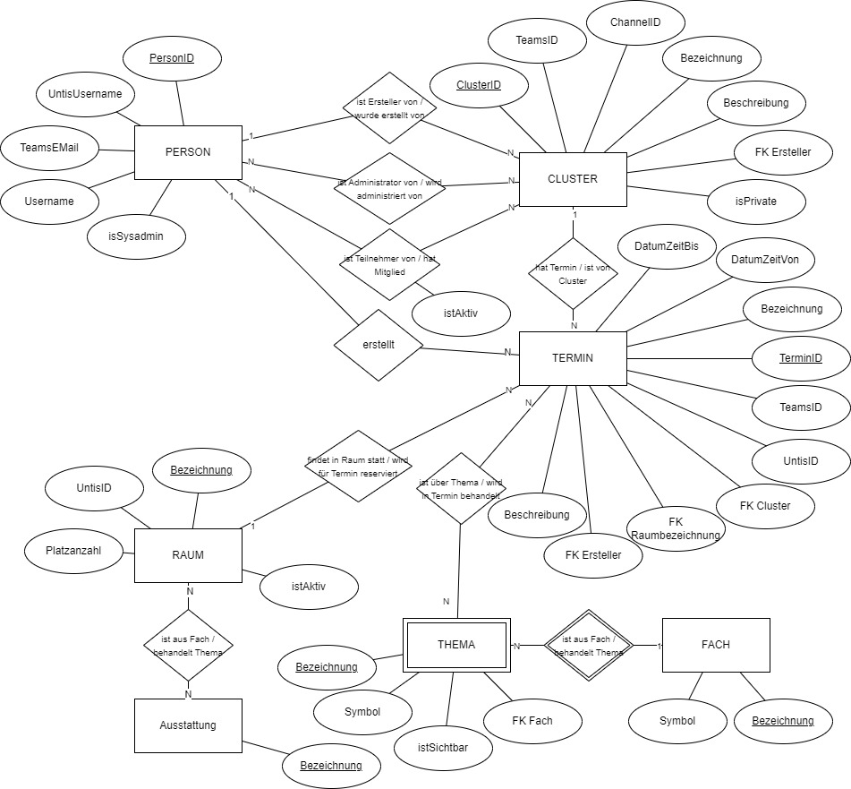

Zum Erstellen der Datenbank wurden folgende Code Snippets genutzt. Die Überlegungen zu den einzelnen Tabellen entsprechen den oben angeführten.

.Codeblock Create Tables
----
create table person (
  id bigint generated by default as identity primary key,
  inserted_at timestamp with time zone default timezone('utc'::text, now()) not null,
  updated_at timestamp with time zone default timezone('utc'::text, now()) not null,
  untis_username varchar(30) unique not null,
  teams_email varchar(50) unique,
  username varchar(30) unique not null,
  is_sysadmin boolean not null
);

create table cluster (
  id bigint generated by default as identity primary key,
  inserted_at timestamp with time zone default timezone('utc'::text, now()) not null,
  updated_at timestamp with time zone default timezone('utc'::text, now()) not null,
  teams_id varchar(30) not null,
  channel_id varchar(30)not null,
  creator bigint references person(id) not null,
  clustername varchar(50) unique not null,
  description text,
  is_private boolean not null,
  unique (teams_id, channel_id)
);

create table room (
  name varchar(20) primary key,
    inserted_at timestamp with time zone default timezone('utc'::text, now()) not null,
  updated_at timestamp with time zone default timezone('utc'::text, now()) not null,
  untis_id varchar(30) not null,
  seats int,
  is_active boolean
);

create table equipment (
  name varchar(30) primary key,
  inserted_at timestamp with time zone default timezone('utc'::text, now()) not null,
  updated_at timestamp with time zone default timezone('utc'::text, now()) not null
);

create table subject (
  name varchar(30) primary key,
  symbol varchar(5) unique not null,
  inserted_at timestamp with time zone default timezone('utc'::text, now()) not null,
  updated_at timestamp with time zone default timezone('utc'::text, now()) not null
);

create table topic (
  name varchar(30) primary key,
  symbol varchar(5) unique not null,
  inserted_at timestamp with time zone default timezone('utc'::text, now()) not null,
  updated_at timestamp with time zone default timezone('utc'::text, now()) not null,
  subject varchar(30) references subject(name) not null,
  is_visible boolean not null
);

create table admin_of (
  person_id bigint references person(id),
  cluster_id bigint references cluster(id),
  primary key (person_id, cluster_id)
);

create table member_of (
  person_id bigint references person(id),
  cluster_id bigint references cluster(id),
  is_active boolean not null,
  primary key (person_id, cluster_id)
);

create table appointment (
  id bigint generated by default as identity primary key,
  inserted_at timestamp with time zone default timezone('utc'::text, now()) not null,
  updated_at timestamp with time zone default timezone('utc'::text, now()) not null,
  teams_id varchar(30) unique not null,
  untis_id varchar(30) unique,
  name varchar(50) not null,
  description text,
  date_from timestamp with time zone not null,
  date_until timestamp with time zone not null,
  roomname varchar(20) references room(name),
  cluster bigint references cluster(id),
  creator bigint references person(id)
);

create table equipment_for_room (
  room varchar(30) references room(name),
  equipment varchar(30) references equipment(name),
  primary key (room, equipment)
);

create table topics_for_appointment (
  appointment bigint references appointment(id),
  topic varchar(30) references topic(name),
  primary key (appointment, topic)
);

create table teaching_times (
  teaching_hour int NOT NULL primary key,
  begin varchar(5) NOT NULL,
  end varchar(5) NOT NULL
);

create table room_size (
   seatcount varchar(30) NOT NULL primary key,
   minimum int NOT NULL,
   maximum int NOT NULL
);
----

Zum Befüllen der Tabellen wurde das im Anschluss angeführte Code Snippet verwendet:

.Codeblock Insert
----
INSERT INTO
    person (untis_username, teams_email, username, is_sysadmin)
VALUES
    ('KammerLar',null, 'KammerLar', true),
    ('KiesseChr', null, 'KiesseChr', true),
    ('VladuRay',null, 'VladuRay', true),
    ('MusterMax','max.muster@htlpinkafeld.at', 'mm', true),
    ('DorferAli', 'alice.dorfer@htlpinkafeld.at', 'Alice Dorfer', false);

INSERT into
    cluster (teams_id, channel_id, creator, clustername, description, is_private)
VALUES
    ('cluster1', 'channel1', 1, 'Fehler 404: Gruppe nicht gefunden', 'Diese Gruppe existiert garnicht.', false),
    ('cluster1', 'channel2', 2, 'Ciao Kakao', 'Rolling with the homies', false),
    ('cluster1', 'channel3', 3, 'Gummibärenbande', 'Mutig und freundlich, so tapfer und gläubig. Fröhlich und frech kämpfen sie auch für dich. Leben im Wald unter Bäumen und Steinen. In ihren Höhlen da sind sie zu Haus.', false),
    ('cluster1', 'channel4', 4, 'Helden in Strumpfhosen', 'Ich habe soeben die gute Nachricht überbracht und ich... ich... stecke tief in der Scheiße!', false),
    ('cluster1', 'channel5', 4, 'Bürobusters', 'Ich bin so motiviert, ich könnte Bäumen beim wachsen zusehen.', false),
    ('cluster2', 'channel1', 2, 'Die taffen Giraffen', 'Ich seh den Baum vor lauter Wäldern nicht.', false),
    ('cluster2', 'channel2', 4, 'Die Mathelarven', 'Wir tun nix, wir wollen nur rechnen.', false),
    ('cluster2', 'channel3', 2, 'Das A-Team', 'Wir schreiben das A ganz groß.', false),
    ('cluster2', 'channel4', 1, 'The Office', 'Unser Office ist 365 Tage im Jahr geöffnet.', false);

INSERT into
    room (name, untis_id, seats, is_active)
VALUES
    ('V_101', 'V_101', 40, true),
    ('V_102', 'V_102', 10, true),
    ('V_103', 'V_103', 30, true),
    ('V_104', 'V_104', 20, true),
    ('CISCO_Labor', 'C_402', 30, false);

INSERT into
    equipment (name)
values
    ('Beamer'),
    ('Beamer mit HDMI Anschluss'),
    ('Beamer mit VGA Anschluss'),
    ('Tafel'),
    ('Whiteboard');

INSERT into
    subject (name, symbol)
values
    ('Deutsch', 'D'),
    ('Mathematik', 'M'),
    ('Englisch', 'E'),
    ('Programmieren', 'POS'),
    ('Betriebswirtschaft', 'BWM');

INSERT into
    topic (name, symbol, subject, is_visible)
values
    ('Mathematik', 'Mathe', 'Mathematik', false),
    ('Algebra und Geometrie', 'AG', 'Mathematik', true),
    ('Lineare Funktion', 'LF', 'Mathematik', true),
    ('Analysis', 'A', 'Mathematik', true),
    ('Wahrsch. und Statistik', 'WS', 'Mathematik', true),
    ('Potenzfunktion', 'PF', 'Mathematik', true),
    ('Deutsch', 'Deuts', 'Deutsch', false),
    ('Leserbrief', 'LB', 'Deutsch', true),
    ('Textinterpretation', 'TI', 'Deutsch', true),
    ('Textanalyse', 'TA', 'Deutsch', true),
    ('Zusammenfassung', 'ZF', 'Deutsch', true),
    ('Kommentar', 'K', 'Deutsch', true),
    ('Erörterung', 'E', 'Deutsch', true),
    ('Englisch', 'Engli', 'Englisch', false),
    ('Health', 'H', 'Englisch', true),
    ('Communication', 'C', 'Englisch', true),
    ('Business and Economy', 'BE', 'Englisch', true),
    ('Programmieren', 'Progr', 'Programmieren', false),
    ('HTML5', 'HT', 'Programmieren', true),
    ('CSS', 'CS', 'Programmieren', true),
    ('Bootstrap', 'B', 'Programmieren', true),
    ('JavaScript seq', 'JSS', 'Programmieren', true),
    ('JavaScript OO', 'JSO', 'Programmieren', true),
    ('NodeJS', 'NJS', 'Programmieren', true),
    ('Java Vererbung', 'JV', 'Programmieren', true),
    ('Betriebswirtschaft', 'BWL', 'Betriebswirtschaft', false),
    ('Personalverrechnung', 'PV', 'Betriebswirtschaft', true),
    ('Rechnungsabgrenzung', 'RA', 'Betriebswirtschaft', true),
    ('Rückstellungen', 'RS', 'Betriebswirtschaft', true),
    ('Anlagenverkauf', 'AV', 'Betriebswirtschaft', true),
    ('Forderungsbewertung', 'FB', 'Betriebswirtschaft', true);

INSERT into
    admin_of (person_id, cluster_id)
values
    (1, 1),
    (3, 1),
    (2, 2),
    (3, 3),
    (4, 4),
    (5, 4),
    (3, 4),
    (4, 5),
    (1, 5),
    (2, 5),
    (3, 6),
    (1, 7),
    (2, 7),
    (3, 7),
    (4, 8),
    (5, 8),
    (1, 9),
    (4, 9),
    (5, 9);

INSERT into
    member_of (person_id, cluster_id, is_active)
values
    (2, 1, true),
    (4, 1, true),
    (5, 1, true),
    (4, 2, true),
    (1, 2, true),
    (1, 3, true),
    (2, 3, false),
    (5, 3, true),
    (2, 4, true),
    (3, 5, false),
    (5, 5, true),
    (1, 6, false),
    (3, 6, false),
    (5, 7, false),
    (1, 8, true),
    (2, 9, true),
    (3, 9, true);

INSERT into
    appointment (teams_id, untis_id, name, description, date_from, date_until, roomname, cluster, creator)
values
    ('termin1', 'termin1', 'Zurück in die Zukunft', 'Diese Kiste fährt elektrisch, aber ich brauche die Atomreaktion für die 1,21 Gigawattleistung, die nötig ist', '2023-07-19 14:00', '2023-07-19 16:40', 'V_101', 1, 2),
    ('termin2', 'termin2', 'Ein Spektrum von Möglichkeiten', 'Die Realität ist etwas für Menschen ohne Vorstellungskraft', '2023-08-02  09:10', '2023-08-02  10:00', 'V_103', 6, 1),
    ('termin3', 'termin3', 'Seien Sie außergewöhnlich', 'Man muss systematisch Verwirrung stiften – das setzt Kreativität frei. Alles, was widersprüchlich ist, schafft Leben.', '2023-08-01  10:00', '2023-08-01  11:55', 'V_104', 8, 4),
    ('termin4', 'termin4', 'Monday Mood', 'Monday should be optional', '2023-11-27  08:15', '2023-11-27  10:00', 'V_101', 3, 3),
	('termin5', 'termin5', 'Der Schwerkraft trotzen', 'Der Kopf ist rund, damit das Denken die Richtung ändern kann.', '2023-05-15  16:40', '2023-05-15  17:30', 'V_102', 5, 3),
    ('termin6', 'termin6', 'Klärung des Nudelrezeptaufwandes', 'Pasta Asciutta sogt die Mutta', '2023-03-16 18:20', '2023-03-16 20:00', 'V_102', 3, 2),    ('termin7', 'termin7', '0100100001100001011011000110110001101111', 'Have you tried turning it off and on again?', '2023-01-26 13:10', '2023-01-26 14:00', 'V_103', 4, 1),
    ('termin8', 'termin8', 'Kalkulation des Zerfallsgesetzes', 'I ate some pi', '2023-05-12 11:05', '2023-05-12 11:55', 'V_104', 7, 5),
    ('termin9', 'termin9', 'Welcher Fall ist der richtige', 'Der Dativ ist dem Genitiv sein Tod', '2023-08-17 09:10', '2023-08-17 10:50', 'V_103', 9, 3);

INSERT INTO
    equipment_for_room (room, equipment)
VALUES
    ('V_101', 'Tafel'),
    ('V_101', 'Beamer'),
    ('V_101', 'Beamer mit HDMI Anschluss'),
    ('V_102', 'Beamer'),
    ('V_102', 'Beamer mit VGA Anschluss'),
    ('V_103', 'Tafel'),
    ('V_104', 'Whiteboard'),
    ('V_104', 'Beamer'),
    ('CISCO_Labor', 'Whiteboard'),
    ('CISCO_Labor', 'Beamer'),
    ('CISCO_Labor', 'Beamer mit HDMI Anschluss'),
    ('CISCO_Labor', 'Beamer mit VGA Anschluss');

INSERT INTO
    topics_for_appointment (appointment, topic)
VALUES
    (1, 'Communication'),
    (1, 'Business and Economy'),
    (1, 'Health'),
    (2, 'Mathematik'),
    (3, 'Personalverrechnung'),
    (3, 'Rechnungsabgrenzung'),
    (4, 'Textinterpretation'),
    (4, 'Textanalyse'),
    (4, 'Zusammenfassung'),
    (5, 'Leserbrief'),
    (5, 'Textinterpretation'),
    (5, 'Textanalyse'),
    (6, 'Lineare Funktion'),
    (6, 'Wahrsch. und Statistik'),
    (7, 'HTML5'),
    (7, 'CSS'),
    (7, 'Bootstrap'),
    (7, 'JavaScript seq'),
    (8, 'Analysis'),
    (9, 'Textanalyse'),
    (9, 'Erörterung');

INSERT INTO
    teaching_times (teaching_hour, begin, end_)
VALUES
    (1, '07:25', '08:15'),
    (2, '08:15', '09:05'),
    (3, '09:10', '10:00'),
    (4, '10:00', '10:50'),
    (5, '11:05', '11:55'),
    (6, '11:55', '12:45'),
    (7, '13:10', '14:00'),
    (8, '14:00', '14:50'),
    (9, '14:50', '15:40'),
    (10, '15:50', '16:40'),
    (11, '16:40', '17:30'),
    (12, '17:30', '18:20'),
    (13, '18:20', '19:10'),
    (14, '19:10', '20:00'),
    (15, '20:00', '20:50'),
    (16, '20:50', '21:40'),
    (17, '21:40', '22:30'),
    (18, '22:30', '23:30');

INSERT INTO
    room_size (seatcount, minimum, maximum)
VALUES
    ('1-10 Sitzplätze', 1, 10),
    ('11-20 Sitzplätze', 11, 20),
    ('21-30 Sitzplätze', 21, 30),
    ('>30 Sitzplätze', 30, 300);
----

=== Projektmanagement
Im Anschluss werden sämtliche Arbeiten, die für einen reibungslosen Ablauf des Projekts gesorgt haben, angeführt und erläutert.

==== YouTrack
Zum Projektmanagement wurde beim Projekt EduCluster das Management-Tool YouTrack von Jetbrains genutzt.

NOTE: ab hier arbeite ich noch
//TODO: ab hier

===== Prozessaufbau
Der Workflow des Prozesses wurde folgendermaßen in YouTrack abgebildet:

In diesem Bild wird der gesamte Workflow der einzelnen Tasks im Projekt dargestellt. Um zunächst den Standard-Workflow zu erläutern, kann hier der Startpunkt eines jeden Tasks im linken oberen Eck erkannt werden: Design. Wenn somit ein neuer Task erstellt wird, steht er automatisch im Status Design. Dieser Status wurde nur eingeplant, um jeden Task vor einer Bearbeitung im Team zu besprechen, bevor er bearbeitet werden kann, um so noch offene Fragen zu beseitigen. Über Open kann er anschließend in den Status Open gelegt werden, von welchem sich Entwickler jederzeit allgemeine oder ihnen zugewiesene Tasks nehmen können, um diese umzusetzen.
Zudem kann ein Task auch von hier direkt über Already Fixed in den Status Fixed verschoben werden, falls er bereits bei einem anderen Task mitgefixed wurde.

.Workflow Status: Design
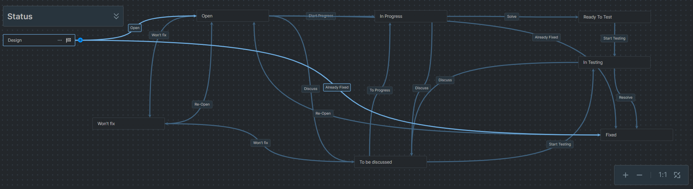
//TODO! Bildbezeichnungen und Verweise anpassen!

Als Nächstes steht der Task im Status Open. Wie bereits erwähnt werden hier die Tasks direkt von den Entwicklern entgegengenommen und umgesetzt. Für die Umsetzung wird der Task weiter über Start Progress in den Status In Progress gesetzt.
Ebenso kann der Task von hier aber auch wieder über Already Fixed direkt in den Status Fixed befördert werden, wenn erst später erkannt wird, dass er bereits gefixed wurde.

.Workflow Status: Open
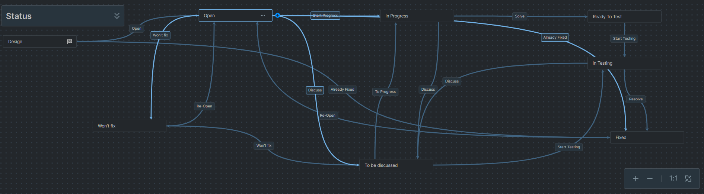

Im Status In Progress steht jeder Task nur, wenn er gerade direkt in der Umsetzung bearbeitet wird. Sobald er fertig ist, wird er weiter über Solve in den Status Ready To Test geschoben.

.Workflow Status: In Progress
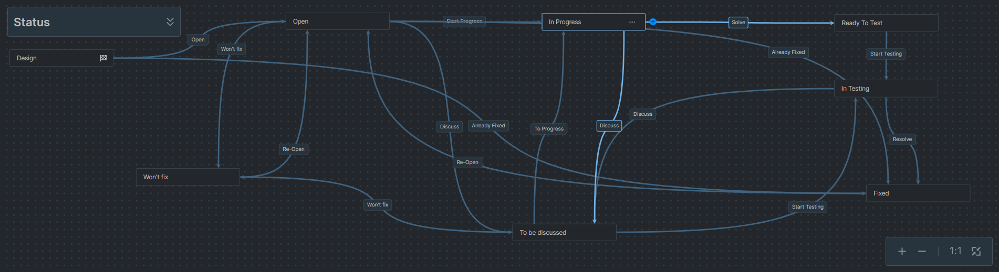

Der Ready To-Test-Status steht für den Zeitraum, wenn ein Task bereits umgesetzt wurde und noch nicht getestet wird. Analog dem Status Open können hier Tester sich die Tasks nehmen und zum Testen über Start Testing in den Status In Testing schieben.

.Workflow Status: Ready To Test
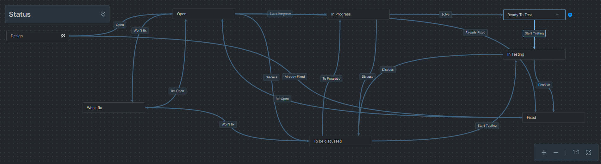

Steht ein Task im Status In Testing, wird er gerade aktiv getestet. Sobald der Tester mit dieser Aufgabe vollständig fertig ist, schiebt er den Task über Resolve in den Fixed Status.

.Workflow Status: In Testing
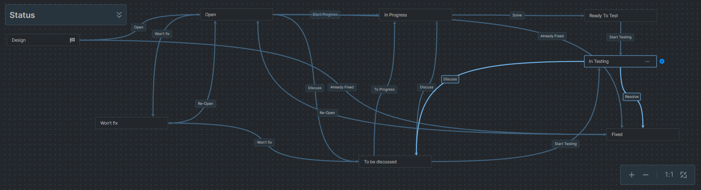

Ein Task im Fixed-Status wurde bereits fertig umgesetzt und getestet. Falls hier jedoch ein Fehler unterläuft und der Task fälschlicherweise in diesem Status landet, kann er über Re-Open wieder zurück in den Open-Status geschoben werden.

.Workflow Status: Fixed
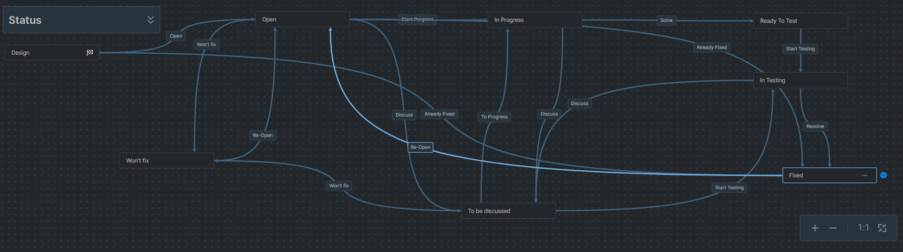

Sollte jedoch im Workflow der Fall entstehen, dass weitere Fragen auftauchen, die erst mit dem Projektteam oder Auftraggeber besprochen werden müssen und somit nicht weiter umgesetzt oder getestet werden können, können diese in einen To Be Discussed-Status geschoben werden. Dies ist vom Open-, In-Progress- oder In-Testing-Status aus möglich. Der Task verweilt dort so lange, bis die Fragen geklärt sind und wird dann in den Status zurückgeschoben, in dem er anschließend weiterbehandelt werden soll.

.Workflow Status: To Be Discussed
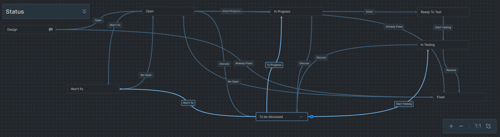

Zuletzt wurde noch ein Won't-Fix-Status hinzugefügt, da sich im Laufe des Projektes manche Tasks als nicht nötig herausgestellt haben. Aus diesem Status können Tasks ebenso wieder aufgelebt werden, falls sie fälschlicherweise dorthin geschoben wurden.

.Workflow Status: Won't Fix
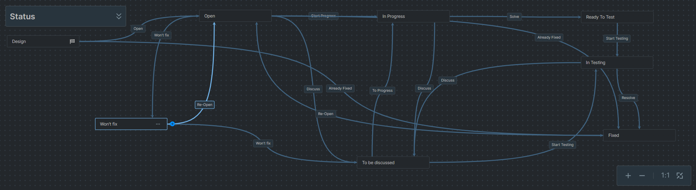

===== Übersicht des Projektfortschritts in YouTrack
Um den Projektfortschritt möglichst deutlich darzustellen, wurde hier vom Projektteam auf das angebotene Kanban Board in YouTrack zurückgegriffen, auf dem ebenfalls die einzelnen Sprints dargestellt werden können.
Im folgenden Bild kann ein Zwischenstand auf dem Kanban Board für den finalen Sprint des Teams EduCluster betrachtet werden. Hier werden die einzelnen Status in Spalten und die Tasks in entsprechenden Spalten dargestellt. Dargestellt wird hier von links nach rechts der Standardworkflow mit einer zusätzlichen Spalte links für die To Be Discussed Tasks, dass diese somit nicht übersehen werden.

.Kanban Board
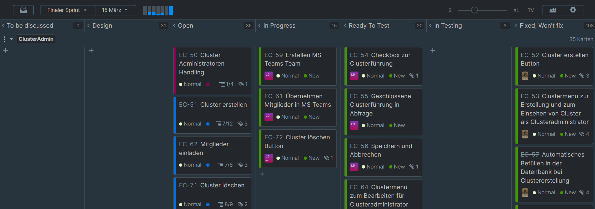

=== Requirements Engineering
Als Requirements Engineering wird das ingenieurmäßige Festlegen von Anforderungen an bestimmte Systeme bezeichnet.footnote:[https://wirtschaftslexikon.gabler.de/definition/requirements-engineering-44113, abgerufen am 06.03.2023] Es wird in größeren Projekten für eine reibungslose Zusammenarbeit benötigt.

Zunächst wurden hierfür in Projekt EduCluster die einzelnen User Stories definiert, welche im Anschluss von der Formulierung in Stories umgewandelt, zu Epics zusammengefasst und auf einzelne Tasks weiter unterteilt wurden.
Hier wird im Anschluss gezeigt, wie dieser Prozess von der User Story zu den einzelnen Tasks aussieht.

==== User Stories
Als Beispiel für eine User Story kann hier das Login herangezogen werden.

.User Story: Login
****
[.underline]*SOLL Prozess: Login*

Als Schüler/Lehrer/Administrator will ich mich in mein Konto einloggen, sodass ich Cluster bilden oder beitreten kann.

* Es müssen folgende Daten ausgefüllt werden: *Username / HTL E-Mail-Adresse und Passwort*.
* Beide Felder sind Pflichtfelder. Werden diese beiden Felder nicht richtig ausgefüllt kann ein Login nicht erfolgen.
* Hat der Nutzer eine *falsche E-Mail-Adresse oder ein falsches Passwort* eingegeben, dann muss er mit einer aussagekräftigen *Fehlermeldung* an das Login Formular zurückgeleitet werden.
* Bei falscher E-Mail-Adresse muss der Nutzer darauf hingewiesen werden, eine derzeit gültige E-Mail-Adresse der HTL Pinkafeld zu verwenden.
* Das Login Formular hat eine *Checkbox 'Angemeldet bleiben'*. Dies bedeutet, dass der Nutzer sich nicht noch einmal einloggen muss, sondern angemeldet bleibt.
* Durch einen *erfolgreichen Login* wird der Nutzer in das Hauptmenü weitergeleitet.
* Der Login erfolgt mit den Schuldaten - die *Authentifizierung* erfolgt in WebUntis.
****

==== Aufsplittung in Tasks
Aus der oben gezeigten User Story konnte folgende Story gebaut werden:

.Story: Login
****
[.underline]*Kontext*

Als Schüler/Lehrer/Administrator muss man sich in sein Konto einloggen können, sodass man Cluster bilden oder beitreten kann.

[.underline]*Ziel*

* Zum Login müssen in einem *Login-Formular* eine HTL-E-Mail-Adresse und ein Passwort angegeben werden (beide als Pflichtfelder ausgeführt).
* Die *Authentifizierung* muss im WebUntis erfolgen.
* Werden beide Felder *korrekt ausgefüllt*, muss der Nutzer zur Hauptseite von EduCluster weitergeleitet und eine Session gestartet werden.
* Bei einer *falschen Eingabe* muss der Nutzer anhand einer aussagekräftigen Fehlermeldung darauf hingewiesen werden und weiterhin am Login-Formular bleiben, um seine Eingaben korrigieren zu können.
* Das Login-Formular muss eine *Checkbox zum ‚Angemeldet bleiben‘* haben, damit die Session beim Schließen des Fensters nicht automatisch abgebrochen wird.

[.underline]*Voraussetzungen*

* Eine Abfrage der Authentifizierung über WebUntis muss möglich sein.
****

Aus dieser Story und der Story zum Logout konnte ein übergreifendes Epic identifiziert und wie folgt definiert werden:

.Epic: Login System (Login & Logout)
****
[.underline]*Kontext*

Als Schüler/Lehrer/Administrator muss man sich in sein Konto ein- und ausloggen können, sodass man Cluster bilden oder beitreten kann.

[.underline]*Stories*

[.underline]#Ablauf des Logins#

_Login Maske_

Das Login erfolgt in einer Login Maske mit zwei Eingabefeldern:

* eines für die Eingabe einer HTL-Pinkafeld-E-Mail-Adresse
* und eines für die Eingabe eines zugehörigen Passwortes.

Beide Felder müssen als Pflichtfelder ausgeführt werden – werden diese beiden Felder nicht richtig ausgefüllt, kann ein Login nicht erfolgen.

Ebenso muss die Login Maske einen Login-Button besitzen.

_Login-Button_

Ein Login-Versuch wird gestartet durch Betätigen des Login-Buttons.

_Authentifizierung_

Das Login erfolgt mit den Schuldaten - die Authentifizierung erfolgt in WebUntis.

_Informations- oder Fehlermeldungen_

Durch einen erfolgreichen Login wird der Nutzer in das Hauptmenü weitergeleitet.

Hat der Nutzer eine falsche E-Mail-Adresse oder ein falsches Passwort eingegeben, dann muss er mit einer aussagekräftigen Fehlermeldung an das Login Formular zurückgeleitet werden.

Bei falscher E-Mail-Adresse muss der Nutzer darauf hingewiesen werden, eine derzeit gültige E-Mail-Adresse der HTL Pinkafeld zu verwenden.

_Checkbox ‚Angemeldet bleiben‘_

Das Login Formular muss eine Checkbox 'Angemeldet bleiben' haben. Wenn diese auf aktiv gesetzt ist, darf der Nutzer sich nicht noch einmal einloggen müssen, sondern muss angemeldet bleiben.

[.underline]#Ablauf des Logouts#

_Logout-Button_

Das Logout aus dem Konto erfolgt über den Logout-Button in der Menüleiste.

Die Sitzung muss durch Betätigen des Logout-Buttons sofort beendet werden.

Der Nutzer muss auf die Login-Seite von EduCluster zurückgeleitet werden.
****

Zusätzlich konnten aus der Login Story 9 einzelne Tasks definiert werden. Drei Beispiele werden im Anschluss angeführt:

.Task: Login Maske
****
[.underline]*Kontext*

Das Login erfolgt in einer Login-Maske mit zwei Eingabefeldern:

* eines für den WebUntis Benutzernamen
* und eines für das WebUntis Passwort

Alle Felder müssen als Pflichtfelder ausgeführt werden. Werden diese Felder nicht richtig ausgefüllt, kann ein Login nicht erfolgen.

Ebenso muss die Login-Maske einen Login-Button besitzen als auch eine Checkbox zum angemeldet bleiben. Siehe dafür EC-43 und EC-45.

[.underline]*Ziele*

Es soll die Login-Maske angelegt werden, mitsamt der Eingabefelder (E-Mail-Adresse, Benutzername, Passwort) und ihrer Bezeichnung sowie der Checkbox zum angemeldet bleiben. Zudem soll noch der Login-Button angelegt werden.

[.underline]*Nicht Ziele*

In diesem Schritt soll noch keine Funktionalität in der Maske verarbeitet werden.
****

.Task: Login-Button
****
[.underline]*Kontext*

Ein Login-Versuch wird gestartet durch Betätigen des Login-Buttons.

[.underline]*Ziele*

Der Button soll eine Anfrage an die WebUntis-Schnittstelle auslösen.

[.underline]*Nicht Ziele*

Die Antwort von WebUntis soll in diesem Schritt noch nicht verarbeitet werden.
****

.Task: Authentifizierung - Anbindung WebUntis
****
[.underline]*Kontext*

Das Login erfolgt mit den Schuldaten - die Authentifizierung erfolgt in WebUntis.

[.underline]*Ziele*

Die Antwort von WebUntis soll in diesem Schritt verarbeitet werden.

* Kommt eine positive Rückmeldung auf die Logindaten zurück, soll eine Sitzung gestartet werden. Der Nutzer soll somit automatisch auf die Hauptseite geleitet werden.
(i) Ist der Nutzer im WebUntis ein Administrator, soll dieser auch auf WebUntis als Administrator eingeloggt werden.
* kommt eine negative Rückmeldung zurück, sollen die Eingaben in den Eingabefeldern bestehen bleiben. Der Nutzer soll auf der Login-Maske verweilen, es soll ihm aber eine informative Fehlermeldung ausgegeben werden (ob E-Mail-Adresse keine gültige HTL-E-Mail-Adresse oder das Passwort nicht dazu passt). Es soll hierbei *keine* Sitzung gestartet werden.

[.underline]*Nicht Ziele*

Die Abfrage der Login-Daten soll hier *nicht* auf der lokalen Datenbank passieren.

[.underline]*Voraussetzungen*

Die Verbindung zu WebUntis muss funktionieren.
****

=== Stundenübersicht

=== Persönliches Fazit

:sectnums!:
