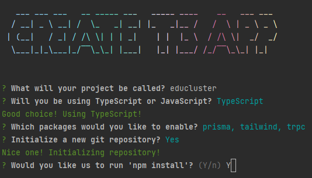
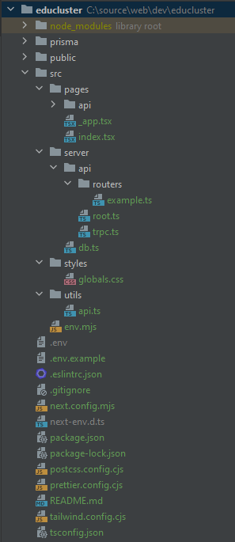
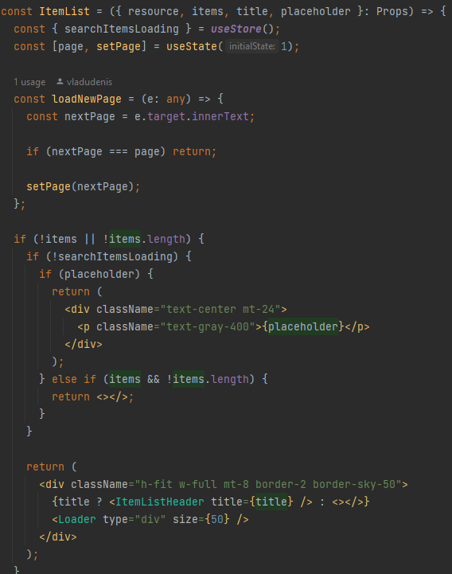
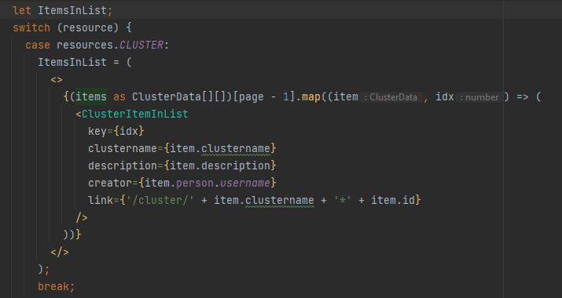
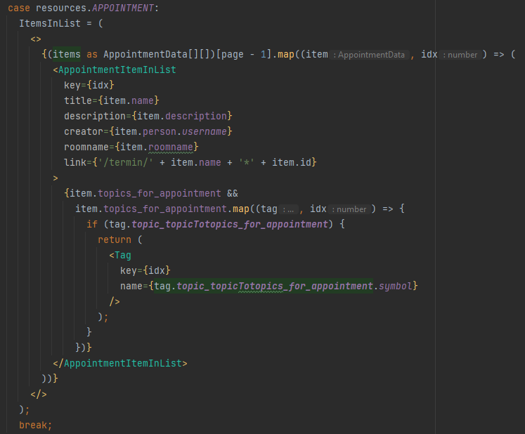
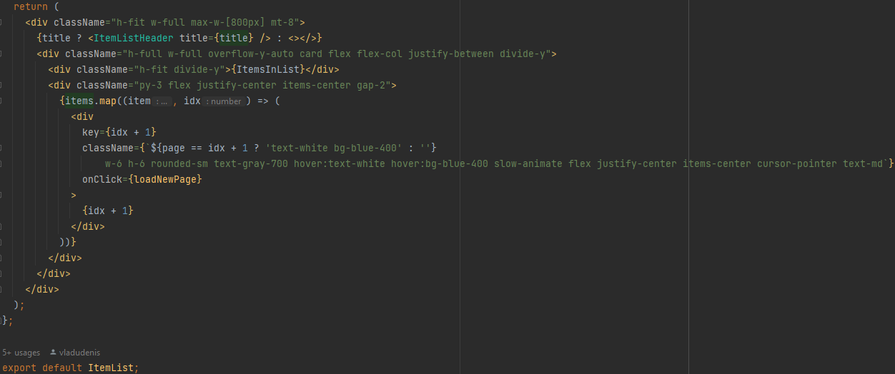
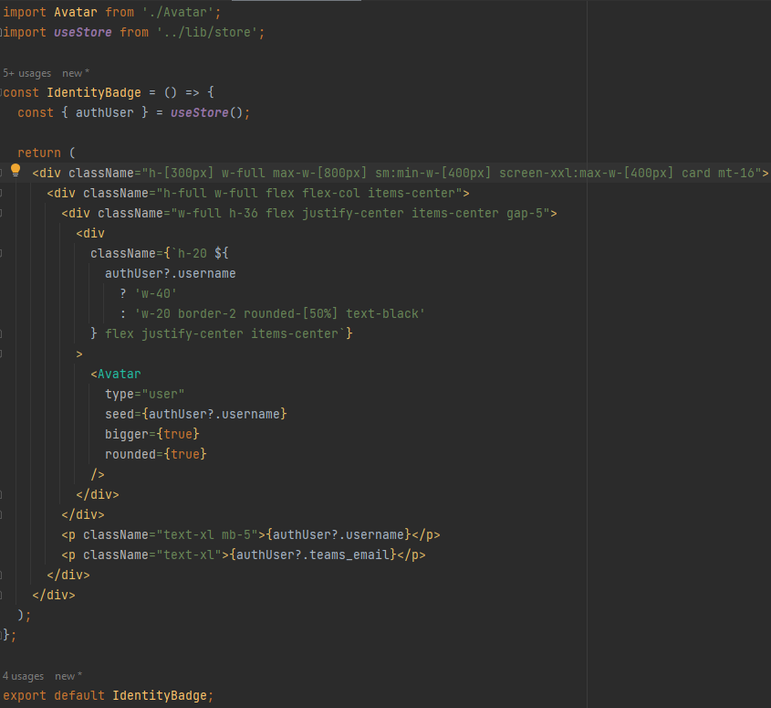
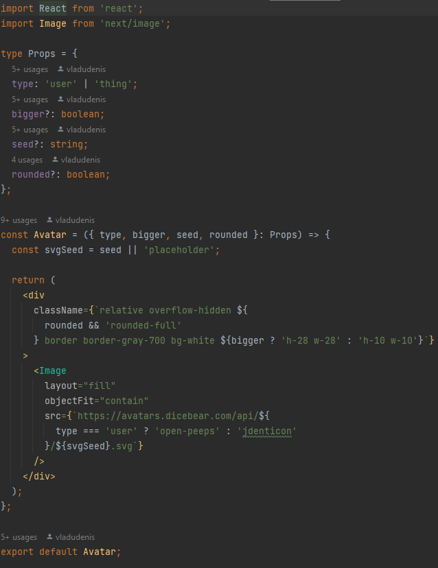
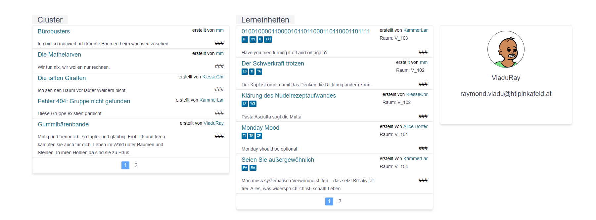
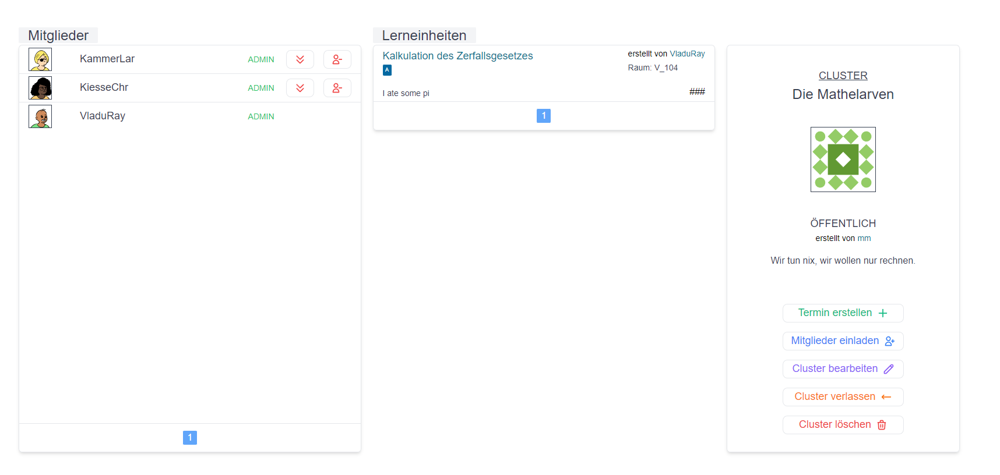

:sectnums:
:sectnumlevels: 5
== Individueller Teil Raymond Denis Vladu

=== Einleitung

Der individuelle Teil gliedert sich in drei Teilbereiche.

Der erste Teil des individuellen Teils befasst sich mit der Evaluierung bewährter Technologie-Stacks, die die Anforderungen des Projekts EduCluster erfüllen. Darin werden verschiedene Technologie-Stacks bewertet und der am besten geeignete Stack ermittelt.

Folglich wird im zweiten Abschnitt die technische Umsetzung erklärt. Dabei wird auf den Aufbau des Grundgerüsts der Applikation gezielt. Es werden die einzelnen Schritte des Aufbaus und der Konfiguration erläutert und mit konkreten Beispielen ergänzt. Außerdem wird die Entwicklung des Frontends erklärt und mittels Beispielen demonstriert.

Zu guter Letzt wird im dritten Teil die Reflexion der eigenen Arbeit erarbeitet und die individuelle Zeiteinteilung präsentiert.

=== Evaluierung der Technologie-Stacks
Eine Evaluierung der verschiedenen potenziellen Technologie-Stacks für die Entwicklung der Webapplikation EduCluster bedeutet eine Analyse und Bewertung der zur Verfügung stehenden Möglichkeiten. Zur Erfüllung dieser Aufgabe werden die bekanntesten Stacks ausgesucht, damit die Qualität der gruppierten Technologien nicht nur theoretisch, sondern auch praktisch bewiesen werden kann.

Im Laufe dieses Abschnitts werden die ausgewählten Stacks vorgestellt und anhand von Beurteilungskriterien bewertet. Die Bewertung wird sich an den Anforderungen richten und anschließend einen Sieger ankündigen, der für die technische Umsetzung benutzt werden soll.

==== Stakeholder der Evaluierung
Bei der Evaluierung eines Technologie-Stacks sollen die Interessen verschiedener Stakeholder beachtet werden.

===== Auftraggeber
Der Auftraggeber, die HTL Pinkafeld, wünscht sich, dass der Technologiestapel der Webapplikation EduCluster weder aus veralteten noch aus frisch auf dem Markt Technologien besteht. Alte Technologien sind nicht zukunftsfähig und frische Technologien sind aufgrund der Unbekanntheit ein hohes Risiko.
Die richtige Wahl eines Technologiestapels muss sowohl Modernheit als auch Zuverlässigkeit priorisieren.

===== Projektteam
Innerhalb des Projekts herrscht die Meinung, dass vor allem auf Modernheit bei der Suche nach den geeigneten Technologien geachtet werden soll. Diese Tatsache folgt daraus, dass die Teammitglieder möglichst viel während der Umsetzung des Projekts lernen und ihre Kenntnisse verbessern wollen. Nichtsdestotrotz müssen die Anforderungen des Auftraggebers gehalten werden.

===== Benutzer
Künftige Nutzer der Webapplikation können den technischen Unterschied zwischen Technologiestapeln nicht erkennen, allerdings ist für ihnen die reibungslose Interaktion mit der Applikation wichtig. Deshalb soll darauf geachtet werden die Leistung der Applikation durch "Overengineering" zu kompromittieren.

===== Zukünftige Entwickler
Falls EduCluster künftig in der HTL Pinkafeld eingesetzt wird bzw. von einer anderen Diplomarbeitsgruppe übernommen wird, sollen diese künftigen Entwickler nicht von der Komplexität der ausgewählten Technologien zurückgehalten werden. Deshalb wird hohe Priorität darauf gesetzt, möglichst simple Lösungsansätze zu finden und dementsprechend praktische Technologien auszuwählen. Wie bereits erwähnt, soll die Falle des "Overengineering" vermieden werden.

===== Technische Betreuung
Die technische Betreuung durch Prof. Dipl.-Inf. David Zach kann nur dann Unterstützung bieten, wenn dem Professor bekannte Technologien genutzt werden. Bei der Nutzung von dem Professor unbekannten Technologien ist das Projektteam auf Internetrecherche angewiesen. Aus diesem Grund soll darauf geachtet werden, bekannte Technologien auszuwählen, damit das Projektteam von der technischen Betreuung des Professors möglichst viel profitieren kann.

==== Zieldefinition
Das Ziel dieser Evaluierung ist die Wahl des richtigen Technologie-Stacks für die Webapplikation EduCluster unter Berücksichtigung der Anforderungen des Projekts. Es wird darauf hingewiesen, dass die Ermittlung einer geeigneten Datenbank nicht inkludiert wird, da dieser Teil von einem anderen Projektmitglied übernommen wird.

===== Was ist ein Technologie-Stack?
Ein Technologie-Stack ist ein Stapel von Technologien, der sich aus Frameworks und Libraries zusammensetzt. Darin können entweder alle oder nur die ausschlaggebendsten Technologien aufgefasst werden, die in dem Projekt ihren Einsatz finden. Da ersteres den vorgesehenen Zeitrahmen sprengen würde, wird die zweite Variante aufgenommen.

Der Stack kann konzeptionell in vier Teilen gespalten werden:

•	Frontend, worin der GUI-Entwurf und die clientseitige Logik implementiert wird
•	Backend, in dem die serverseitige Logik und die Anbindung an die Datenbank implementiert wird
•	API, die eine Verbindung zwischen Frontend und Backend aufbaut
•	Datenbank, wo die relevanten Daten gespeichert und abgerufen werden

Wie bereits erwähnt wird die Datenbankschicht aus dieser Evaluierung ausgeschlossen. Somit liegt der Fokus auf den Frontend, den Backend und die Schnittstelle.

===== Warum wird ein Technologie-Stack benötigt?
Um die Gestaltung einer umfangreichen Webapplikation wie EduCluster sicherzustellen und dabei ein qualitatives Ergebnis liefern zu können hat sich das Projektteam dazu entschieden, die mit dieser Aufgabe verbundenen Komplexität durch Einsatz bewährter Technologien möglichst viel zu reduzieren.

Der Einsatz mehrerer Technologien und deren Auffassung in Form eines Technologiestapels hat sich vor allem durch den Einfluss großer Technologie-Konzernen wie Meta (vormals Facebook), Netflix und Amazon als Standard durchgesetzt. Um den Umsetzungserfolg gewährleisten zu können ist es strategisch sinnvoll, diesem Trend zu folgen.

===== Anforderungen an den Technologie-Stack
Der Stack muss in erster Linie Technologien enthalten, mit denen die Entwickler bereits Erfahrung gesammelt haben. Es ist natürlich unmöglich einen Stack zu finden, in dem alle Technologien von allen Entwicklern bereits genutzt wurden. Allerdings soll im Allgemeinen auf Technologien verzichtet werden, mit denen keiner der Entwickler Erfahrung hat, da sonst ein großer Schnitt der zur Verfügung stehenden Zeit unproduktiv genutzt wird.

Außerdem sollen nur die Technologien ausgewählt werden, die den Entwicklungsaufwand am meisten reduzieren und den schnellsten Entwicklungsprozess fördern. Hier wird nochmals darauf hingewiesen, dass eine effiziente Nutzung der verfügbaren Zeit der wichtigste Faktor ist, um ein Projekt der Größe von EduCluster erfolgreich abschließen zu können.

Die laufende Innovation im Bereich der Webentwicklung bewirkt eine ständige Änderung der Technologie-Trends. Dies bedeutet, dass viele Technologien im Laufe der Zeit von besseren Varianten ersetzt werden. Um zu verhindern, dass sich die Applikation EduCluster von Technologien abhängig macht, die in kürzester Zeit durch neue Stars ersetzt werden, soll auf eine möglichst moderne Ausstattung gezielt werden.

Um unnötige Bugs auszuschließen und die Entwicklererfahrung möglichst gut zu gestalten ist es sinnvoll auf eine vollständige Typensicherheit der Applikation zu zielen. Typensicherheit ist ein wesentlicher Schutz vor Programmfehlern, die von dem Compiler vor der Ausführung des Programms bereits gefangen werden.

Zu guter Letzt soll auf die Beliebtheit der jeweiligen Technologien geachtet werden, um die sicherste Wette auf einen dauerhaften Technologiestapel zu setzen.

==== Ermittlung der möglichen Frontend-Technologien
Dieser Abschnitt umfasst die drei bekanntesten Frontend-Technologien stand 2022. footnote:[Vgl. https://technostacks.com/blog/best-frontend-frameworks/, abgerufen am 29.10.2022]

===== React.js
React ist eine deklarative, komponentenbasierte JavaScript Bibliothek für den Frontend. Sie wurde im Jahr 2013 mit der Open-Source-Lizenz von dem damaligen Unternehmen „Facebook“ veröffentlicht.

Abgesehen davon, dass sie die bekannteste JavaScript-Bibliothek ist, bietet React auch eine breite Palette an Features.

Zum einen besitzt sie ein virtuelles DOM footnote:[Vgl. https://reactjs.org/docs/faq-internals.html, abgerufen am 29.10.2022], das zwischengespeichert und mit dem tatsächlichen DOM synchronisiert wird, um nur diejenigen Komponenten zu rendern, die sich geändert haben. Damit erzielt React eine Erhöhung der Performanz und ermöglicht eine deklarative API. Das bedeutet, dass der Entwickler den erwünschten UI-Zustand definieren kann und React führt im Hintergrund die benötigte Arbeit durch, damit das DOM diesen Zustand entspricht.

Obwohl das Programmieren mit React sich an die Prinzipien des deklarativen Paradigmas hält, ermöglicht die Bibliothek beim Erstellen von Komponenten eine Wahl zwischen funktionelle und klassenbasierte Komponenten. Damit kann sich der Entwickler für eine bestimmte JSX-basierte Syntax entscheiden.

Zu guter Letzt gibt es zumindest für funktionelle Komponente die Möglichkeit, sogenannte „Hooks“ footnote:[Vgl. https://reactjs.org/docs/hooks-intro.html, abgerufen am 29.10.2022] selbst zu definieren oder von einem Package Manager zu installieren. Diese Konstrukte ermöglichen einen direkten Zugriff auf Zustands- und Lebenszyklus-Features in Form einer Funktion.

===== Vue.js
Vue ist ein JavaScript Framework, das häufig als Alternative zu React vorgestellt wird. Jedoch wurde Vue nicht von einem Internet-Giganten, sondern einem gewöhnlichen Entwickler entwickelt und schließlich im Jahr 2014 veröffentlicht.

Vue ist ebenso wie React auf Komponenten und deklarativem Rendering basiert, und setzt ebenfalls auf die Strategie des virtuellen DOMs. Jedoch ist Vue in einer Hinsicht React überlegen. Es besitzt eine sogenannte „two-way data binding“, wodurch eine sofortige Synchronisierung zwischen UI und Datenmodell sicherstellt wird.

Ein weiteres Merkmal von Vue sind die „directives“ footnote:[Vgl. https://vuejs.org/api/built-in-directives.html, abgerufen am 29.10.2022]. Diese sind Anweisungen, die in dem HTML-Template eingebettet werden können und bestimmte Verhalten kontrollieren oder auslösen.

===== Angular
Angular ist ein auf TypeScript basierendes Framework, das von Google im Jahr 2016 veröffentlicht wurde. Angular ist zwar weniger beliebt wie React und Vue footnote:[Vgl. https://2022.stateofjs.com/en-US/libraries/front-end-frameworks/, abgerufen am 11.01.2023], aber es wird dennoch in vielen Unternehmen eingesetzt, vor allem in Österreich footnote:[Vgl. https://www.stepstone.at/jobs/angular mit Treffer für React.js und Vue.js, aufgerufen am 29.10.2022]. Dafür gibt es gute Gründe.

Angular hat ein System entwickelt, das ein hierarchisches „Dependency Injection“ Konzept beinhaltet. Dank dieses Features können Klassen mit Angular-Decorators ihre Abhängigkeiten konfigurieren. Unter diesen Angular-Decorators gibt es Komponente und Directives, die teils auch in React bzw. Vue existieren, aber auch sogenannte „Pipes“ und „Injectables“, die endemisch für das Angular-Framework sind.

In weiterer Folge ist anzumerken, dass Angular aus der Kiste typensicher ist. TypeScript kann zwar auch mit React und Vue eingesetzt werden, jedoch werden dessen zahlreiche Features nirgends besser genutzt als im Angular. Damit eignet sich dieses Framework für die Entwicklung großer Webapplikationen mit einer komplexen Struktur.

==== Ermittlung der möglichen Backend-Technologien
In diesem Abschnitt werden die drei bekanntesten Backend-Technologien stand 2022 footnote:[Vgl. https://www.statista.com/statistics/1124699/worldwide-developer-survey-most-used-frameworks-web/, abgerufen am 30.10.2022] präsentiert, inklusiv eine moderne vierte Option, die sich sowohl als Frontend- als auch als Backend-Technologie kategorisieren lässt.

===== Express.js
Express ist ein auf Node.js basierendes Web-Framework, das den serverseitigen Teil einer Webapplikation übernimmt. Es wurde von IBM und Strongloop entwicklet und schließlich im Jahr 2010 veröffentlicht. Die drei beliebtesten Tech-Stacks footnote:[Vgl. https://www.fingent.com/blog/top-7-tech-stacks-that-reign-software-development/, aufgerufen am 30.10.2022] in der Webentwicklung – MEAN, MERN und MEVN – basieren alle auf Express.

Mit Express werden Funktionalitäten von Node.js vereinfacht und weitere Features angeboten, wie beispielsweise ein Routing-System oder eine Middleware-Schicht.

Ein weiterer Vorteil von Express ist die Vereinfachung des Entwicklungsprozesses einer REST API. Jedoch ist derselbe Prozess weitaus komplizierter, wenn eine andere API-Architektur bevorzugt wird, wie beispielsweise RPC.

Abschließend ist anzumerken, dass ein Express-Backend auch den Vorteil einer einzigen übergreifenden Programmiersprache bietet. Node.js ist eine serverseitige Laufzeitumgebung für JavaScript und ist der Nutzung des Express-Frameworks vorausgesetzt. Dadurch wird die Komplexität verschiedener Programmiersprachen für den Frontend und Backend reduziert.

===== ASP .NET Core
ASP.NET Core ist ein plattformübergreifendes Framework zum Erstellen von Applikationen, das 2016 von Microsoft als Nachfolger von ASP.NET veröffentlicht wurde. Das Framework ermöglicht nicht nur die Entwicklung von Webapplikationen, sondern auch die Erstellung von Webdiensten, IoT-Apps und mobilen Backends sowie ihre Bereitstellung in der Cloud.

Applikationen, die mit ASP.NET Core entwickelt werden, können eine von drei möglichen Programmiersprachen nutzen: C#, F# und Visual Basic. Die beliebteste von diesen ist C#.

Das Framework bietet eine große Liste an Features footnote:[Vgl. https://learn.microsoft.com/de-ch/aspnet/core/introduction-to-aspnet-core?view=aspnetcore-7.0#why-choose-aspnet-core, abgerufen am 30.10.2022], die es besonders attraktiv machen als Werkzeug zur Entwicklung für Webapplikationen. Erstens bietet es eine einheitliche Umgebung zum Erstellen des UIs sowie der API. Darüber hinaus ist es mit Blazor, einem Framework innerhalb von ASP.NET Core, möglich, C# clientseitig einzusetzen und damit Webbenutzeroberflächen zu erstellen.

===== Django
Django ist ein Web-Framework für die Programmiersprache Python, das 2005 von Django Software Foundation veröffentlicht wurde und von derselben Non-Profit-Organisation heutzutage gepflegt wird.

Ein großer Vorteil von Django ist die Möglichkeit, das Datenmodell der Applikation in Python statt in SQL aufzubauen. Dieses Feature wird von Djangos ORM ermöglicht, indem es Datenstrukturen in Python-Klassen übersetzt.footnote:[Vgl. https://www.ibm.com/cloud/learn/django-explained#:~:text=Starting%20a%20Django%20project%20allows,within%20a%20fully%20Python%20environment., abgerufen am 30.11.2022]

In weiterer Folge stellt Django eine CRUD-Funktionalität bereit, womit die Applikation mit der Datenbank direkt gekoppelt wird. Auch bietet das Framework Cross-Site Scripting, Software-Administrierungsfeatures und übernimmt das Management der Nutzer-Sessions. Das letzte Feature ist vor allem für die effiziente Skalierung von Django-Webapplikationen relevant, da es ermöglicht, mehrere Instanzen der Applikation zu erzeugen und die Session-Daten von Benutzern einfach auf neue Instanzen zu transferieren.

Django kann rein als Backend genutzt werden und durch eines der beliebten Frontend-Frameworks ergänzt werden, aber es bietet auch die Möglichkeit, die Django Templating-Sprache für die Erzeugung dynamischer HTML-Inhalte zu nutzen. Diese eignet sich für eine Applikation mit MVC-Architektur besonders gut.

===== Ausnahmefall: Next.js
Next ist ein Ausnahmefall, weil es sowohl eine Frontend- als auch eine Backend-Lösung anbietet. In diesem Sinne ist Next.js ein Full-Stack Framework footnote:[Vgl. https://launchdarkly.com/blog/whats-so-great-about-nextjs/, abgerufen am 30.11.2022]. Es wurde im Jahr 2016 von Vercel Inc. veröffentlicht und wird als ein React-basiertes Web-Framework beschrieben.

Mit Next ist ein React-Frontend und ein Node-Backend vorausgesetzt. Dadurch ist der Vorteil einer einheitlichen Programmiersprache für Frontend und Backend so wie bei Express gegeben. Darüber hinaus bietet das Framework eine große Liste von modernen Features an.

Es gibt drei Arten von Rendering footnote:[Vgl. https://nextjs.org/learn/foundations/how-nextjs-works/rendering, abgerufen am 30.11.2022], die von Next.js unterstützt werden:

•	Client Side Rendering, das standardmäßig von allen anderen Frameworks benutzt wird
•	Server Side Rendering, wo das HTML der Seite für jeden Request auf den Server generiert wird
•	Static Site Generation, wodurch eine Generierung der Seite während dem Build-Prozess der Applikation durchgeführt wird

SSR und SSG sind eine moderne Art des Renderings, das sich „Pre-Rendering“ nennt. Darin wird das Abrufen von Daten und die Transformierung der React-Komponente in HTML vor dem Absenden der Response an den Client durchgeführt.

Next.js bietet nicht nur performante Arten von Rendering, sondern auch eine Lösung zur Authentifizierung durch NextAuth und ein effizientes Routing-System, das aus Dateien und Ordnern automatisch Routen generiert. Das Framework bietet auch Packages zur weiteren Optimierung der Performance, wie „next/image“ und „next/link“.

Zu guter Letzt wird allen Next.js Webapplikationen die Möglichkeit angeboten, die Cloud-Hosting Plattform von Vercel zu nutzen. Das Hosting kommt auch mit einer integrierten CI/CD Pipeline und Edge Functions, Funktionen zur effizienten Lieferung der Seiten-Inhalte vom nächstgelegenen CDN Server. Für Hobby-Projekte ist das Hosting kostenlos.

==== Ermittlung der möglichen API-Architekturen

Es gibt vier bekannte API-Architekturen, die heutzutage eingesetzt werden.footnote:[Vgl. https://www.altexsoft.com/blog/soap-vs-rest-vs-graphql-vs-rpc/, abgerufen am 04.11.2022]

===== RPC
RPC steht für “Remote Procedure Call” und ist ein Kommunikationssystem für Client-Server-basierende Applikationen, das Prozeduren aus anderen Adressräumen aufrufen kann als den Adressraum, in dem die aufrufende Prozedur ausgeführt wird. Dabei findet die Ausführung der Logik einmal am Client, dann am Server und anschließend wieder am Client statt.

Das älteste RPC-Protokoll – XML-RPC – wurde vor SOAP und REST entwickelt, aber mittlerweile gibt es moderne Alternativen. In 2016 veröffentlichte Google ein plattformübergreifendes und höchst performantes RPC-Framework, den sogenannten gRPC. Dieses eignet sich besonders gut für den Einsatz in einer Microservice-Architektur.

Im Jahr 2021 wurde tRPC veröffentlicht, ein RPC-Framework, das auf TypeScript basiert und als Konkurrent gegen GraphQL bei der Popularisierung von typensicheren APIs gilt. tRPC ist ein vitaler Bestandteil des t3-Stacks.footnote:[Vgl. https://create.t3.gg/, abgerufen am 04.11.2022]

===== SOAP
“Simple Object Access Protocol”, oder kurz SOAP, ist ein XML-basiertes Protokoll, das zur Verbreitung der sogenannten „Web Services“ geführt hat. Das XML-Format legt die Struktur der Request- und Response-Nachrichten fest.footnote:[Vgl. https://stoplight.io/api-types/soap-api, abgerufen am 06.11.2022]

Im Hintergrund nutzt SOAP das RPC-Muster, um die Parameter von Funktionen und Methoden zu befüllen und das entsprechende Return-Ergebnis zurückzuliefern. Jedoch waren RPC-Lösungen vor der Einführung von SOAP auf einer einzigen Programmiersprache limitiert, die von beiden Seiten benutzt werden musste. Mit SOAP wurde eine Entkopplung eingeführt, wodurch die Nutzung verschiedener Programmiersprachen ermöglicht wurde.

Obwohl es immer noch weit verbreitet ist, verliert SOAP in letzter Zeit an Beliebtheit.footnote:[Vgl. https://www.researchgate.net/figure/Trend-of-SOAP-and-REST-in-Google-searches_fig1_296702598, abgerufen am 06.11.2022]

===== REST
REST ist ein Akronym für „Representational State Transfer“ und beschreibt ein Architekturstil für verteilte Hypermedia-Systeme.footnote:[ Vgl. https://www.ics.uci.edu/~fielding/pubs/dissertation/rest_arch_style.htm, abgerufen am 06.11.2022] Eine REST-API ist eine API, die sich an den Beschränkungen des REST-Architekturstils halten.

Mit REST wird bei jeder Client-Anfrage die Repräsentation des Ressourcenzustands an einem entsprechenden Endpoint weitergeleitet. Diese Information kann in verschiedenen Formaten übermittelt werden, aber das beliebteste Format ist derzeit JSON. Sobald die Anfrage ankommt wird eine dem Endpoint entsprechende Logik ausgeführt und die erwartete Information im selben Format zurückgeschickt.

Damit eine API „RESTful“ gekennzeichnet werden kann, muss sie folgenden Kriterien erfüllen footnote:[Vgl. https://www.redhat.com/en/topics/api/what-is-a-rest-api, abgerufen am 06.11.2022]:

•	Client-Server-Architektur mit HTTP-Anfragen muss vorhanden sein
•	„Statelessness“, die Trennung von Anfragen, sodass keine Client-Informationen zwischen zwei Anfragen gespeichert werden
•	Cachebare Daten, die Client-Server-Interaktionen vereinfachen
•	Eine Uniforme Schnittstelle, damit Informationen in standardisierte Form übermittelt werden
•	Ein hierarchisches System, die jedem Server-Typ richtig einordnet und das für den Client unsichtbar ist

===== GraphQL
GraphQL ist eine Abfragesprache und eine serverseitige Laufzeitumgebung zum Ausführen von Abfragen, die vom damaligen Facebook entwickelt und in 2012 veröffentlicht wurde. 

GraphQL ist Datenbankunabhängig und ermöglicht die Definierung von Typen und von zwei Arten von Abfragen: Mutations und Queries. Mutations sind datenändernde Abfragen wie Create, Update und Delete. Queries hingegen sind Read-Only-Abfragen.

Entwickelt wurde GraphQL als Reaktion auf Probleme, die mit der Nutzung einer REST-API auftauchen. Deswegen ist der größte Vorteil von GraphQL auch der größte Nachteil von REST: Under- und Overfetching. REST-Endpunkte können nur fixe Datenstrukturen zurückliefern, was dazu führt, dass in vielen Fällen entweder zu wenige Daten oder zu viele Daten geliefert werden. Ersteres kann nur mit mehreren Abfragen gelöst werden, während letzteres zwangsläufig mit Leistungsabfälle verbunden ist.

Mit GraphQL ist es möglich, höchst spezifische Abfragen clientseitig zu definieren, ohne dafür serverseitig einen entsprechenden Endpoint aufbauen zu müssen, der diese Abfragen behandelt. GraphQL hat nur einen einzigen Endpoint. Dieser kann mit allen Arten von Abfragen umgehen. Diese Kapazität von GraphQL löst das Problem des Under- und Overfetching.footnote:[Vgl. https://www.howtographql.com/basics/1-graphql-is-the-better-rest/, aufgerufen am 06.11.2022]

Eine GraphQL-API implementiert GraphQL serverseitig und clientseitig. Es gibt bereits mehrere Bibliotheken, die eine vollständige Implementierung bereitstellen, wie beispielsweise Apollo Client/Server.footnote:[Vgl. https://graphql.org/code/, aufgerufen am 06.11.2022]

==== Beurteilungskriterien

Zunächst werden die Beurteilungskriterien vorgestellt.

===== Persönliche Erfahrung
Angesichts des großen Ökosystems von Technologien im Bereich der Webentwicklung ist die Auswahl eines geeigneten Stacks in erster Linie von der persönlichen Erfahrung der einzelnen Projektmitglieder abhängig. Die Vertrautheit mit Frameworks steigert die Geschwindigkeit des Entwicklungsprozesses und vermindert die Chancen von Programmfehlern und Bugs. 

Persönliche Erfahrung ist ein großer Vorteil und gilt als wichtigstes Kriterium bei der Auswahl. Daher wird eine Gewichtung von 40% vergeben.

===== Vereinfachung der Komplexität
Frameworks dienen in erster Linie die Aufgabe, den Programmieraufwand zu reduzieren und die Effizienz des Programmierers zu steigern. Je besser ein Framework diese Aufgabe erfüllt, desto besser schneidet es auch ab im Vergleich zu anderen Frameworks. Der Programmieraufwand wird generell durch Automatisierung von Prozessen und "Out-of-the-box"-Bereitstellung von Strukturen reduziert. Bei der Steigerung der Effizienz trägt eine intuitive Syntax am meisten bei.

Die Vereinfachung der Komplexität bekommt eine Gewichtung von 25% aufgrund ihrer Wichtigkeit.

===== Modernheit
Es soll eine Applikation entwickelt werden, die nicht schon in den nächsten paar Monaten nach der Entwicklung auf veraltete Technologien basiert. Das ist vor allem deswegen wichtig, weil sich in der Webentwicklung sehr schnell neue Frameworks etablieren. EduCluster benötigt Frameworks und eine API-Architektur, die auf dem neuesten Stand sind und den Test der Zeit bestehen können.

Für die Modernheit wird eine 20%ige-Gewichtung vergeben.

===== Beliebtheit
Beliebte Frameworks haben eine größere Anzahl an Anhänger. Dementsprechend stehen auf Foren wie StackOverflow mehr Fragen und Antworten, die einem bei Schwierigkeiten schnell aushelfen können. Auch wenn eine Frage noch nicht gestellt wurde, ist aufgrund der hohen Anzahl an Experten mit einer niedrigen Reaktionszeit zu rechnen. Das ist insofern ein Vorteil, dass die Dokumentation eines Frameworks allein meistens nicht ausreicht, um alle Fragen abzudecken, die während der Entwicklung auftauchen.

Diesem Kriterium wird eine Gewichtung von 15% vergeben, da die Anzahl von Fragen großteils schon durch die persönliche Erfahrung der Teammitglieder reduziert werden soll.

===== Überblick der Beurteilungskriterien und deren Gewichtung
Zusammenfassend werden folgende Beurteilungskriterien mit ihrer entsprechenden Gewichtung bei der Beurteilung verwendet:
[%header,format=csv]
|===
Beurteilungskriterium, Gewichtung
Persönliche Erfahrung, 40%
Vereinfachung der Komplexität, 25%
Modernheit, 20%
Beliebtheit, 15%
|===

==== Beurteilung
Nun sollen die zur Auswahl stehende Möglichkeiten anhand der Beurteilungskriterien bewertet werden. Anschließend wird ein Sieger angekündigt, der bei der technischen Umsetzung benutzt werden soll.

===== Beurteilung der Frontend-Technologien
Dieser Abschnitt befasst sich mit der Bewertung der Frontend-Frameworks.

====== Persönliche Erfahrung

 - React.js: React ist eine auf JavaScript basierende Bibliothek. JavaScript ist allen Projektmitgliedern bekannt aus dem Unterricht. Mit der Bibliothek hat allerdings nur ein Projektmitglied viel Erfahrung, weil er mit ihr sowohl in seiner Freizeit als auch in der Firma Projekte umgesetzt hat. Hingegen konnten die anderen zwei Mitglieder keine Erfahrung mit React sammeln. Das Erlernen der Bibliothek könnte wegen des erfahrenen Mitglieds um ein vielfaches beschleunigt werden, weshalb React.js die Note 2 bekommt.
 - Vue.js: Vue basiert ebenfalls auf die Programmiersprache JavaScript und ist daher von jedem Mitglied erlernbar. Allerdings haben alle Mitglieder nur die Grundlagen der Bibliothek aus dem Unterricht erlernt. Diese Kenntnisse reichen leider für die Umsetzung der Webapplikation nicht aus und müssten von jedem Mitglied erweitert werden. Aus diesem Grund erhält Vue.js die Note 3.
 - Angular: Angular basiert auf TypeScript. Mit TypeScript hat ebenfalls nur ein Mitglied Erfahrung, aber da die Typensicherheit einen wichtigen Bestandteil der erfolgreichen Umsetzung der Webapplikation darstellt, wird TypeScript auf jeden Fall von jedem Mitglied gemeistert werden müssen. Mit Angular selbst hat kein einzelnes Mitglied Erfahrung. Deshalb bekommt Angular die Note 5.

====== Vereinfachung der Komplexität

 - React.js: React ermöglicht eine "Separation of Concerns", oder Abtrennung der Bedenken, auf der Ebene der UI. In sogenannten Komponenten werden React-Elemente in JSX, einer Erweiterung der Programmiersprache JavaScript, erstellt und in einer Hierarchie geordnet, die der gewünschten Hierarchie im DOM entspricht. Weitere Features wie States, Props, Hooks und Lifecycle-Methoden verleihen Entwickler mit mehr Kontrolle über ihr Frontend. React erhält die Note 2.
 - Vue.js: Vue hat sehr viel mit React gemeinsam. Im Gegensatz zu React sind Vue Komponente nicht in einer einzigen Datei abgebildet, sondern bestehen aus mehreren Dateien, die HTML, CSS und JavaScript abtrennen. Allerdings ist es auch in Vue möglich JSX zu verwenden. Während React eine unidirektionale Datenbindung hat, besitzt Vue eine bidirektionale Datenbindung. Diese Tatsache erhöht die Komplexität und macht Vue anfälliger auf Endlosschleifen. Deshalb wird die Note 3 vergeben.
 - Angular: Angular ist aus dieser Gruppe das schwierigste Framework zu erlernen, aber gleichzeitig bietet es die breiteste Palette an Werkzeugen, um den Entwicklungsprozess zu verbessern. Es basiert auf TypeScript und nutzt dessen Decorators bei der Erstellung von Komponenten. Angular und Vue haben viele Ähnlichkeiten, aber Angular hat mehr Vorgaben. Auch hier wird die Note 2 vergeben.

====== Modernheit
 - React.js: React wurde im Mai 2013 veröffentlicht und ist damit die älteste Technologie aus der Gruppe. Es sind bereits 10 Jahre seit der Veröffentlichung vergangen, aber React hat sich kontinuierlich verbessert und ist in dieser Zeit ständig auf dem modernsten Stand geblieben im Bereich der Frontend-Frameworks. Aus diesem Grund verdient React zumindest die Note 3.
 - Vue.js: Vue wurde im Februar 2014 veröffentlicht. Weil es nicht einmal um ein Jahr jünger ist als React und sich nicht wesentlich von diesem unterscheidet, erhält das Framework ebenfalls die Note 3.
 - Angular: Angular wurde im September 2016 veröffentlicht und ist das jüngste Framework. Das Framework hat die Nutzung von TypeScript im Frontend popularisiert und hat moderne Features wie Dependency Injection und Decorators. Aus diesem Grund verdient Angular die Note 2.

====== Beliebtheit
 - React.js: React ist die beliebteste Technologie aus der Gruppe.footnote:[Vgl. https://2022.stateofjs.com/en-US/libraries/front-end-frameworks/, abgerufen am 20.01.2023] Ungefähr 82% der Entwickler nutzen React laut State of JS 2022. Die Zahlen sprechen für sich: React verdient die Note 1.
 - Vue.js: Diesselbe Statistik zeigt, dass ungefähr 46% der Entwickler Vue.js nutzen. Damit erhält Vue die Note 3.
 - Angular.js: Angular hat gegenüber von Vue nur einen winzigen Vorteil. Ungefähr 49% der Entwickler nutzen das Framework. Hier wurde ebenfalls die Note 3 vergeben.

===== Beurteilung er Backend-Technologien
Dieser Abschnitt befasst sich mit der Bewertung der Backend-Frameworks.

====== Persönliche Erfahrung
 - Express.js: Express ist eines der bekanntesten Web-Frameworks und basiert auf Node. Alle Mitglieder durften im Unterricht Erfahrung mit Express sammeln, allerdings ist kein Mitglied besonders gut vertraut mit dem Framework, weshalb die Note 2 vergeben wird.
 - ASP .NET Core: Obwohl ASP .NET Core auch zu den beliebten Web-Frameworks gehört, hat nur ein Mitglied damit Erfahrung auf einem grundlegenden Niveau. Dementsprechend wird die Note 4 vergeben.
 - Django: Dieses ist auch ein beliebtes Framework, allerdings hat kein Mitglied jegliche Erfahrung damit. Aus diesem Grund wird die note 5 vergeben.
 - Next.js: Next ist eine ziemlich neue Technologie. Trotzdem konnten zwei Mitglieder mit dem Framework Erfahrung sammeln. Eines der Mitglieder hat sogar fortgeschrittene Erfahrung mit der Umsetzung von Webapplikationen basierend auf Next. Deswegen bekommt auch Next.js die Note 2.

====== Vereinfachung der Komplexität
- Express.js: Express unterstützt Entwickler dabei das Backend ihrer Applikation mit REST-Endpunkten auszustatten und globale Middlewares einzubinden, die weitere Funktionalitäten wie die Authentifizierung und Autorisierung von Benutzer oder das Logging von Funktionsaufrufen ermöglichen. Dadurch wird die Komplexität des Backend-Aufbaus vereinfacht. Allerdings hat das Framework wenige Rendering-Tools anzubieten. Express stützt sich auf die Model-View-Controller-Architektur und erzwingt eine gewisse Struktur. Deswegen erhält es die Note 3.
- ASP .NET Core: ASP .NET Core bietet eine einheitliche Umgebung zum Erstellen von UI und API. Außerdem sind die clientseitige Verwendung von C# und die einheitliche Strukturierung von einzelne Seiten auf der Webseite hilfreiche Tools um den Entwicklern mehr Kontrolle zu verleihen. ASP .NET Core enthält auch integrierte Abhängigkeitsinjektion und parallele Versionsverwaltung. Deswegen wird die Note 2 vergeben.
- Django: Django ist einzigartig, weil es im Gegensatz zu den anderen Frameworks eine Möglichkeit bereitstellt, die Applikation mit der Datenbank zu verbinden und darauf zuzugreifen. Darüber hinaus übernimmt das Framework das Management der Nutzer-Sessions und bietet eine eigene Templating-Sprache zur Erzeugung dynamischer HTML-Inhalte für MVC-Applikationen. Django erhält die Note 1.
- Next.js: Next hat im Gegensatz zu Express keine Vorgaben an die API-Architektur. Das Framework kann in Verbindung mit jeder Architektur genutzt werden. Darüber hinaus bietet es moderne Features, um das Rendering durch statische oder serverseitige Implementierungen zu verbessern. Für cloudbasierte Applikationen stellt Next kostenlos eine Cloudinfrastruktur sowie eine CI/CD-Pipeline bereit. Angesichts dieser Vorteile verdient das Framework die Note 1.

====== Modernheit
- Express.js: Express wurde im November 2010 veröffentlicht. Obwohl es immer noch ein essenzieller Teil der beliebtesten Tech-Stacks im Bereich der Webentwicklung gilt, ist es bereits 13 Jahre alt. Würden RESTful APIs in der Zukunft nicht mehr die beliebtesten sein, wäre Express in großer Gefahr, ersetzt zu werden. Aus diesem Grund erhält es die Note 4.
- ASP .NET Core: ASP .NET Core wurde im Juni 2016 veröffentlicht und ist der Nachfolger vom ASP .NET. Das Framework hat moderne Features wie plattformübergreifende Unterstützung, verbesserte Modularität mit Docker-Unterstützung und eine solide Cloud-Unterstützung footnote:[Vgl. https://jelvix.com/blog/asp-net-vs-asp-net-core#:~:text=Just%20like%20ASP.NET%2C%20ASP,better%20than%20ASP.NET%20does., abgerufen am 20.01.2023]. Das Framework verdient die Note 2.
- Django: Django ist das älteste Framework in der Gruppe. Es wurde im Juli 2005 veröffentlicht. Es steht zur Debatte, ob dieses Framework überhaupt noch relevant genug ist, um es heutzutage in einem Tech-Stack aufzunehmen. Wegen des erhöhten Risikos erhält Django die Note 5.
- Next.js: Next ist das jüngste Framework in der Gruppe und wurde im October 2016 veröffentlicht. Seine Features sind für die Entwicklung moderner Webapplikationen gedacht und für Cloud-Hosting optimiert. Features wie die Edge Functions, die die Bereitstellung von Inhalten von dem Nutzer am nächsten CDN-Server ermöglichen, sind ein Beweis dafür, dass Next im Gegensatz zu anderen Backend-Frameworks ein Pionier im Bereich Cloud ist. Deshalb verdient es die Note 1.

====== Beliebtheit
- Express.js: Express schneidet bei Statistiken über beliebteste JavaScript-Frameworks immer gut ab footnote:[Vgl. https://userguiding.com/blog/javascript-frameworks/, abgerufen am 20.01.2023]. Das bewährte Framework gilt als Standard in Tech-Stacks wie MERN, MEAN und MEVN. Dank dieser Beliebtheit erhält Express die Note 1.
- ASP .NET Core: ASP .NET Core ist nach Express das beliebteste Backend-Framework footnote:[Vgl. https://www.statista.com/statistics/1124699/worldwide-developer-survey-most-used-frameworks-web/, abgerufen am 20.01.2023]. Unternehmen wie Slack und StackOverflow nutzen das Framework. Aus diesen Gründen erhält es die Note 2.
- Django: Django ist hinter ASP .NET Core ein weiteres beliebtes Framework. Unternehmen wie Google, YouTube und Instagram nutzen das Framework. Relativ zu den anderen Frameworks ist Django trotz seines Alters in den Top 10 beliebteste Backend-Frameworks. Deshalb wird auch Django die Note 2 vergeben.
- Next.js: Next ist im Vergleich zu den anderen Frameworks ein Neuling, allerdings wurde das Framework bereits in das Tech-Stack vieler großen Unternehmen aufgenommen. Beispiele dafür sind Netflix, Vimeo, Twitch, Coinbase, Nike, Uber und OpenAI. Next ist zwar aktuell noch nicht so beliebt die anderen Frameworks, nichtsdestotrotz verdient das Framework wegen des positiven Trends die Note 3.

===== Beurteilung der API-Architekturen
Dieser Abschnitt befasst sich mit der Bewertung der API-Architekturen.

====== Persönliche Erfahrung
 - RPC: Mit der RPC-Architektur hat ein Mitglied fortgeschrittene Erfahrung und zwei Mitglieder grundlegende Erfahrung. Somit wird die Note 2 vergeben.
 - SOAP: Kein Mitglied hat jegliche Erfahrung mit der SOAP-Architektur. Aus diesem Grund erhält sie die Note 5.
 - REST: Mit REST haben alle drei Mitglieder grundlegende Erfahrung. Die REST-Architektur erhält dafür die Note 3.
 - GraphQL: Mit GraphQL hat nur ein Mitglied grundlegende Erfahrung. Daher wird die Note 4 vergeben.

====== Vereinfachung der Komplexität
- RPC: gRPC und tRPC  sind höchst performant und gleichzeitig leicht aufzusetzen. Beide haben sehr gute Dokumentationen auf ihrer Webseite und sind in dieser Hinsicht im Gegensatz zu SOAP und REST besser darin, neue Entwickler bei der Aufsetzung zu unterstützen. Hier wird die Note 1 vergeben.
- SOAP: SOAP ist für seinen großen Overhead berüchtigt. Im Gegensatz zu anderen Architekturen codiert sie ihre Repräsentationen in XML und erhöht somit die Bytegroße von Paketen um ein Vielfaches. Diese Hindernisse erhöhen eher die Komplexität, statt sie zu vereinfachen. Deswegen wird die Note 5 vergeben.
- REST: REST ist eine sehr schlanke API-Architektur, das ihre Repräsentationen in JSON codiert und die Bytegroße minimal haltet. Das Programmieren von Endpoints ist sehr einfach. Dabei werden die HTTP-CRUD-Methoden verwendet werden. Diese Art der Komplexitätsreduktion verdient die Note 1.
- GraphQL: GraphQL ist sehr gut darin, Probleme zu lösen, die erst bei der Y-Skalierung einer Applikation entstehen footnote:[Vgl. https://akfpartners.com/techblog/2008/05/08/splitting-applications-or-services-for-scale/, abgerufen am 20.01.2023]. In dieser Hinsicht vereinfacht GraphQL die Komplexität höchst komplexer Applikationen. Weniger komplexe Applikation wie voraussichtlich EduCluster profitieren von dieser Vereinfachung nicht. Ganz im Gegenteil: die Aufsetzung von GraphQL selbst führt unnötige Komplexität ein. Aus diesem Grund wird die Note 4 vergeben.

====== Modernheit
- RPC: Unter RPC versteht man verschiedene Formen der Architektur, wie XML-RPC, gRPC und tRPC. XML-RPC ist die älteste davon und wird heutzutage nicht mehr oft verwendet. Hingegen sind gRPC und tRPC moderne API-Architekturen. gRPC wurde in 2016 und tRPC erst im Jahr 2021 eingeführt. Wegen dieser beiden Varianten von RPC wird die Note 1 vergeben.
- SOAP: SOAP wurde im Jahr 1999 vom Wide Web-Konsortium eingeführt. Wenn wir XML-RPC nicht berücksichtigen, ist diese API-Architektur die älteste aus der Gruppe. Deshalb wird die Note 5 vergeben.
- REST: REST wurde im Jahr 2000 von Roy Fielding eingeführt und begann ab 2005 immer beliebter zu werden. Das macht diese Architektur relativ alt. Trotzdem gilt auch noch heute als moderne API-Architektur, weshalb die Note 2 vergeben wird.
- GraphQL: GraphQL wurde im Jahr 2015 veröffentlicht. Diese API-Architektur ist relativ neu und ihre Features -- singulärer Endpunkt, einmalige Fetches und Typensicherheit -- sind höchst modern. Daher wird die Note 1 vergeben.

====== Beliebtheit
- RPC: RPC ist zwar performant, allerdings ist sein Einsatz nur auf spezifische Fälle eingeschränkt, weshalb diese Architektur in der Gruppe an letzter Stelle ist, nach Beliebtheit sortiert foornote:[Vgl. https://www.webscrapingapi.com/the-5-most-popular-api-styles-and-what-sets-them-apart, abgerufen am 20.01.2023]. In diesen spezifischen Fällen ist die Architektur allerdings sehr beliebt, weshalb die Note 4 vergeben wird.
- SOAP: SOAP ist nach REST die zweitbeliebteste Architektur. Auch wenn der Einsatz von SOAP-APIs aktuell nachlässt, bleibt diese API-Architektur eine solide Entscheidung für viele Tech-Stacks. SOAP wird die Note 2 vergeben.
- REST: REST ist die beliebteste API-Architektur in der Gruppe. Das könnte sich aber in nächste Zeit wegen des erhöhten Einsatzes von Microservices, wo GraphQL und gRPC eine bessere wahl sind, ändern. Nichtsdestotrotz verdient diese Architektur aktuell die Note 1.
- GraphQL: Obwohl GraphQL ein Neuling ist, ist diese Architektur immer im Top 3 beliebteste API-Architekturen zu finden. Deswegen verdient sie die Note 3.

==== Entscheidung und Begründung der Auswahl
Nun werden in diesem Abschnitt die Ergebnisse der Beurteilung ausgewertet. Die Technologien mit dem niedrigsten Punktestand werden als Gewinner ausgezeichnet.

===== Ergebnisse der Frontend-Frameworks
In diesem Abschnitt werden die Ergebnisse der Frontend-Frameworks dargestellt und daraus ein Sieger ausgewählt.

[%header,format=csv]
|===
Kriterium, Gewichtung, React.js, Ergebnis, Vue.js, Ergebnis, Angular, Ergebnis
Persönliche Erfahrung, 40%, 2, "0,8", 3, "1,2", 5, 2
Vereinfachung der Komplexität, 25%, 2, "0,5", 3, "0,75", 2, "0,5"
Modernität, 20%, 3, "0,6", 3, "0,6", 2, "0,4"
Beliebtheit, 15%, 1, "0,15", 3, "0,45", 3, "0,45"
Gesamt, , , "2,05", , "3,0", , "3,35"
|===

React.js ist laut den Ergebnissen der Sieger. Diese Bibliothek hat im Gegensatz zu Vue und Angular wenige Vorgaben und ist sehr flexibel. React kann mit JavaScript oder mit TypeScript verwendet werden. Darüber hinaus wird die Möglichkeit angeboten, entweder klassenbasierte oder funktionale Komponente zu entwickeln.

===== Ergebnisse der Backend-Frameworks
[%header,format=csv]
|===
Kriterium, Gewichtung, Express.js, Ergebnis, ASP .NET Core, Ergebnis, Django, Ergebnis, Next.js, Ergebnis
Persönliche Erfahrung, 40%, 2, "0,8", 4, "1,6", 5, 2, 2, "0,8"
Vereinfachung der Komplexität, 25%, 3, "0,75", 2, "0,5", 1, "0,25", 1, "0,25"
Modernität, 20%, 4, "0,8", 2, "0,4", 5, 1, 1, "0,2"
Beliebtheit, 15%, 1, "0,15", 2, "0,3", 2, "0,3", 3, "0,45"
Gesamt, , , "2,5", , "2,8", , "3,55", , "1,7"
|===

Der Sieger ist Next.js, die Ausnahme im Bereich der Backend-Frameworks, da es als Full-Stack Framework gilt. Die Voraussetzung eines React-Frontends ist gegeben und wird durch ein flexibles Node.js Backend ergänzt. Die modernen Rendering-Features des Frameworks ermöglichen eine hohe Leistung der Webapplikation.

===== Ergebnisse der API-Architekturen
[%header,format=csv]
|===
Kriterium, Gewichtung, RPC, Ergebnis, SOAP, Ergebnis, REST, Ergebnis, GraphQL, Ergebnis
Persönliche Erfahrung, 40%, 2, "0,8", 5, 2, 3, "1,2", 4, "1,6"
Vereinfachung der Komplexität, 25%, 1, "0,25", 5, "1,25", 1, "0,25", 4, 1
Modernität, 20%, 1, "0,2", 5, 1, 2, "0,4", 1, "0,2"
Beliebtheit, 15%, 4, "0,6", 2, "0,3", 1, "0,15", 3, "0,45"
Gesamt, , , "1,85", , "4,75", , "2,0", , "2,25"
|===

Bei den API-Architekturen zeichnet sich RPC als Sieger aus. REST steht an zweiter Stelle mit einem winzigen Nachteil gegenüber von RPC. Für unseren Technologie-Stapel eignet sich tRPC besser als gRPC, weil letzteres eher für Microservices gedacht ist. Unsere Webapplikation wird ein Monolith sein und benötigt daher die Schnelligkeit von gRPC nicht, kann aber sehr wohl von der Typensicherheit von tRPC profitieren. Außerdem lässt sich die tRPC API auf Next.js sehr leicht aufsetzen.

===== Auswahl des Technologie-Stapels
Das Ergebnis hat gezeigt, dass React, Next.js und tRPC die Gewinner der Beurteilung sind. Diese Technologien bilden nun das Tech-Stack von EduCluster. Ergänzend dazu werden TypeScript und TailwindCSS genutzt werden. TypeScript ist ein typensicherer Compiler für JavaScript und TailwindCSS ist ein CSS-Framework. Zu guter Letzt wird Prisma, ein moderner objektrelationaler Mapper, für die Datenbankanbindung genutzt, um die vollständige Typensicherheit von EduCluster zu garantieren.

Diese Kombination von Technologien ist unter dem Begriff "t3-Stack" bekannt -- ein Technologie-Stapel, der von einem ehemaligen Twitch.tv Softwareingenieur namens Theo Browne popularisiert wurde footnote:[Vgl. https://github.com/topics/t3-stack, abgerufen am 20.01.2023]. Das Team hat sich für diesen Stapel entschieden, weil er höchst modern ist und von einer ständig wachsenden Entwickler-Gemeinschaft unterstützt wird. Mit diesem Tech-Stack soll EduCluster den Test der Zeit bestehen und die Entwicklung möglichst viel beschleunigen und vereinfachen.

=== Technische Umsetzung
In diesem Kapitel wird die technische Umsetzung mithilfe von Screenshots dokumentiert.

==== Einleitung
Die folgende technische Umsetzung bezieht sich auf die Aufsetzung des Projekts und auf das Erstellen der React-Komponente für die Dashboard-Seite

==== Bootstrapping
Um am einfachsten eine Applikation mit dem t3-Stack zu erzeugen, benutzt man die Befehlszeilenschnittstelle von create-t3-app. Im Terminal ist "npm create t3-app@latest" einzugeben. Dieses Kommando beginnt ein Dialog, der folgendermaßen aussieht:

Nach der Installation der Abhängigkeiten wird das Grundgerüst der Applikation mit der gewünschten Verzeichnisstruktur bereitgestellt.

In den Konfigurationsdateien muss derzeit nichts angepasst werden. Nun kann die Entwicklung beginnen.

==== React-Komponenten
Im folgenden Kapitel werden die genannten React-Komponenten, die für die Entwicklung der Dashboard-Seite benötigt werden, präsentiert und erklärt.

Die Dashboard-Seite soll auch die Hauptseite der Webapplikation sein. Diese Seite soll drei Hauptkomponenten darstellen:

- Eine Auflistung der Cluster, in denen der Benutzer ein Teilnehmer oder Administrator ist
- Eine Auflistung der Lerneinheiten, in denen der Benutzer ein Teilnehmer oder Administrator ist
- Eine Auflistung der persönlichen Informationen des Benutzers mit einem generierten Profil-Avatar

Die ersten zwei Komponenten können in eine einzige React-Komponente zusammengefasst werden, die je nach übergebene Properties die Liste mit den richtigen Elementen befüllt.

===== Auflistung der Cluster und Lerneinheiten
Zuerst soll ein Datentyp für die Properties definiert werden, die in diese Komponente übergeben werden:

image:img/raymond/itemlist_props.png[]

Der Attribut "resource" definiert den Ressourcentyp der eingegebenen Liste von Gegenständen. Danach werden über den Attribut "items" die Gegenstände in einem zweidimensionalen Array übermittelt.

Die Zweidimensionalität ist daher notwendig, weil die Liste sehr lang werden kann und durch die Implementierung einer Seitennummerierung das endlose Scrollen vermieden werden soll. Man soll auf eine beliebige Seite navigieren können und den entsprechenden Array von Gegenständen aufgelistet bekommen.

Der Titel der Liste wird im optionalen Attribut "title" übergeben. Falls sich die Liste nicht im Ladezustand befindet und trotzdem keine Gegenstände übergeben wurden, soll ein beliebiger Platzhalter-Text angezeigt werden, der mit "placeholder" übergeben wurde.

Nun kann die Komponente erstellt werden.

Die Funktion "loadNewPage" stellt die Funktionalität der Seiten-Navigation bereit. Darunter wird durch mehrere IF-Anweisungen auf folgenden Fällen geprüft:

- Wurde explizit "null" oder wurden keine Gegenstände übermittelt, greift die erste Kondition.
- Wurde der Ladezustand nicht auf "true" gesetzt, greift die zweite Kondition, ansonsten wird ein Loader innerhalb einer leeren Box gerendert
- Wurde ein Platzhalter-Text übergeben, wird dieser angezeigt, ansonsten wird geprüft ob "items" ein leerer zweidimensionaler Array ist statt "null", und wenn das zutrifft wird nichts gerendert

Falls die erste Kondition nicht zutrifft, gibt es garantiert ein zweidimensionaler Array mit Gegenständen wie Cluster-, Lerneinheiten- oder Raum-Objekte. Nun muss zwischen diesen Fällen unterschieden werden, um die richtigen Elemente zu rendern.

Wenn der Cluster-Ressourcentyp übergeben wurde, wird in einer Variable die ClusterItemInList-Komponente zwischengespeichert. Ebenso wird die AppointmentItemInList-Komponente zwischengespeichert, wenn der Lerneinheit-Ressourcentyp übgergeben wurde.

Am Ende dieser Komponente wird eine Box mit den aufgelisteten Elementen gerendert:

Die Variable, in der die richtige Komponente zwischengespeichert wurde, wird innerhalb eines Teilungselements gerendert. Darunter werden die einzelnen Kästchen für die Seitennummerierung generiert. Da Arrays null-indiziert sind, wird "idx + 1" für die Seitennummer angezeigt. Dem Element, der den Kästchen darstellt, wird ein Click-Event-Handler zugewiesen, um die Seiten-Navigation zu implementieren.

===== Auflistung der persönlichen Informationen
Die persönlichen Informationen des Benutzers, die angezeigt werden sollen, sind der Benutzername auf Educluster, der standardmäßig mit dem WebUntis-Benutzernamen equivalent ist aber umgeändert werden kann, und die HTL E-Mail-Adresse. Diese werden aus dem "authUser" Objekt, der den clientseitigen Zustand des eingeloggten Benutzers repräsentiert, hergeleitet und in der Komponente angezeigt.

In der Avatar-Komponente wird ein zufälliger Avatar für den Benutzer nach dem Benutzernamen generiert. Dafür wird auf die Schnittstelle von avatars.dicebear zugegriffen, die die Generierung durchführt und ein Bild zurückliefert.

Die Properties der Komponente übergeben alle relevanten Informationen für die Generierung, wie den Typen -- "user" für einen menschlichen Avatar und "thing" für ein willkürliches Muster -- und den Kern, der in diesem Fall den Benutzernamen entspricht. Für Cluster und Termine werden jeweils Muster-Avatare generiert, die sich aus den Cluster- bzw. Terminnamen erzeugen lassen. Bei fehlender Eingabe des Kerns wird "placeholder" als Standardkern an avatars.dicebear übergeben.

Für die Anpassung des Avatars an anderen Stellen wie auf der Cluster-Seite, Termin-Seite und in der Menüleiste werden zwei weitere Properties definiert: "bigger" und "rounded". Ersteres erhöht die Höhe und Breite des Avatars und letzteres ändert den quadratischen Darstellungstyp des Avatars auf einen runden Darstellungstyp.

===== Endergebnis
Das Endergebnis sieht folgendermaßen aus:

Hier sieht man die zwei Instanzen der ItemList-Komponente, die jeweils die relevanten Cluster bzw. Lerneinheiten des Benutzers auflistet. Auch die IdentityBadge-Komponente ist ersichtlich und zeigt den Benutzernamen, die HTL E-Mail-Adresse sowie den generierten Avatar.

Die erzeugte Komponente werden auch auf anderen Seiten der Webapplikation verwendet. Ihre Allgemeinheit macht sie wiederverwendbar und gleichzeitig auch spezifisch genug, um einzelne Teile einer Seite zu entsprechen.

Hier ist die Cluster-Seite zur Demonstration:

Man erkennt die Auflistung der Lerneinheiten. Rechts wird eine Komponente gerendert, die die obige Avatar-Komponente verwendet. Hier ist allerdings der Darstellungstyp quadratisch und der Avatar stellt ein Muster statt einer menschlichen Figur dar.

=== Reflexion der eigenen Arbeit
In diesem Kapitel wird über die eigene Arbeit reflektiert.

==== Persönlicher Verantwortungsbereich
Ich entschloss mich aufgrund meiner Erfahrung mit Next.js das Projekt aufzusetzen und unseren GitHub Repository zu initialisieren. Darüber hinaus hat die Entwicklung des Frontends den Großteil meiner Zeit in Anspruch genommen. Ich habe außerdem bei der Untis-Integration Unterstützung geleistet.

==== Stundenübersicht
Das folgende Diagramm stellt meine Zeiteinteilung bildlich dar.

// TODO: Tortendiagramm einfügen

// TODO: Erklärung der Daten

==== Persönliches Fazit
// TODO

:sectnums!:
