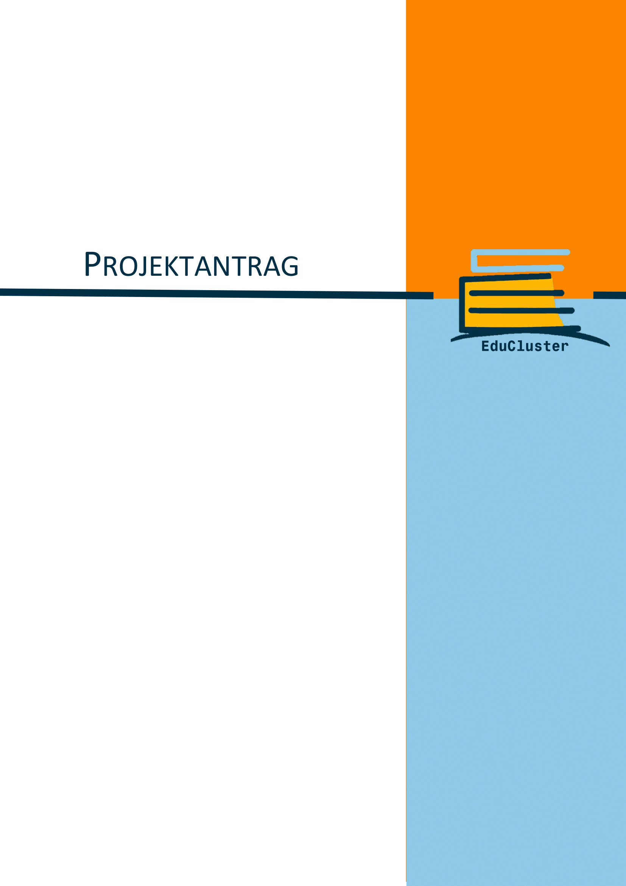

:sectnums:
:sectnumlevels: 3

<<<

== Projektantrag

=== Inhalt des Diplomarbeitsantrages
Die nachfolgenden Punkte umfassen den Inhalt des Diplomarbeitsantrages für das Projekt „EduCluster“.

=== Schule
Höhere technische Bundeslehr- und Versuchsanstalt PINKAFELD

=== Abteilung
Hauptverantwortlich: Informatik

=== AV
Hauptverantwortlich: AV Prof. Mag. Thomas Gabriel, BSc

=== Abschließende prüfung
xx.05.2023

=== Betreuer/innen
Hauptverantwortlich: Prof. MMag. Bernd Hochwarter +
Andere: Prof. Dipl.-Inf. David Zach

=== Ausgangslage
Bis dato werden Raumreservierungen in der HTL Pinkafeld ausschließlich über WebUntis und nur von Professoren abgewickelt. Schüler/innen können sich einzig zu Lerneinheiten außerhalb der Klassenräume verabreden oder vor Ort nach freien Klassenräumen suchen, in welchen sie möglicherweise nicht ausreichend lange bleiben können aufgrund einer später dort stattfindenden Unterrichtseinheit.

=== Projektteam (Arbeitsaufwand)
[%header, cols="3,5,1,2"]
|===
|Name |Individuelle Themenstellung |Klasse |Arbeitsaufwand
|Lara Kammerer (Hauptverantwortlich)| Datenbankarchitektur, Datenbankanbindung, Requirements Engineering| 7YCIF| 180 Stunden
|Christoph Kiessewetter| Konzeption und Durchführung der Integration von externer Software zur Unterstützung des Lernerfolges| 7YBIF| 180 Stunden
|Raymond Denis Vladu| Konzeption der gesamten Frontend-Applikation unter Berücksichtigung der aktuellen UX und UI-Designvorgaben|7YBIF| 180 Stunden
|===

=== Projektpartner
HTL Pinkafeld, Abteilung Informatik +
Meierhofplatz 1 +
7423 Pinkafeld +
AV IF

=== Untersuchungsanliegen der individuellen Themenstellungen
Folgende Untersuchungsanliegen sind für die einzelnen Teammitglieder vorgesehen:

Lara Kammerer: Evaluierung der zu verwendenden Datenbank, sowie deren Bereitstellung. Konzeption und Implementierung der Backend-Logik in Kooperation mit den bereitgestellten Anbindungen. Datenerhebung zusätzlicher Informationen zur Unterstützung des Terminerstellungsprozesses.

Christoph Kiessewetter: Evaluierung der anzuwendenden Testing-Techniken bzw. der automatisierten Testing-Tools. Integration von Microsoft-Teams und Untis zur Unterstützung des Lernerfolges.

Raymond Denis Vladu: Evaluierung der Frameworks und Libraries unter Berücksichtigung der aktuellen Standards. Designen der GUI nach Erkenntnissen aufgrund der UX-Evaluierung.

=== Zielsetzung
Die responsive WebApp stellt die Möglichkeit zur Verfügung, sich zu digitalen "Lernclustern" zusammenzufinden. Die Auswahl findet aufgrund von angekündigten Themenbereichen, Räumen und Übungszeiten statt. Unter zu Hilfenahme von Schnittstellen zu vorhandenen Systemen (WebUntis, Microsoft-Teams) wird die Zeitplanung bzw. die externe Userberechtigung durchgeführt.

=== Geplantes Ergebnis der Prüfungskandidatin/des Prüfungskandidaten
Lara Kammerer:  Backend, gemäß den Anforderungen und den Erkenntnissen aus der Evaluierung implementiert und zur Verfügung gestellt

Christoph Kiessewetter: Integration von Microsoft-Teams und Untis in EduCluster inkl. nachvollziehbarem und dokumentiertem Testergebnis

Raymond Denis Vladu: Frontendapplikation, erstellt gemäß geltenden UX- und UI Richtlinien

=== Meilensteine
[cols="1,3"]
|===
|26.09.2022|Projektantrag eingereicht
|10.10.2022|Requirements Engineering abgeschlossen
|31.10.2022|Datenbank- und Tech-Stack-Evaluierungen abgeschlossen
|14.11.2022|Datenbankmodell entworfen und Test-Datenbank aufgesetzt
|31.01.2023|Implementierung des Prototyps abgeschlossen
|15.02.2023|Tests des Prototyps abgeschlossen
|01.03.2023|Implementierung abgeschlossen
|15.03.2023|Tests abgeschlossen
|20.03.2023|GO Live durchführen
|31.03.2023|Projekt abgeschlossen
|===

=== Rechtliche Reglung (mit dem/den Projektpartner/n erfolgt durch)
wird gesondert vereinbart

:sectnums!:
