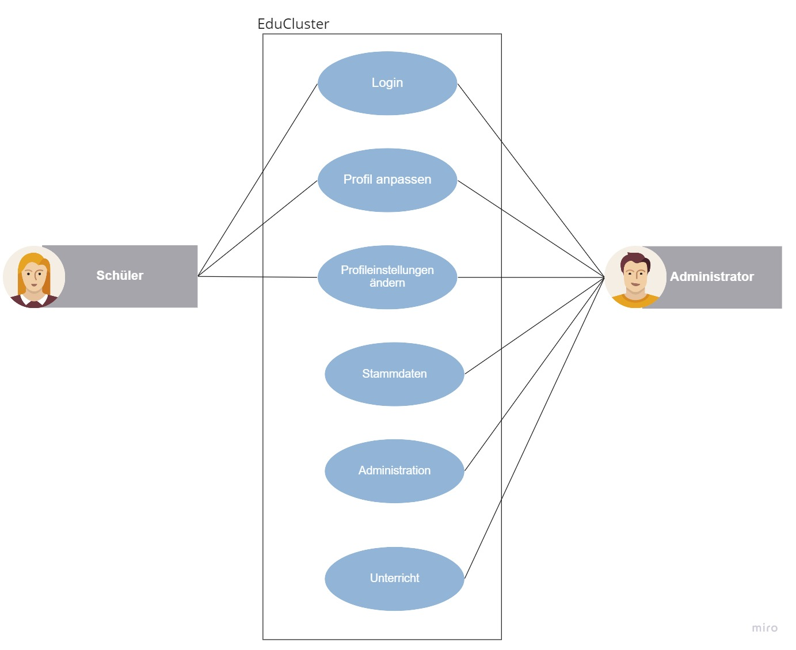
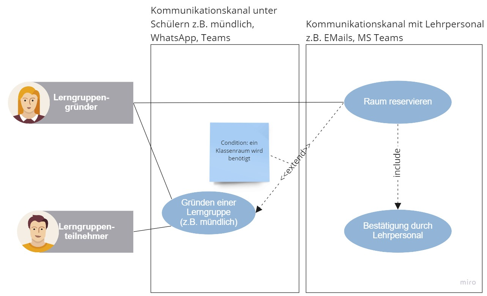
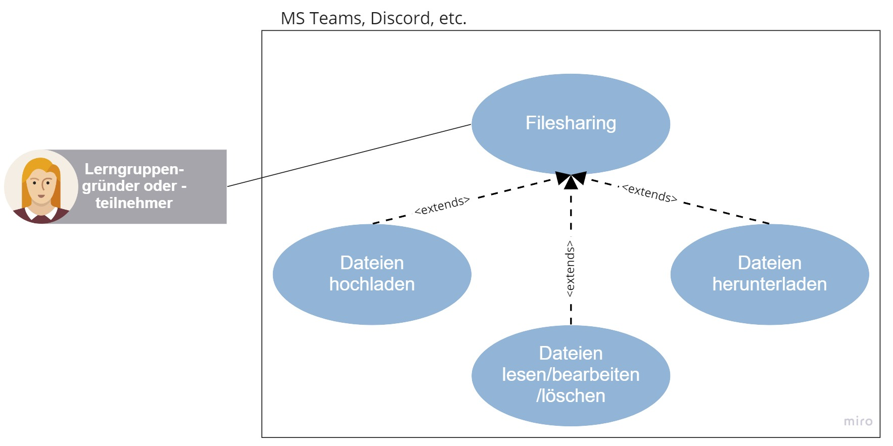
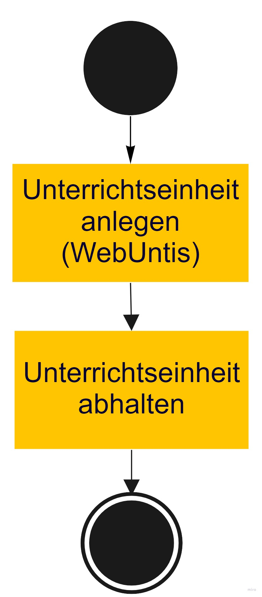
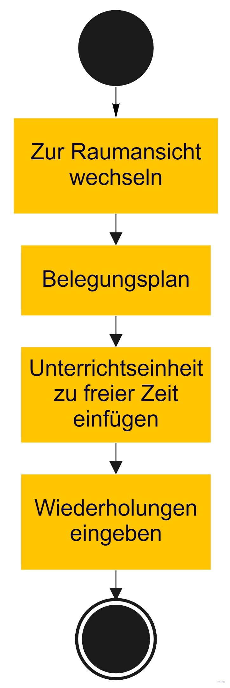

Vorstudie

:sectnums:
:sectnumlevels: 3
== Projekt: „EduCluster“
[discrete]
=== Projekt: EduCluster
//TODO Vorstudie einfügen und GENDERN!!

=== Einleitung
Diese Vorstudie beschreibt die notwendigen Rahmenbedingungen, welche zur Umsetzung der EduCluster Webapplikation für die HTL Pinkafeld notwendig sind. Die Ausgangssituation zeigt das Verbesserungspotential für das Projekt EduCluster auf.

Im Kapitel Zieldefinition werden die festgelegten Ziele erläutert. Wie genau diese umgesetzt werden, wird in den Kapiteln Anforderungen und Analyse der IST und SOLL Prozesse näher beschrieben.

Weiters ist auch das Software-Design, als auch deren Systemarchitektur, im Kapitel Software-Design genauer beschrieben.

=== Auftraggeber Beschreibung
Der Auftraggeber des EduCluster Projektes ist die HTL Pinkafeld. Die Schule ist an der innovativen Lösung des Projektes interessiert, bestehende, bereits verwendete Produkte miteinander zu kombinieren und diese einfach über eine Plattform erreichbar zu machen.

Die HTL Pinkafeld ist mit ihrem aktuellen Stand der Dinge nicht zufrieden. Die Kombination erlaubt der Schule, ihre tagtäglichen Prozesse simpler und übersichtlicher abzuwickeln und somit deren Ablauf und Darstellung für alle Beteiligten, den Schüler/innen und Professor/innen, verständlich zu machen.

=== Auftragnehmer Beschreibung
Die Auftragnehmer bestehen aus folgenden Teammitgliedern:
[%header,format=csv]
|===
Bild, Beschreibung
Bild von HOBE, Prof. MMag. Bernd Hochwarter Projektbetreuer Tel.: +43 664 917 26 79 E-Mail: bernd.hochwarter@htlpinkafeld.at Meierhofplatz 1 7423 Pinkafeld
Bild von ZADA, Prof. Dipl.-Inf. David Zach Technischer Betreuer Tel.: +43 3357 424 91 260 E-Mail: david.zach@htlpinkafeld.at Meierhofplatz 1 7423 Pinkafeld
Bild von Lara, Lara Kammerer Requirements Engineer Entwicklerin Datenbankarchitektin Klasse: 7YCIF E-Mail: lara.kammerer@htlpinkafeld.at GitHub: https://github.com/fiadora 2351 Wiener Neudorf
Bild von Christoph, Christoph Kiessewetter Tester Operations Entwickler Klasse: 7YBIF E-Mail: christoph.kiessewetter@htlpinkafeld.at GitHub: https://github.com/ChristophKiessewetter 7463 Oberpodgoria
Bild von Denis, Raymond Denis Vladu Entwickler Softwarearchitekt Klasse: 7YBIF E-Mail: raymond.vladu@htlpinkafeld.at GitHub: https://github.com/vladudenis 7400 Oberwart
|===

=== Analyse
In den folgenden Kapiteln wird der IST-Zustand, die Ausgangssituation, kurz und detailliert beschrieben. Eine SWOT-Analyse des IST-Zustandes, sowie eine detaillierte Beschreibung der IST-Prozesse ist ebenfalls enthalten.

==== Ausgangssituation
Bis dato werden Raumreservierungen ausschließlich über WebUntis abgewickelt. Ebenso kann dies nur von Professor/innen oder Administrator/innen in WebUntis durchgeführt werden. Schüler/innen können sich entweder in nicht belegten Räumen zusammenfinden, ohne zuvor die Lerneinheit für weitere Mitschüler/innen sichtbar zu machen oder den Studiersaal besuchen, bei welchem nur selten auf ein individuelles Themengebiet eingegangen werden kann.

Daher ergeben sich folgende Verbesserungspotentiale, die umgesetzt werden sollen:

==== "Quick & Easy" Räume für Lerngruppen reservieren
Es soll Schüler/innen die Möglichkeit geboten werden, Lerngruppen zu erstellen und benötigte Räume zu belegen. Somit kann ein überfüllter Studiersaal entlastet werden.
Oftmals wollen mehrere Schüler/innen einer Klasse den gleichen Lernstoff im Falle einer kurz darauffolgenden Schularbeit aufarbeiten. Der Studiersaal bietet hier zum Austausch betroffener Schüler/innen nicht die richtige Umgebung, da durch ebendiesen Austausch derer andere Mitschüler/innen aufgrund der Ablenkung in ihrem Lernprozess negativ beeinflusst werden können. Es soll daher künftig möglich sein, mehrere Schüler/innen mit demselben Anliegen in einzelnen Räumen unterzubringen, um sich dort auch ausgiebig in den gewünschten Themenbereichen austauschen zu können.

==== Lerngruppen mit übersichtlichem File-Sharing
Unterrichtseinheiten werden durch die hohe Menge an Lehrstoff schnell überfordernd oder unübersichtlich - ebenso die Lernunterlagen. Zudem finden im Moment die einzelnen Prozesse stets auf unterschiedlichen Plattformen statt. Während zum Anlegen der Einheiten ausschließlich WebUntis genutzt wird, werden für das Abhalten und zur Dokumentbereitstellung weitere Plattformen genutzt – mal MS Teams, mal LMS und mal das lokale Schullaufwerk, je nach Vor- und Nachteilen bei Unterricht vor Ort oder im Distance Learning bzw. nach Präferenz der einzelnen Lehrkräfte. Um die Effizienz einer solchen Einheit jedoch durch ebendiese Unübersichtlichkeit der vielen Unterlagen nicht zu schwächen, stellt “EduCluster” eine einfach zu bedienende Verbindung zu MS Teams zur Verfügung. Hier können Dokumente im Unterricht bearbeitet und freigeben werden. Somit sind alle Übungsmaterialien schnell und übersichtlich auf einer einzelnen Plattform für weiterführende Lerneinheiten verfügbar.

==== Lernevents planen
Um den Schüler/innen stressige Situationen, wie hektische Test-Saisonen, zu erleichtern, ermöglicht “EduCluster” es ihnen, neben der spontanen Reservierung von Räumen ebenso Räume im Voraus, über mehrere Wochen hinweg, zu planen. Durch das automatische Erstellen eines MS Teams Channels/Teams kann ebenso auf eine Online Session zurückgegriffen werden. Die Entscheidung, wie diese Lernevents geplant werden, ist noch nicht gefallen, weshalb in den folgenden Absätzen dieses Dokumentes beides zu lesen ist.

Aus den oben erwähnten Gründen möchte das Projektteam „EduCluster“ eine Webapplikation entwickeln, die es Schüler/innen ermöglicht, Lerngruppen zu organisieren, Lernsitzungen zu planen und Räume für den geplanten Lernsitzungen zu buchen.

Die App wird somit als eine Verbindung von WebUntis und MS Teams über eine benutzerfreundliche Bedienoberfläche, mit der Zusatzfunktion zur Bildung von Lerngruppen mit gegebenenfalls Raumreservierung umgesetzt.

=== IST-Prozesse
Die momentane Situation an der HTL Pinkafeld lässt keine einheitliche Erstellung von Unterrichtseinheiten und Lerneinheiten zur gemeinsamen Weiterbildung der Schüler/innen zu. Es existiert noch kein zentrales System, das ebenso von Schüler/innen genutzt werden kann, um sich zu Lerngruppen zusammenzufinden und geeignete Räume zu diesen Vorhaben zur Verfügung zu stellen.

Es kann ein Use Case zu allgemeinen Einstellungen auf dem Profil wie folgt erstellt werden. Während ein/e Schüler/in ausschließlich die Berechtigung zum Login, Anpassen seines/ihres eigenen Profils und seiner/ihrer Profileinstellungen hat, kann ein/e Administrator/in in EduCluster noch zusätzlich zu seinem/ihrem Profil auch die der anderen Mitnutzer/innen ändern, ebenso wie Stammdaten zu den Räumen und Themen, Unterrichtseinheiten als auch Lerneinheiten aller Personen bearbeiten als auch Löschen und sonstige administrative Handlungen durchführen.

.Master Use Case - IST: Einstellungen ändern

Der Use Case zur Bildung ebendieser Lerngruppen kann momentan einzig wie unten angeführt aussehen. Es muss ein/e Schüler/in, hier dargestellt als Lerngruppengründer/in, persönlich oder per Messenger gemeinsam mit seinen/ihren Klassenkameraden/innen eine gemeinsame Lerneinheit planen. Im Anschluss kann der/die Lerngruppenadministrator/in oder eine/r der Teilnehmer/innen bei Bedarf einen geeigneten Raum suchen, der hierfür genutzt wird. Hier wird jedoch keine Plattform angeboten, die zu entsprechendem Zeitpunkt ungenutzte Klassenräume veranschaulicht und somit zu einer Reservierung zur Verfügung stellt, weshalb das Lehrpersonal auf einem der gegebenen Wege erreicht werden muss.

.Master Use Case - IST: Lerngruppenbildung persönlich/über Messenger

Im Anschluss wird die Lerneinheit im Moment wie folgt durchgeführt. Vom/Von der Lerngruppengründer/in wird ein virtueller Raum in MS Teams händisch erstellt, wofür die Erstellung eines Teams mitsamt aller Lerngruppenteilnehmer/innen zuvor nötig wird. Im Anschluss kann die Lerntätigkeit von der gesamten Lerngruppe ausgeübt werden. Hierzu kann sowohl von einem Voice oder Video-Call, einem Whiteboard als auch Filesharing Gebrauch gemacht werden.

.Master Use Case - IST: Durchführung einer Remote Lerneinheit
image::Bilder Diagramme Vorstudie/UseCaseIST-DurchführungEinerRemoteLerneinheit.jpg[LerneinheitIst]

Das Filesharing selbst ergibt sich dann, wie im Anschluss gezeigt, aus dem Hochladen, gemeinsamen Bearbeiten oder Löschen und Herunterladen der einzelnen Files aus MS Teams.

.Master Use Case - IST: Filesharing

Unterrichtseinheiten hingegen steht bereits ein System zur Verfügung, welches zur Raumreservierung herangezogen wird – WebUntis. Zusammengefasst von einem Master IST-Prozess zum Anlegen und Abhalten der Unterrichtseinheiten können folgende Prozesse identifiziert werden:

. Unterrichtseinheiten anlegen
. Unterrichtseinheiten abhalten & Dokumentenbereitsstellung

.Master IST-Prozess: Unterrichtseinheiten anlegen & abhalten

Der Master IST-Prozess gliedert sich in die unten dargestellten IST Prozesse.

Zum Anlegen einer Unterrichtseinheit muss in WebUntis zuerst die Wochenplanansicht des gewünschten Raumes geöffnet werden, welche die bereits gebuchte Belegung des Raumes darstellt. Hier kann im Anschluss, wie von Kalender-Programmen gewohnt, ein weiterer Termin, also eine Unterrichtseinheit, hinzugefügt werden. Es können im Anschluss sämtliche weiteren Daten zu der Unterrichtseinheit angegeben werden, sowie ein Wiederholungsintervall.

.IST-Prozess: Unterrichtseinheiten anlegen

Das Abhalten der Unterrichtseinheit wird bei momentanen Möglichkeiten unterschieden in zwei Varianten: vor Ort, in einem physischen Raum oder roomless, wobei sich die zweitere Variante zumeist einer Microsoft Teams-Besprechung bedient oder anhand von Selbststudiumsunterlagen erfolgt. Die MS Teams-Besprechung wird hierbei anhand von Screensharing betrieben. Bei beiden Methoden können im Anschluss oder bereits während der Sitzung zusätzliche Dokumente hochgeladen werden. Das Medium hierzu unterscheidet sich bisher jedoch noch stark. Während von manchen Lehrkräften ebenso die MS Teams Datenablage genutzt wird, verwenden andere den klassischen E-Mail-Weg.

.IST-Prozess: Unterrichtseinheiten abhalten & Dokumentenbereitstellung

=== SWOT-Analyse im IST-Zustand
Eine SWOT-Analyse zeigt den aktuellen Status der Umgebung, sowie ihre Möglichkeiten zur Verbesserung auf. ‚Opportunities‘ stellen das Potential im momentanen Umfeld dar, während ‚Threats‘ die Risiken des Schulbetriebs derzeit aufweisen. ‚Strengths‘ und ‚Weaknesses‘ sollen zudem noch die Stärken und Schwächen des Schulbetriebs darstellen. Diese Analyse wird im IST-Zustand des Systems durchgeführt.

//TODO: SWOT Analyse anpassen: Opportunities und Threats = Einflüsse von Außen?
[%SWOT-Analyse,cols=2*]
.SWOT-Analyse
|===
| *Opportunities*

* es kann eine erhöhte Benutzerfreundlichkeit und Übersicht erzielt werden – Vereinheitlichung des Systems
* das Raumbuchungssystem kann auf Schüler/innen ausgeweitet werden – Rückzugsort zum Lernen
* es kann ein zusätzlicher Fokus auf Verbreitung des Wissens unter den Schüler/innen gelegt werden – Hilfe untereinander

| *Threats*

* bereits eingeführte Plattformen durch innovative Funktionen zur Lernunterstützung
* willkürliche Belegung von Räumen durch Schüler/innen – muss durch Administrator/in immer aufgelöst werden

|*Strengths*

* es können alle Funktionen der verschiedenen Plattformen genutzt werden – Vielfältigkeit im Lernprozess
* Raumbuchungen von Lehrpersonal oder Administrator/innen auf WebUntis möglich – keine Probleme durch willkürliche Belegung von Räumen durch Schüler/innen
* WebUntis ist erweiterbar

|*Weaknesses*

* zu viele verschiedene Plattformen in Verwendung – Unübersichtlichkeit
* auf jeder Plattform wird erst Einarbeitungszeit benötigt - Komplexität
* Raumbuchungen nur von Lehrpersonal oder Administrator/innen möglich – Lerngruppen haben keinen Ort zum konzentrierten Lernen
* durch ausschließlich persönliche Lerngruppenbildung kein Durchmischen über Klassengrenzen hinaus – gegenseitige Hilfe nicht möglich

|===

:sectnums!:
