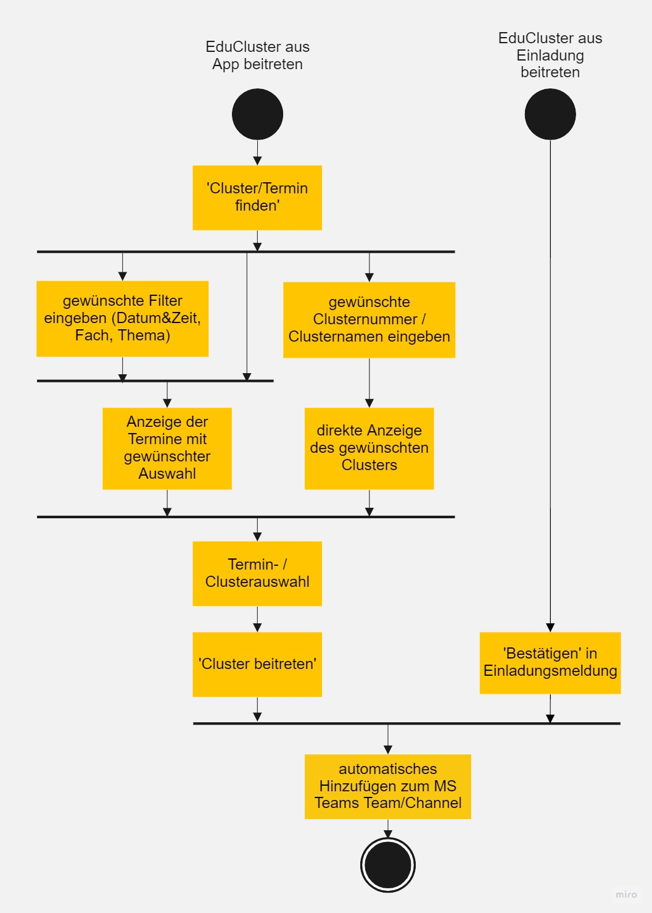

:sectnums:
:sectnumlevels: 3

<<<

== Vorstudie

=== Einleitung
//TODO Lara: Deckblatt ganzseitig einfügen

Diese Vorstudie beschreibt die notwendigen Rahmenbedingungen, welche zur Umsetzung der EduCluster Webapplikation für die HTL Pinkafeld notwendig sind. Die Ausgangssituation zeigt das Verbesserungspotential für das Projekt EduCluster auf.

Im Kapitel Zieldefinition werden die festgelegten Ziele erläutert. Wie genau diese umgesetzt werden, wird in den Kapiteln Anforderungen und Analyse der IST- und SOLL-Prozesse näher beschrieben.

Weiters ist auch das Software-Design, als auch deren Systemarchitektur, im Kapitel Software-Design genauer beschrieben.

=== Auftraggeber Beschreibung
Der Auftraggeber des EduCluster Projektes ist die HTL Pinkafeld. Die Schule ist an der innovativen Lösung des Projektes interessiert, bestehende, bereits verwendete Produkte miteinander zu kombinieren und diese einfach über eine Plattform erreichbar zu machen.

Die HTL Pinkafeld ist mit ihrem aktuellen Stand der Dinge nicht zufrieden. Die Kombination erlaubt der Schule, ihre tagtäglichen Prozesse simpler und übersichtlicher abzuwickeln und somit deren Ablauf und Darstellung für alle Beteiligten, den Schüler/innen und Professor/innen, verständlich zu machen.

=== Auftragnehmer Beschreibung
Die Auftragnehmer bestehen aus folgenden Teammitgliedern:

.Betreuer
[%header, cols="1,2"]
|===
|Bild|Beschreibung
^a|image::img/Bilder Vorstudie/HOBE.png[]
|Prof. MMag. Bernd Hochwarter +
Projektbetreuer +
Tel.: +43 664 917 26 79 +
E-Mail: bernd.hochwarter@htlpinkafeld.at +
Meierhofplatz 1 7423 Pinkafeld
^a|image::img/Bilder Vorstudie/ZADA.jpg[]
|Prof. Dipl.-Inf. David Zach +
Technischer Betreuer +
Tel.: +43 3357 424 91 260 +
E-Mail: david.zach@htlpinkafeld.at +
Meierhofplatz 1 7423 Pinkafeld
|===
//TODO Denis: Bild einfügen
//TODO Christoph: Bild einfügen
.Teammitglieder
[%header, cols="1,2"]
|===
|Bild|Beschreibung
^a|image::img/lara/Foto.png[]
|Lara Kammerer +
Requirements Engineer, Entwicklerin, Datenbankarchitektin +
Klasse: 7YCIF +
E-Mail: lara.kammerer@htlpinkafeld.at +
GitHub: https://github.com/KammererLara +
2351 Wiener Neudorf
|Bild von Christoph|Christoph Kiessewetter +
Tester, Operations, Entwickler +
Klasse: 7YBIF +
E-Mail: christoph.kiessewetter@htlpinkafeld.at +
GitHub: https://github.com/ChristophKiessewetter +
7463 Oberpodgoria
^a|image::img/raymond/Foto.png[]|Raymond Denis Vladu +
Entwickler, Softwarearchitekt +
Klasse: 7YBIF +
E-Mail: raymond.vladu@htlpinkafeld.at +
GitHub: https://github.com/vladudenis +
7400 Oberwart
|===

=== Analyse
In den folgenden Kapiteln wird der IST-Zustand, die Ausgangssituation, kurz und detailliert beschrieben. Eine SWOT-Analyse des IST-Zustandes, sowie eine detaillierte Beschreibung der IST-Prozesse ist ebenfalls enthalten.

==== Ausgangssituation
Bis dato werden Raumreservierungen ausschließlich über WebUntis abgewickelt. Ebenso kann dies nur von Lehrkräften oder Administrierenden in WebUntis durchgeführt werden. Schüler/innen können sich entweder in nicht belegten Räumen zusammenfinden, ohne zuvor die Lerneinheit für weitere Mitschüler/innen sichtbar zu machen oder den Studiersaal besuchen, bei welchem nur selten auf ein individuelles Themengebiet eingegangen werden kann.

Daher ergeben sich folgende Verbesserungspotentiale, die umgesetzt werden sollen:

. "Quick & Easy" Räume für Lerngruppen reservieren
+
Es soll Schüler/innen die Möglichkeit geboten werden, Lerngruppen zu erstellen und benötigte Räume zu belegen. Somit kann ein überfüllter Studiersaal entlastet werden.
Oftmals wollen mehrere Schüler/innen einer Klasse den gleichen Lernstoff im Falle einer kurz darauffolgenden Schularbeit aufarbeiten. Der Studiersaal bietet hier zum Austausch betroffener Schüler/innen nicht die richtige Umgebung, da durch ebendiesen Austausch derer andere Mitschüler/innen aufgrund der Ablenkung in ihrem Lernprozess negativ beeinflusst werden können. Es soll daher künftig möglich sein, mehrere Schüler/innen mit demselben Anliegen in einzelnen Räumen unterzubringen, um sich dort auch ausgiebig in den gewünschten Themenbereichen austauschen zu können.

. Lerngruppen mit übersichtlichem File-Sharing
+
Unterrichtseinheiten werden durch die hohe Menge an Lehrstoff schnell überfordernd oder unübersichtlich - ebenso die Lernunterlagen. Zudem finden im Moment die einzelnen Prozesse stets auf unterschiedlichen Plattformen statt. Während zum Anlegen der Einheiten ausschließlich WebUntis genutzt wird, werden für das Abhalten und zur Dokumentbereitstellung weitere Plattformen genutzt – mal Microsoft-Teams, mal LMS (Lernen Mit System, ein Lernmanagementsystem) und mal das lokale Schullaufwerk, je nach Vor- und Nachteilen bei Unterricht vor Ort oder im Distance Learning bzw. nach Präferenz der einzelnen Lehrkräfte. Um die Effizienz einer solchen Einheit jedoch durch ebendiese Unübersichtlichkeit der vielen Unterlagen nicht zu schwächen, stellt EduCluster eine einfach zu bedienende Verbindung zu Microsoft-Teams zur Verfügung. Hier können Dokumente im Unterricht bearbeitet und freigeben werden. Somit sind alle Übungsmaterialien schnell und übersichtlich auf einer einzelnen Plattform für weiterführende Lerneinheiten verfügbar.

. Lernevents planen
+
Um den Schüler/innen stressige Situationen, wie hektische Test-Saisonen, zu erleichtern, ermöglicht EduCluster es ihnen, neben der spontanen Reservierung von Räumen ebenso Räume im Voraus, über mehrere Wochen hinweg, zu planen. Durch das automatische Erstellen eines Microsoft-Teams-Teams/Channels kann ebenso auf eine Online Session zurückgegriffen werden. Die Entscheidung, wie diese Lernevents geplant werden, ist noch nicht gefallen, weshalb in den folgenden Absätzen dieses Dokumentes beides zu lesen ist.

Aus den oben erwähnten Gründen möchte das Projektteam „EduCluster“ eine Webapplikation entwickeln, die es Schüler/innen ermöglicht, Lerngruppen zu organisieren, Lernsitzungen zu planen und Räume für den geplanten Lernsitzungen zu buchen.

Die App wird somit als eine Verbindung von WebUntis und Microsoft-Teams über eine benutzerfreundliche Bedienoberfläche, mit der Zusatzfunktion zur Bildung von Lerngruppen mit gegebenenfalls Raumreservierung umgesetzt.

==== IST-Prozesse
Die momentane Situation an der HTL Pinkafeld lässt keine einheitliche Erstellung von Unterrichtseinheiten und Lerneinheiten zur gemeinsamen Weiterbildung der Schüler/innen zu. Es existiert noch kein zentrales System, das ebenso von Schüler/innen genutzt werden kann, um sich zu Lerngruppen zusammenzufinden und geeignete Räume zu diesen Vorhaben zur Verfügung zu stellen.

Es kann ein Use Case zu allgemeinen Einstellungen auf dem Profil wie folgt erstellt werden. Während ein Schüler/eine Schülerin ausschließlich die Berechtigung zum Login, Anpassen seines/ihres eigenen Profils und seiner/ihrer Profileinstellungen hat, kann ein Administrator/eine Administratorin in EduCluster noch zusätzlich zu seinem/ihrem Profil auch die der anderen Mitnutzer/innen ändern, ebenso wie Stammdaten zu den Räumen und Themen, Unterrichtseinheiten als auch Lerneinheiten aller Personen bearbeiten als auch Löschen und sonstige administrative Handlungen durchführen.

.Use Case - IST: Einstellungen ändern
image::img/Bilder Diagramme Vorstudie/UseCaseIST-EinstellungenÄndern.jpg[]

Der Use Case zur Bildung ebendieser Lerngruppen kann momentan einzig wie unten angeführt aussehen. Es muss ein Schüler/eine Schülerin, hier dargestellt als Lerngruppengründer/in, persönlich oder per Messenger gemeinsam mit seinen/ihren Klassenkameraden/innen eine gemeinsame Lerneinheit planen. Im Anschluss kann der/die Lerngruppenadministrator/in oder einer der Teilnehmer/eine der Teilnehmerinnen bei Bedarf einen geeigneten Raum suchen, der hierfür genutzt wird. Hier wird jedoch keine Plattform angeboten, die zu entsprechendem Zeitpunkt ungenutzte Klassenräume veranschaulicht und somit zu einer Reservierung zur Verfügung stellt, weshalb das Lehrpersonal auf einem der gegebenen Wege erreicht werden muss.

.Use Case - IST: Lerngruppenbildung persönlich/über Messenger
image::img/Bilder Diagramme Vorstudie/UseCaseIST-Lerngruppenbildung.jpg[]

Im Anschluss wird die Lerneinheit im Moment wie folgt durchgeführt. Vom Lerngruppengründer/Von der Lerngruppengründerin wird ein virtueller Raum in Microsoft-Teams händisch erstellt, wofür die Erstellung eines Teams mitsamt aller Lerngruppenteilnehmer/innen zuvor nötig wird. Im Anschluss kann die Lerntätigkeit von der gesamten Lerngruppe ausgeübt werden. Hierzu kann sowohl von einem Voice oder Video-Call, einem Whiteboard als auch Filesharing Gebrauch gemacht werden.

.Use Case - IST: Durchführung einer Remote Lerneinheit
image::img/Bilder Diagramme Vorstudie/UseCaseIST-DurchführungEinerRemoteLerneinheit.jpg[]

Das Filesharing selbst ergibt sich dann, wie im Anschluss gezeigt, aus dem Hochladen, gemeinsamen Bearbeiten oder Löschen und Herunterladen der einzelnen Files aus Microsoft-Teams.

.Use Case - IST: Filesharing
image::img/Bilder Diagramme Vorstudie/UseCaseIST-Filesharing.jpg[]

Unterrichtseinheiten hingegen steht bereits ein System zur Verfügung, welches zur Raumreservierung herangezogen wird – WebUntis. Zusammengefasst von einem Master IST-Prozess zum Anlegen und Abhalten der Unterrichtseinheiten können folgende Prozesse identifiziert werden:

. Unterrichtseinheiten anlegen
. Unterrichtseinheiten abhalten & Dokumentenbereitsstellung

.Master IST-Prozess: Unterrichtseinheiten anlegen & abhalten
image::img/Bilder Diagramme Vorstudie/ISTProzess-UnterrichtseinheitAnlegenAbhalten.jpg[width=150]

Der Master IST-Prozess gliedert sich in die unten dargestellten IST-Prozesse.

Zum Anlegen einer Unterrichtseinheit muss in WebUntis zuerst die Wochenplanansicht des gewünschten Raumes geöffnet werden, welche die bereits gebuchte Belegung des Raumes darstellt. Hier kann im Anschluss, wie von Kalender-Programmen gewohnt, ein weiterer Termin, also eine Unterrichtseinheit, hinzugefügt werden. Es können im Anschluss sämtliche weiteren Daten zu der Unterrichtseinheit angegeben werden, sowie ein Wiederholungsintervall.

.IST-Prozess: Unterrichtseinheiten anlegen
image::img/Bilder Diagramme Vorstudie/ISTProzess-UnterrichtseinheitAnlegen.jpg[width=150]

Das Abhalten der Unterrichtseinheit wird bei momentanen Möglichkeiten unterschieden in zwei Varianten: vor Ort, in einem physischen Raum oder roomless, wobei sich die zweitere Variante zumeist einer Microsoft-Teams-Besprechung bedient oder anhand von Selbststudiumsunterlagen erfolgt. Die Microsoft-Teams-Besprechung wird hierbei anhand von Screensharing betrieben. Bei beiden Methoden können im Anschluss oder bereits während der Sitzung zusätzliche Dokumente hochgeladen werden. Das Medium hierzu unterscheidet sich bisher jedoch noch stark. Während von manchen Lehrkräften ebenso die Microsoft-Teams Datenablage genutzt wird, verwenden andere den klassischen E-Mail-Weg.

.IST-Prozess: Unterrichtseinheiten abhalten & Dokumentenbereitstellung

=== SWOT-Analyse im IST-Zustand
Eine SWOT-Analyse zeigt den aktuellen Status der Umgebung, sowie ihre Möglichkeiten zur Verbesserung auf. "Opportunities" stellen das Potential im momentanen Umfeld dar, während "Threats" die Risiken des Schulbetriebs derzeit aufweisen. "Strengths" und "Weaknesses" sollen zudem noch die Stärken und Schwächen des Schulbetriebs darstellen. Diese Analyse wird im IST-Zustand des Systems durchgeführt.

//TODO? check David
[%SWOT-Analyse,cols=2*]
.SWOT-Analyse
|===
a| *Opportunities*

* Nutzungswunsch von weiteren Unterrichtseinrichtungen - Möglichkeit zur Erweiterung auf weitere Schulen
* Wunsch von Schülern/Schülerinnen zu Apps auf verschiedenen Geräten - Erweiterbarkeit auf Smartphones, Tablets, Smartwatches und mehr

a| *Threats*

* Änderungen in WebUntis- oder Microsoft-Teams-Schnittstelle
* neuartiges Raumreservierungssystem, das die Clusterbildung ablöst

a|*Strengths*

* es können alle Funktionen der verschiedenen Plattformen genutzt werden – Vielfältigkeit im Lernprozess
* es kann eine erhöhte Benutzerfreundlichkeit und Übersicht erzielt werden – Vereinheitlichung des Systems
* das Raumbuchungssystem kann auf Schüler/innen ausgeweitet werden – Rückzugsort zum Lernen
* es kann ein zusätzlicher Fokus auf Verbreitung des Wissens unter den Schüler/innen gelegt werden – Hilfe untereinander

a|*Weaknesses*

* willkürliche Belegung von Räumen durch Schüler/innen – muss durch Administrator/in immer aufgelöst werden
* Überbelegungen der Räume durch Schüler/innen möglich wodurch keine Räume mehr für Unterrichtsänderungen frei sind

|===

Aus der oberhalb dargestellten SWOT-Matrix kann deutlich das Potential in der Übersicht über die verschiedenen genutzten Plattformen erkannt werden. Jedoch bringt dieses Potential bei einer Vereinheitlichung und Reduktion auf ausgewählte Plattformen, wie dargestellt das Risiko durch die nicht genutzten Funktionen der nicht mehr genutzten Plattformen mit.

Ebenso deutlich wird eine fehlende Möglichkeit an Lerngruppenbildung über Klassengrenzen hinausgehend als auch zur Raumreservierung von Schüler/innen zum Rückzug für Lernaktivitäten in ebendiesen Lerngruppen. Auch dieses Potential birgt aber bei der Lösung das Risiko in sich, dass es durch die Willkür von Schüler/innen bei der Raumbuchung zu Konflikten mit Raumbuchungen für Unterrichtseinheiten kommen kann, welche eigens von einem/einer Administrator/in aufgelöst werden müssen.

=== Zieldefinition
In den folgenden Absätzen werden die Zielgrößen geschildert und beschrieben, die Liefergegenstände erklärt, sowie EduClusters Nicht-Ziele deklariert.

==== Zielgrößen
Das Hauptziel des Projektes EduCluster ist die Verbindung von Plattformen, um die Lernaktivitäten von Studierenden zu unterstützen. Dieses Hauptziel kann in folgende Zielgrößen gegliedert werden:

. *Schaffen von Übersicht über die Nutzung eines einzigen Tools zur remote Unterrichtseinheit & Dokumentenbereitstellung*
+
Momentan werden verschiedenste Tools zu Remote Sessions sowie zum Filesharing genutzt – welches gewählt wird variiert oft durch Präferenzen des Lehrpersonals. Das kann schnell zu nicht ausreichender Übersicht bei den Schülern/Schülerinnen führen.
Durch EduCluster soll dies zu einem Tool zusammengeführt werden, da beim Eröffnen eines Clusters direkt und automatisch ein Microsoft-Teams-Team/Channel erstellt wird. Bei jedem Anlegen eines Termins wird somit ebenso automatisch ein Termin in Microsoft-Teams angelegt, der entweder online genutzt werden kann, oder vor Ort stattfinden kann und das Team, das diesen Termin angelegt hat, kann direkt zum Filesharing genutzt werden.

. *Vereinfachung der Bedienoberfläche bei der Vielzahl an genutzten Plattformen*
+
Die Bedienoberfläche soll die Vielzahl an genutzten Plattformen einfach und benutzerfreundlich darstellen. Es soll mit einem Button-Klick das gewünschte Team in Microsoft-Teams geöffnet werden können, oder ein Termin in sowohl Microsoft-Teams oder WebUntis angezeigt werden, je nach Wunsch. Die Handhabung der vielen Tools auf einmal wird somit drastisch vereinfacht und übersichtlicher gestaltet.

. *Erweiterung des WebUntis-Raumreservierungsfeatures für alle Benutzenden*
+
WebUntis bietet das Feature, einen Raum für eine Unterrichtseinheit zu reservieren, zurzeit nur für Lehrkräfte. Aufgrund von komplizierter Handhabung dieser Reservierung, wird jedoch häufig bei spontaner Nutzung eines Raumes darauf verzichtet, diesen zu buchen. Oft ergibt sich dadurch ein erhöhter Zeitaufwand in der Raumsuche.
+
Die Hauptaufgabe von EduCluster findet sich daher darin, dieses Feature auszubauen, um ebenso Schülern/Schülerinnen zu ermöglichen Lerngruppen zu bilden und zu diesem Zweck Lehrräume zu buchen. Außerdem soll die Nutzung des Features erleichtert werden, damit die Orchestrierung von parallelen Lerneinheiten in verschiedenen Lehrräumen reibungslos verlaufen kann.

==== Liefergegenstände
Der Hauptliefergegenstand des Projektes EduCluster ist die Webapplikation mit all ihren Funktionen wie in den Zielgrößen beschrieben. Dieses kann in folgende Liefergegenstände gegliedert werden:

. Organisation von zusätzlichen Unterrichtseinheiten (Freifächer, Nachhilfe)
. Optimierter Unterricht durch schnell und einfach organisierte Cluster

==== Nicht-Ziele
Im folgenden Abschnitt werden die Nicht-Ziele des Projekts deutlich und detailliert erörtert, damit keine Ungewissheit darüber besteht, welche Features in der Projektabwicklung berücksichtigt werden und welche nicht.

. *Die Registrierung soll nicht in EduCluster selbst implementiert werden*
+
In EduCluster wird der Registrierungsprozess nicht selbst implementiert. Das Login läuft über die Schnittstelle zu WebUntis, wodurch eine Registrierung der Nutzenden obsolet wird. Durch das Login mittels WebUntis kann zudem auch auf eine zusätzliche Abfrage, ob der/die Nutzende noch aktiv bei der Ausbildungsstätte ist, verzichtet werden.

. *Es soll nicht zusätzlich zur Webapplikation auch eine native Applikation implementiert werden*
+
Von einer nativen Applikation wird aufgrund des Projektfortschritts abgesehen. Die Priorität wird auf die Webapplikation gesetzt.

. *EduCluster wird nicht ergänzbar auf mehrere Bildungsstätten und ebenso schulauswärtige Personen aufgebaut*
+
Da EduCluster von auswärtigen Personen wegen der an WebUntis delegierten Login-Abwicklung nicht verwendbar ist, wird zurzeit auf das Schulpersonal und die Schüler/innen eingeschränkt. Es werden in diesem frühen Stadium ebenso keine weiteren Bildungsstätten eingeplant, wobei diese Möglichkeit für künftige Pläne offengehalten wird.

. *Es sollen für die Applikation keine weiteren Lern-Tools eingebaut werden, wie ein Karteikartensystem und eine Prüfungssimulation*
+
Der Fokus des Systems liegt auf der Clusterbildung und dem Abhalten der Lerneinheiten. Das System beschränkt sich somit auf die nötigsten Tools: Clusterbildung, Abhalten der Lerneinheiten (vor Ort und roomless), integriertes Filesharing, sowie ein Whiteboard zur gemeinsamen Bearbeitung als auch die Archivierung der Lernunterlagen zur späteren Nutzung von sämtlichen Usern.
Eine Implementierung des genannten Karteikartensystems sowie anderer Features an einem späteren Zeitpunkt in der Projektabwicklung bleibt allerdings eine offene Möglichkeit.

. *Es soll kein EduCluster internes eigenes System für Filesharing, Whiteboard und Online Sessions geben*
+
EduCluster soll die Vorteile von Microsoft-Teams und WebUntis mit der zusätzlichen Möglichkeit zur Lerngruppenbildung zusammenführen. Es wird daher von einer eigenen Implementierung eines Filesharing-Systems, eines Whiteboards als auch von Online Sessions abgesehen, da die über Microsoft-Teams laufen wird und EduCluster nur die übersichtliche Verbindung der beiden Tools darstellt.

=== Anforderungen
Die Anforderungen an das Projekt EduCluster können wie folgt definiert werden:

==== Funktionale Anforderungen (Functional Requirements)
Die folgenden funktionalen Anforderungen beschreiben die wesentlichen Komponenten des Systems in natürlicher Sprache. In einem weiteren Schritt werden diese dann in User-Stories genauer definiert.

. Login
+
Nutzende müssen sich mit ihren schulinternen Zugangsdaten anmelden, um alle Funktionalitäten der App verwenden zu können. Es besteht die Möglichkeit, eine Checkbox mit „angemeldet bleiben“ zu aktivieren. Dies hat zur Folge, dass der/die Nutzende in seinem/ihrem Konto angemeldet bleibt und dadurch noch einfacher und schneller auf die Funktionalitäten der App zugreifen kann. Das Zurücksetzen des Passworts erfolgt entsprechend im Schulsystem. Änderungen am Login im Schulsystem werden somit auch für EduCluster wirksam.

.. *Authentifizierung und Autorisierung*
+
Das Login wird daher durch eine Weiterleitung der eingegebenen Daten an WebUntis abgewickelt, welches die Korrektheit der Daten bestätigen muss. Nach Authentifizierung durch WebUntis folgt eine Autorisierung durch EduCluster selbst, wobei die authentifizierte Person je nach ihrer Rolle im WebUntis eine entsprechende Rolle im EduCluster bekommt, die ihre Nutzungsmöglichkeit dementsprechend beschränkt.

.. *Erfolgreicher Login*
+
Nach der Autorisierung wird der/die Nutzende direkt an das Hauptmenü weitergeleitet. Es wird eine Session für den eingeloggten Nutzenden/die eingeloggte Nutzende erstellt und bis zum Zeitpunkt des Logouts bzw. bis zum Ablauf des erstellten Login-Cookies im System gespeichert.

.. *Gescheiterter Login*
+
Bei einem Fehlschlag der Authentifizierung wird hingegen eine informative Error-Nachricht ausgegeben und zur ursprünglichen Login-Seite zurückgesprungen.

. *Clusterbildung*
+
Die Erstellung eines Clusters wird in EduCluster jedem Nutzenden ermöglicht. Das geschieht durch Betätigen des Buttons "Cluster erstellen", wodurch sich das Clustermenü eines Administrators/einer Administratorin öffnet. Hier können nun Angaben zum Clusternamen und allgemeinen Informationen angegeben werden. Durch den Button "Speichern"- oder "Speichern und Zurück" wird dieses Cluster erstellt, wodurch auch automatisch ein eigenes Team/eigener Channel auf Microsoft-Teams erstellt wird. Durch "Speichern" wird nur das Cluster angelegt, der/die Nutzende bleibt aber weiterhin im Clustermenü, wohingegen er/sie durch ‚Speichern und Zurück‘ in sein Hauptmenü zurückkommt. In beiden Fällen wird er/sie durch eine aussagekräftige Informationsmeldung über die Erstellung des Clusters informiert.
+
Aus dem Clustermenü können im Anschluss durch den Button "Mitglieder einladen"
Mitschüler/innen zum Cluster eingeladen werden – hier wird lediglich eine E-Mail an die betroffenen Mitschüler/innen geschickt, in welcher sie durch Betätigen eines Links automatisch zu entsprechendem Cluster hinzugefügt werden. Das Beitreten zum Cluster hat eine automatische Teilnahme am zugehörigen Microsoft-Teams-Team/Channel zur Folge.
Die Administration über das Cluster kann in späterer Folge durch Erteilen von Administratorenrechten an einzelne Teilnehmer/innen ebenso auf mehrere Mitschüler/innen aufgeteilt werden.

. *Terminerstellung*
+
Ein Termin wird über ein Terminerstellungsmenü aus dem Clustermenü eines bereits erstellten Clusters gebildet. Dieses kann durch Betätigen eines Buttons "Termin erstellen mit Raum" oder "Termin erstellen ohne Raum" im Administratorenmenü des Clusters betreten werden. Es folgt standardmäßig eine Veranschaulichung aller zum Ansichtszeitpunkt freien Räume tabellarisch als Liste. Im Anschluss kann ein gewünschter Zeitpunkt zur Erstellung des Clusters, ebenso wie weitere Filter zu Raumgrößen und Raumausstattung eingegeben werden, wodurch die Ansicht an entsprechende Filter angepasst wird.

.. *Farbliche Darstellung des Raumstatus*
+
Räume, die zu genanntem Zeitpunkt mit den gewünschten Kapazitäten zur Verfügung stehen, werden in Grün dargestellt. Räume, die die Angaben nicht zur Gänze erfüllen, die also zum Beispiel zu klein für die angegebene Schüleranzahl sind oder nicht entsprechende Ausstattung besitzen, werden in Gelb angezeigt. Räume die den Angaben in mehreren Punkten nicht entsprechen, werden in der Ansicht in Schwarz dargestellt. Geordnet wird die Liste standardmäßig von Grün über Gelb nach Schwarz, um direkt auf den ersten Blick die freien Räume zu sehen.

.. *Informationsangabe*
+
Nach Auswahl des entsprechenden Raumes, kann auf der darauffolgenden Seite ein Titel zur Sitzung, verschiedene Tags bezüglich des behandelten Themas bzw. Schulfachs und auch die Kapazitäten an Plätzen für Teilnehmende für die Lerneinheit eingegeben werden. Durch Bestätigen der Eingaben mit einem Button "Speichern und Zurück" wird zurück auf die Clusterseite weitergeleitet und der Termin angelegt. Der gewählte Raum wird somit für die Lerneinheit gebucht und im System als auch WebUntis für den geplanten Zeitraum reserviert. Zusätzlich wird auch auf Microsoft-Teams ein Termin dazu angelegt. Dies sollte direkt im Clustermenü wieder ersichtlich sein.

.. *Raumloser Termin*
+
Auf der Clusterseite steht ebenso ein Button mit der Bezeichnung: „Termin erstellen ohne Raum“ zur Verfügung, welcher dann direkt zu einer Seite weiterleitet, wo die Cluster-Details eingegeben werden können. Die Eingabe zum Zeitraum, den Themen und Kapazität erfolgt analog, einzig der reservierte Raum wird durch eine ‚Raumlos‘-Bemerkung ersetzt.

.. *Beschränkungsfilter*
+
Je nach aktiviertem Filter können angezeigte Räume beliebig beschränkt werden. Zum Erstellen der Termine können Filter zum gewünschten Zeitslot, der Raumausstattung und der Größe ausgewählt werden. Die Filter zum Zeitslot werden mit zwei Dropdown-Menüs ausgeführt, um eine Anfangs- und Endzeit angeben zu können, sollte die Lerneinheit über mehrere Schuleinheiten geplant sein. Die sonstigen Filter werden einfache Buttons zum Auswählen, um somit den Filter zu aktivieren.

. *Clusterbeitritt*
+
Um einem Cluster beitreten zu können, muss einem Termin beigetreten werden. Standardmäßig erfolgt eine Veranschaulichung aller aktiven und in Zukunft geplanten Sitzungen tabellarisch mittels Listenansicht. Je nach aktiviertem Filter können die angezeigten Termine beliebig beschränkt werden. Hier stehen Filter zur Zeit, den Terminbezeichnungen oder Clusternamen bzw. zu Tags zu den behandelten Themen oder auch allgemein den Schulfächern zur Verfügung.
Die Termine werden anschließend gefiltert und durch Öffnen des Termins kann einem Cluster und somit auch Termin beigetreten werden. Sollte ein Cluster direkt durch den Clusternamen gesucht werden, jedoch aber noch keinen Termin erstellt haben, scheint dieser trotzdem in der Liste auf und es kann ihm direkt beigetreten werden.

. *Profil*
+
Um auf das persönliche Profil zugreifen zu können, muss im Hauptmenü "Profil" ausgewählt werden. Hier können nun die in EduCluster konfigurierten Benutzereinstellungen, die zu einer eindeutigen Identifikation des Nutzenden beitragen eingestellt werden. Es kann ein Nickname angelegt und ein Bit-Avatar erstellt werden.

. *Einstellungen*
+
Hierfür kann im Hauptmenü ein Button "Einstellungen bearbeiten" ausgewählt werden, wodurch der Nutzende zu einer Einstellungsseite weitergeleitet wird. Im Einstellungsbereich können Dark-Mode, Schriftgröße, Schriftfarbe und Schriftart konfiguriert werden.

. *Administration*
+
Systemadministratoren/Systemadministratorinnen haben zusätzlich am Hauptmenü die Möglichkeit durch das Betätigen eines Buttons "Administration" in ein Administrationsmenü zu gelangen. In ebendiesem Menü können Cluster mit Administratorenrechten geöffnet und somit Cluster aufgelöst oder Termine abgesagt werden. Zusätzlich können hier Raumausstattungen bearbeitet werden, um Räume hinzuzufügen, müssen diese im WebUntis ergänzt werden, da diese in die Datenbank von EduCluster lediglich synchronisiert werden oder Räume inaktiv gestellt werden, sollten diese nicht für Lerneinheiten zur Verfügung gestellt werden.
+
Ebenso können die einzelnen Katalogwerte zu Raumausstattung, Modi, Unterrichtsfächern und Tags ergänzt, bearbeitet oder gelöscht werden.

==== Nicht-funktionale Anforderungen (Non-functional Requirements)
Die Nicht-Funktionalen Anforderungen werden in die unten angeführten Kategorien eingeteilt und kurz beschrieben. Zu einem späteren Zeitpunkt werden diese Anforderungen noch genauer beschrieben und um Werte ergänzt, die eine Messbarkeit ermöglichen.

. *Sicherheit*
+
//TODO? check David
Die Webapplikation muss die OWASP Top zehn Sicherheitsrisiken für Webseiten beachten und ihnen entgegenwirken. Die OWASP Foundation ist eine non-profit Stiftung, die sich zum Ziel gesetzt hat, die Software Security im Allgemeinen zu verbessern. Dafür hat sie zehn Sicherheitsrisiken für Software definiert:

.. Injection
.. Fehler in der Authentifizierung
.. Verlust der Vertraulichkeit sensible Daten
.. XML External Entities (XXE)
.. Fehler in der Zugriffskontrolle
.. Sicherheitsrelevante Fehlkonfiguration
.. Cross-Site Scripting (XSS)
.. Unsichere Deserialisierung
.. Nutzung von Komponenten mit bekannten Schwachstellen
.. Unzureichendes Logging & Monitoring

. *Erweiterbarkeit des Systems und Qualität des Codes*
+
Die Codebasis des Projekts muss so konzipiert und umgesetzt werden, dass zukünftige Weiterentwicklungen einfach und effizient durchgeführt werden können. Die Modularität der Microservice-Architektur bring hier einen riesigen Vorteil, währt aber gegen schlechte Entwicklungsgewohnheiten nicht. Daher müssen die sogenannten Clean Code Rules eingehalten werden und zusätzlich Tools verwendet werden, die bei der Feststellung eines gewissen Stils aushelfen (Prettier, ESLint, etc.). Es muss möglich sein, dass unterschiedliche Entwickler/innen sich im Code zurechtfinden und nötige Erweiterungen einfach durchführen können.

. *Kompatibilität*
+
Die Technologien müssen so ausgewählt werden, dass die Integration durch Schnittstellenanbindungen an andere Systeme einfach umgesetzt werden kann.

. *Testen*
+
Test-Driven-Development als Prinzip sollte angewandt werden. Das bedeutet, dass Unit-Tests bereits bei der Entwicklung des Codes als wesentlicher Bestandteil umgesetzt werden sollen. Entwickler/innen sind dazu angehalten, von Anfang an „testbaren“ Code zu schreiben und auch fertigen Code selbst zu testen.

. *Rechtliche Anforderungen*
+
Sämtliche rechtlichen Anforderungen wie AGBs, Datenschutzvorgaben und bestimmte Gesetze sind einzuhalten.

=== Software Design
In diesem Kapitel werden Details über die wichtigsten Entscheidungen, die im Bereich des Software-Designs gemacht wurden, erläutert. Diese wurden in den jeweiligen individuellen Evaluierungen gemacht und dementsprechend begründet.

.Software-Design

==== System-Architektur
Die Systemarchitektur ist einfach gehalten und zielt auf eine skalierbare Lösung mit maximaler Performance ab. Aus diesem Grund wurden die modernsten Technologien ausgewählt, aus welchen ein Monolith mit einer alleinstehenden Datenbank entwickelt werden soll.

.System-Architektur

Die Webapplikation EduCluster kommuniziert mit drei verschiedenen Diensten. Mit der auf PlanetScale in der Cloud gehosteten PostgreSQL Datenbank kommuniziert die Applikation über den Prisma Client, der eine Verbindung automatisch herstellt. Hingegen bieten WebUntis und Microsoft-Teams eine REST-Schnittstelle, über die Daten abgefragt oder Operationen durchgeführt werden können.

Der Tech-Stack besteht aus:

* Next.js, ein FullStack-Framework mit einem React-Frontend und einem Node.js Backend
* TypeScript, ein typensicherer Dialekt von JavaScript mit einem dedizierten Compiler
* TailwindCSS, ein unopiniated Framework zum Designen mit CSS
* tRPC, eine Lösung für die typensichere Überbrückung zwischen Client und Server
* Prisma, ein auf Typescript basierender und völlig typensicherer next-gen ORM

Dieser Stack nennt sich t3-Stack. Er wurde von einem ehemaligen Twitch.tv Softwareentwickler namens Theo Browne erfunden und wird im Bereich der Webentwicklung immer beliebter, da es Full-Stack Typensicherheit anbietet und auf das größte und beliebteste React-Framework – Next.js – aufbaut.

===== Webapplikation
Die Entwickler/innen des Next.js-Frameworks bieten auch einen Cloud-Hosting-Dienst an, der sich besonders gut für Next-Applikationen eignet, da er auch Integrationen mit anderen Plattformen und Tools unterstützt. Darüber hinaus kann Vercel mit dem GitHub Repository der zu hostenden Applikation verknüpft werden, um eine automatisierte CI/CD-Pipeline aufzusetzen. Nach jedem erfolgreichen Merge-Request oder direktem Push wird ein neuer Build ausgeführt und die gehostete Applikation wird auf die aktuelle Version gebracht. Zuletzt ist das Hosten auf Vercel für kleinere Projekte trotz beeindruckender Performance mit keinen Kosten verbunden.

===== WebUntis
WebUntis ist das Grundgerüst des Projekts, da die ganze Raumreservierungslogik davon abhängig ist. Deshalb muss hier eine reibungslose Kommunikation über die WebUntis gRPC API erfolgen. Wichtig ist außerdem, dass auf jedem Request eine entsprechende Response in kürzester Zeit zurückkommt, und dass bei unerwarteten Fehlern sichere Fallback-Verhalten definierten wurden.
Für Node.js gibt es ein WebUntis-Package zum Installieren, das als Wrapper über die API fungiert. Dieses Package kommt zudem mit definierten Typen, damit die Entwicklung auch in TypeScript erfolgen kann.

===== Microsoft Graph (Teams)
Außer WebUntis ist die Applikation auch von Microsoft-Teams abhängig, weil es eine Vielzahl an lernunterstützenden Tools zu Verfügung stellt. Darunter gibt es ein Whiteboard, Kahoot Quiz sowie die Möglichkeit zum Filesharing. Um diese Tools anbieten zu können, wird für jedes Lerncluster ein Team/Channel benötigt.
Um das geplante Verhalten der Applikation hinsichtlich ihrer Anlehnung an Microsoft-Teams zu ermöglichen, wird eine Kommunikation über die Microsoft Graph REST API benötigt.

==== Ablaufprozesse (SOLL-Prozesse)
EduCluster soll ein zentrales System zu Erstellung von Unterrichtseinheiten und ebenso Lerneinheiten von Schülern/Schülerinnen unter sich oder Schülern/Schülerinnen mit Lehrkräften, sogenannte Cluster, zur Verfügung stellen. Der in der untenstehenden Abbildung dargestellte Use Case zur Lerngruppenbildung verdeutlicht die Grundaufgabe des Projekts.
Wie in der untenstehenden Abbildung dargestellt muss ein Cluster von einem/einer sogenannten Lerngruppenadministrierenden erstellt werden. Dieser/Diese kann sowohl eine Lehrkraft als auch ein Schüler/eine Schülerin sein, da es sich hierbei einzig um den Gründenden/die Gründende der Lerngruppe handelt. Sollte sich also ein Schüler/eine Schülerin bereit erklären, seine Mitschüler/innen in bestimmten Themengebieten beim Lernen zu unterstützen, kann er somit ebenfalls ein Cluster erstellen. Dieses Cluster stellt im Anschluss die Lerngruppe dar, die im Anschluss Termine zu Lerneinheiten planen kann und wird automatisch von EduCluster in Microsoft-Teams als eigenes Team/eigener Channel angelegt. Zum Erstellen eines solchen Termins muss der/die Lerngruppenadministrierende in EduCluster diesen Termin erstellen – hier kann zwischen einer Lerneinheit vor Ort (also auch mit Raumreservierung) oder remote gewählt werden. Die Raumreservierung findet ebenfalls in EduCluster selbst statt, wodurch automatisch ein Termin im WebUntis für den zugehörigen Raum erstellt wird. Zusätzlich wird automatisch beim Anlegen eines Termins auch in Microsoft-Teams ein Termin für das entsprechende Team/den entsprechenden Channel angelegt, welcher genutzt werden kann, um allgemeine Informationen zu teilen oder für eine Remote–Lerneinheit.
Nach dem Erstellen eines Clusters können Nutzende dem erstellten Cluster beitreten. Solange ein Cluster noch keinen Termin hat, kann dieser nur direkt durch seinen Namen oder die ID gefunden werden. Sobald ebenso ein Termin erstellt wurde, kann ein Cluster ebenfalls über die Terminsuche gefunden werden, in der zusätzliche Filter zu Unterrichtsfächern und Themen bzw. einer bestimmten Zeit gefiltert werden kann. Durch Auswählen eines Termins kann im Anschluss einem Cluster beigetreten werden.

.Use Case - SOLL: Lerngruppenbildung

Zur Durchführung wird zum bisherigen System nur die genutzte Plattform vereinheitlicht, wodurch Übersicht geschaffen wird. Ebenso kann dieser Termin auch von EduCluster aus geöffnet werden, um die grundsätzliche Handhabung vereinheitlicht auf EduCluster zu behalten.
Der Termin kann somit aus EduCluster oder Microsoft-Teams direkt geöffnet und abgehalten werden. Zudem kann im Termin selbst das Filesharing und Whiteboard - von Microsoft-Teams mitgeliefert - genutzt werden. Die Dateien stehen im Team im Anschluss so lange zur Verfügung, bis das Team endgültig gelöscht wird.

.Use Case - SOLL: Durchführung einer Remote Lerneinheit
image::img/Bilder Diagramme Vorstudie/UseCaseSOLL-DurchführungEinerRemoteLerneinheit.jpg[]

Das Filesharing selbst wird sich zur bisherigen Nutzung ausschließlich durch die Vereinheitlichung der Plattform verändern. Es findet damit ausschließlich auf Microsoft-Teams statt.

.Use Case - SOLL: Filesharing

Im Use Case zum Einstellungen ändern wird lediglich dargestellt, welche Einstellungen welcher User vornehmen kann.

.Use Case - SOLL: Einstellungen ändern
image::img/Bilder Diagramme Vorstudie/UseCaseSOLL-EinstellungenÄndern.jpg[]

Der Grundprozess zur Handhabung von EduCluster kann wie folgt beschrieben werden:
+
Beim Betreten des Webservices wird das eigene Profilbild und die eigenen Cluster, in welchen der User Mitglied ist, angezeigt. Es kann gewählt werden, ob ein Cluster erstellt werden soll, oder ein Termin gefunden, um zu einem anderen Cluster beizutreten. Zudem kann auch das eigene Profil bearbeitet oder die Einstellungen angepasst werden.

Fällt die Wahl auf das Erstellen eines neuen Clusters, muss zunächst der Button zum ‚Cluster erstellen‘ betätigt werden. Anschließend wird der/die Nutzenden auf eine Seite verbunden, an der dieser/diese nun einen Namen für das Cluster wählen kann, als auch bereits Freunde/Freundinnen zum Cluster einladen oder Termine erstellen. Zum Schluss müssen diese Einstellungen nur noch gespeichert werden, wodurch automatisch vom System ein Microsoft-Teams-Team/Channel erstellt wird. Namen oder Beschreibungen unter einfachen Hochkommata in den folgenden Use-Case-Abbildungen sind tatsächliche Buttons in der EduCluster-Applikation.

.SOLL-Prozess: Cluster erstellen

Das Einladen der Freunde/Freundinnen kann wie im Prozess Mitglieder einladen veranschaulicht werden. Es wird lediglich durch das Einladen eine generierte E-Mail mit Bestätigungslink an die ausgewählten Mitschüler/innen gesendet, welchen diese im Anschluss zum Beitreten betätigen können.

.SOLL-Prozess: Mitglieder einladen
image::img/Bilder Diagramme Vorstudie/SOLLProzess-MitgliederEinladen.jpg[width=150]

Sobald ein Cluster existiert, kann vom/von der Clusteradministrierenden ein Termin für dieses Cluster geplant werden. Hierfür muss in der Clusteransicht entweder der ‚Termin mit Raum‘- oder der ‚Termin ohne Raum‘-Button angewählt werden. Der/Die erstere leitet den Administrator/die Administratorin im Anschluss an eine Raumsuche weiter, welche vereinzelte Filter zu Datum und Zeit, ebenso wie Raumgröße und Raumausstattung anbietet. Im Anschluss werden mehrere Räume in einem Listenformat angezeigt. Räume, die hier sämtlich Bedingungen erfüllen, werden mit einem grünen Haken dargestellt, die, die Bedingungen nicht zur Gänze erfüllen mit einer gelben Welle und jene, die keine der Bedingungen erfüllen mit einem roten Kreuz.
Durch Auswählen eines Raumes oder durch die Wahl zu Beginn für einen Termin ohne Raum wird der/die Nutzende nun zu einer Seite weitergeleitet, auf welcher er/sie dem Termin noch eine Bezeichnung geben kann, wie auch ihn mit mehreren Tags zu den Themengebieten versehen kann. Auf dieser Ansicht wird ebenso ein Grundriss zum gegebenen Raum angezeigt, um den Raum im Anschluss zur Lerneinheit leichter finden zu können.
Durch den Klick auf den ‚Speichern‘- oder ‚Speichern und Zurück‘-Button wird dieser Termin in die Datenbank geschrieben, in Microsoft-Teams angelegt und bei benötigtem Raum zudem in WebUntis auf den entsprechenden Raum gebucht.
Sollte der zuvor gebuchte Raum in späterer Folge für eine Unterrichtseinheit benötigt werden, kann diese Reservierung durch einen Administrator/eine Administratorin wieder storniert werden. Der/Die Lerngruppenadministrierende und sämtliche Mitschüler, die sich hierzu bereits angemeldet haben, bekommen somit eine Benachrichtigung vom System, dass der Termin abgesagt wurde.

.SOLL-Prozess: Termin erstellen

Ein Schüler/Eine Schülerin, der/die ein Cluster sucht, um den Lerneinheiten beizuwohnen, betätigt zuallererst den ‚Termin finden‘-Button. Hier können Filter zur Lerneinheit angewählt werden, zu Thema, Datum und Zeit. Sollte ein Cluster direkt gesucht werden, kann auch nach einem Clusternamen oder einer ID gesucht werden – hier kann ein Cluster ebenso bereits ohne geplante Termine gefunden werden.
Sollte ein Termin oder Cluster nun den eigenen Wünschen entsprechen, kann diesem Cluster beigetreten werden. Ebenso kann einem Cluster durch Betätigen des Links aus der Einladungs-E-Mail beigetreten werden.
In beiden Fällen wird direkt mit dem Click auf "Cluster beitreten" oder auf den Link diese Person zum Cluster hinzugefügt und automatisch ebenso in das Microsoft-Teams-Team/Channel hinzugefügt.
Die Clusterbildung wird grundsätzlich offen geführt, sollte jedoch nicht gewünscht sein, dass sich auch weitere Schüler/innen aus anderen Klassen dazu finden, kann durch Setzen eines Flags eingestellt werden, dass das Cluster ausschließlich durch den geteilten Link gefunden werden kann. Durch die allgemein offene Handhabung können sich durch EduCluster aber auch die Schüler/innen aus verschiedenen Klassen zusammenfinden, um gemeinsam den Lehrstoff zu erarbeiten.

.SOLL-Prozess: Cluster beitreten

Die Lerneinheit selbst wird je nach der Entscheidung, sie vor Ort oder online zu führen entsprechend abgehalten. In einem physischen Raum finden sich die einzelnen Teilnehmer/innen zusammen und halten dort ihre Einheit ab. Für eine roomless Einheit finden sich die Schüler/innen gemeinsam in dem zugehörigen Microsoft-Teams-Termin ein. Es können mehrere Personen den Lehrinhalt teilen oder gemeinsam auf einem Whiteboard gearbeitet werden. Im Anschluss, oder auch bereits während der Lerneinheit können gemeinsam erarbeitete Dateien im Speichersystem von Microsoft-Teams hochgeladen werden, die im Anschluss zum Download zu Verfügung stehen.

.SOLL-Prozess: Lerneinheit abhalten & Dokumentenbereitstellung

Sollte ein Termin später nicht stattfinden können, kann dieser im System und somit auch WebUntis und Microsoft-Teams abgesagt werden. Hierfür muss einzig das zugehörige Cluster angewählt werden, im Anschluss der Termin geöffnet und der ‚Termin absagen‘-Button betätigt werden. Dies kann allerdings ausschließlich von einem/einer Clusteradministrierenden oder Systemadministrierenden durchgeführt werden. Der Termin wird somit zusätzlich automatisch aus WebUntis und Microsoft-Teams entfernt. Sämtliche Mitglieder des Teams werden hierüber durch eine Informationsmeldung benachrichtigt.

.SOLL-Prozess: Termin absagen

Ebenso kann ein Teilnehmer/eine Teilnehmerin eines Clusters sich entschließen, den Terminen des Clusters nicht mehr beiwohnen zu wollen und dazu das Cluster verlassen. Hierfür muss lediglich das gewünschte Cluster ausgewählt werden und ‚Cluster verlassen‘ betätigt werden. Der Nutzer wird somit automatisch aus dem Cluster entfernt und ebenso aus dem Microsoft-Teams-Team/Channel.

.SOLL-Prozess: Cluster verlassen

Sollte ein Cluster generell nicht mehr gebraucht werden, kann es zur Gänze gelöscht werden. Ebenso wie das Absagen von Terminen kann dies aber nur von einem/einer Cluster- oder Systemadministrierenden durchgeführt werden. Hierzu muss im Clustermenü der ‚Cluster löschen‘-Button getätigt werden. Im Anschluss bekommen sämtliche Mitglieder eine Benachrichtigung, dass das Cluster gelöscht wurde und sie noch weitere zwei Wochen Zeit haben, sich ihre gewünschten Dateien aus dem Team/Channel herunterzuladen. Das Cluster selbst wird vorerst nur in der Datenbank mit einem Löschungsdatum versehen. Nach Ablauf dieser zwei Wochen wird das Cluster automatisch gelöscht und ebenso sämtliche Termine als auch das Microsoft-Teams-Team/Channel mit seinen hochgeladenen Dateien.

.SOLL-Prozess: Cluster löschen
image::img/Bilder Diagramme Vorstudie/SOLLProzess-ClusterLöschen.jpg[width=200]

<<<
==== User Stories
****
[.underline]*SOLL-Prozess: Login*

Als Schüler/in/Lehrer/in/Administrator/in will ich mich in mein Konto einloggen, sodass ich Cluster bilden oder beitreten kann.

* Es müssen folgende Daten ausgefüllt werden: *Username / HTL-E-Mail-Adresse und Passwort*.
* Beide Felder sind Pflichtfelder. Werden diese beiden Felder nicht richtig ausgefüllt kann ein Login nicht erfolgen.
* Hat der/die Nutzende eine *falsche E-Mail-Adresse oder ein falsches Passwort* eingegeben, dann muss er/sie mit einer aussagekräftigen *Fehlermeldung* an das Login-Formular zurückgeleitet werden.
* Bei falscher E-Mail-Adresse muss der/die Nutzende darauf hingewiesen werden, eine derzeit gültige E-Mail-Adresse der HTL Pinkafeld zu verwenden.
* Das Login-Formular hat eine *Checkbox "Angemeldet bleiben"*. Dies bedeutet, dass der/die Nutzende sich nicht noch einmal einloggen muss, sondern angemeldet bleibt.
* Durch einen *erfolgreichen Login* wird der/die Nutzende in das Hauptmenü weitergeleitet.
* Der Login erfolgt mit den Schuldaten - die *Authentifizierung* erfolgt in WebUntis.
****

<<<
****
[.underline]*SOLL-Prozess: Cluster erstellen*

Als Nutzer/in will ich ein Cluster zur Verwendung als Lerngruppe erstellen können, um im Anschluss Termine planen zu können.

* Das Erstellen eines Clusters erfolgt über ein *Clusterbearbeitungsmenü*.
* Es muss möglich sein, durch einen *Button "Cluster erstellen"* am Hauptmenü im Clusterbearbeitungsmenü für Clusteradministratoren zu landen - egal, ob ordinärer Nutzer/in oder Administrator/in.
* Es muss ein Clustername einzugeben sein. Dieser muss eingegeben werden und nicht leer (" ") sein, um gespeichert werden zu können.
* Im Clustermenü muss der Clustername, der/die Erstellende, eine Checkbox für die geschlossene Führung des Clusters, sämtliche Mitglieder in einer Liste und alle Termine in einer Liste angezeigt werden.
* Die *Checkbox zur Clusterführung* muss standardmäßig deaktiviert sein (Cluster offen). Durch Anhaken der Checkbox muss das Cluster geschlossen geführt werden. In der Datenbank muss das anhand eines Flags gespeichert werden.
* Wenn das Flag gesetzt ist, darf das Cluster in der Terminsuche nicht auffindbar sein. Betreten darf es nur durch Einladungen werden können.
* Durch Betätigen des *Buttons "Speichern"* müssen sämtliche Daten des Clusters in die Datenbank geschrieben werden. Der Nutzer bleibt weiterhin im Clustermenü - kommt allerdings in den allgemeinen Clustermenümodus des/der Administrierenden.
* Durch Betätigen des *Buttons "Speichern und Zurück"* sollen sämtliche Daten des Clusters in die Datenbank geschrieben werden. Der/Die Nutzende wird in das Hauptmenü zurückgeleitet.
* Der Vorgang muss mittels des *Buttons "Abbrechen"* abgebrochen werden können. Der/Die Nutzende wird somit in das Hauptmenü weitergeleitet und das Cluster nicht erzeugt.
* Durch Speichern der Clusterdaten muss vom System automatisch ein eigenes Microsoft-Teams-Team/Channel erstellt werden mit einem User EduCluster als Administrator und dem Clusteradministrator als einfaches Mitglied.
****

<<<
****
[.underline]*SOLL-Prozess: Mitglieder einladen*

Als Clusteradministrator/in will ich Mitschüler/innen oder Lehrer/innen zu einem Cluster einladen können, damit meine Mitschüler/innen direkt dem Cluster beitreten können, ohne zu suchen.

* Das Hinzufügen zu einem Cluster erfolgt im *Mitglieder-Einlade-Menü* des Clusteradministrators/der Clusteradministratorin.
* Durch Betätigen des *Buttons "Mitglieder einladen"* im Clustermenü muss der/die Nutzende zum Mitglieder-Einlade-Menü weitergeleitet werden. Hier muss anstatt der Termine im Clustermenü ein einzeiliges Feld zur Eingabe einer E-Mail-Adresse gemeinsam mit einem "\+"-Button daneben erscheinen. Statt den Buttons des Clustermenüs dürfen nur ein Button "Anfragen versenden" und "Abbrechen" sichtbar bleiben.
* Durch Klicken des *Buttons "+"* müssen weitere einzeilige Felder zur E-Mail-Eingabe unterhalb hinzugefügt werden können.
* Ab einer Anzahl von zwei Zeilen muss ebenfalls ein *Button "-"* zur Verfügung stehen, um Zeilen wieder zu entfernen.
* Es müssen alle Felder ausgefüllt sein, damit der *Button "Anfragen versenden"* klickbar ist.
* Durch Betätigen des Buttons "Anfragen versenden" muss bei korrekter Eingabe an jeden der Accounts, die durch die eingegebenen Mail-Adressen angesprochen werden, eine Clustereinladung gesendet werden. Die Einladung muss anhand einer Informationsmeldung den eingeladenen Nutzenden angezeigt werden und muss von diesen bestätigt oder abgelehnt werden müssen.
* Bei der Verwendung von nicht-HTL-Pinkafeld-E-Mail-Adressen oder nichtexistierenden vermeintlichen HTL-Pinkafeld-Adressen muss eine aussagekräftige Fehlermeldung ausgegeben werden, die zusätzlich aussagt, um welche E-Mail-Adresse es sich im Fehler handelt und keine E-Mails versendet werden. Der/Die Nutzende muss im Anschluss seine Angaben korrigieren können und daher im Mitglieder-Einlade-Menü bleiben. Die bisher geschehenen Eingaben müssen bestehen bleiben.
* Durch Betätigen des *Buttons "Abbrechen"* muss der/die Nutzende wieder zurück auf das Clustermenü geleitet werden. Die Eingaben müssen wieder verworfen werden.
****

<<<
****
[.underline]*SOLL-Prozess: Termin erstellen*

Als Clusteradministrator/in will ich Termine zugehörig zu einem Cluster erstellen können, um gemeinsam zu bestimmten angegebenen Themen zu lernen.

* Das Termin-Erstellen erfolgt im *Terminmenü eines Clusteradministrators/einer Clusteradministratorin*.
* Durch Betätigen des *Buttons "Termin mit Raum"* muss der/die Administrierende direkt zu der Raumsuche weitergeleitet werden.
* In der *Raumsuche* müssen Informationen zum Datum und der Uhrzeit vollständig (in jedem der vier Felder) eingegeben werden, damit in der darunterliegenden Liste Räume angezeigt werden. Die Datumsfelder müssen als Datumsfelder mit Datumsauswahl ausgeführt sein. Die Uhrzeitfelder müssen als Dropdown mit den Schulstunden-Beginnzeiten und -Endzeiten ausgeführt sein.
* Durch das Auswählen von *Filtern zu Raumgröße und Raumausstattung* muss beim Betätigen der *Schaltfläche "Filter anwenden"* die Abfrage der Datenbank angepasst werden.
* Es werden die Filter zueinander als UND-Verknüpfung betrachtet - zuerst werden Räume angezeigt, die alle Bedingungen erfüllen, im Anschluss welche, die nur einen Teil der Bedingungen erfüllen und im Anschluss jene, die keine dieser Anforderungen erfüllen (jeweils gekennzeichnet mit einem grünen Haken, einer gelben Welle oder einem roten Kreuz).
* Neben jedem der Räume muss eine Information über die Erfüllung der Bedingungen und eine klickbare *Schaltfläche "Raum auswählen"* sein, die bei Betätigen zum Terminmenü des Administrators zum Bearbeiten führen muss.
* Es muss eine Terminbezeichnung einzugeben sein. Diese muss eingegeben werden und nicht leer (" ") sein, um gespeichert werden zu können.
* Durch Betätigen des *Buttons "Termin ohne Raum"* muss der/die Administrierende direkt zum Terminbearbeitungsmenü weitergeleitet werden.
* Im Terminmenü muss die Terminbezeichnung, der Clustername, der Ersteller/die Erstellerin und die Eingabefläche für Tags mitsamt einer Schaltfläche "Übernehmen" angezeigt werden, sowie der Grundriss des jeweiligen Raumes (bei einem roomless Termin wird hier nur ein Icon gezeigt sowie als Bezeichnung des Raumes "roomless"). Ebenso muss ein Button zum Speichern, Speichern und Zurück und Abbrechen angezeigt werden.
* Die Tags müssen in der Eingabefläche als Autocomplete-Daten eingegeben werden können, die ab drei Zeichen automatisch per Dropdown vorgeschlagen werden. Ausgewählte Daten der vorgeschlagenen müssen mit der Schaltfläche "Übernehmen" im Anschluss hinzugefügt werden können. Bei Themenbereichen müssen hier die Unterrichtsfächer automatisch hinzugefügt werden. Es müssen aber auch direkt die Unterrichtsfächer als Tag hinzugefügt werden können.
* Wird die *Schaltfläche "Übernehmen"* angewählt, ohne dass die Eingabe im zugehörigen Eingabefeld einer Option aus dem Drop-Down entspricht, muss eine aussagekräftige Fehlermeldung ausgegeben werden und die Daten nicht gespeichert.
* Durch Betätigen des *Buttons "Speichern"* müssen sämtliche Daten des Clusters in die Datenbank geschrieben werden. Der/Die Nutzende bleibt weiterhin im Terminmenü - kommt allerdings in den allgemeinen Terminmenümodus des Administrators/der Administratorin.
* Durch Betätigen des *Buttons "Speichern und Zurück"* sollen sämtliche Daten des Termins in die Datenbank geschrieben werden. Der/Die Nutzende wird in das Hauptmenü zurückgeleitet.
* Der Vorgang muss mittels des *Buttons "Abbrechen"* abgebrochen werden können. Der/Die Nutzende wird somit in das Hauptmenü weitergeleitet und der Termin nicht erzeugt.
* Durch Speichern der Termindaten muss vom System automatisch ein der Termin im Hauptmenü bei allen Clustermitgliedern angezeigt werden und ebenso, wenn Termin mit Raum im WebUntis bei entsprechendem Raum von EduCluster angelegt werden bzw. zusätzlich in Microsoft-Teams im Team/Channel als Termin angelegt werden. Bei der roomless Einheit kann ebendieser Termin verwendet werden.
****

<<<
****
[.underline]*SOLL-Prozess: Cluster beitreten aus Einladung*

Als Schüler/in/Lehrer/in/Systemadministrator/in der HTL Pinkafeld will ich einem Cluster mithilfe des Links aus einer direkten Einladung beitreten können, um den Organisationsaufwand zu verringern.

* Das Beitreten zu einem bestimmten Cluster erfolgt durch die *Informationsmeldung der Einladung* eines Clusteradministrators/einer Clusteradministratorin.
* Die Einladung muss als Informationsmeldung ausgegeben werden, egal auf welcher Seite sich der/die Nutzende gerade aufhält. Es muss sowohl ein *Button "Bestätigen"* als auch *"Ablehnen"* zur Verfügung stehen.
* Beim Bestätigen der Einladung muss der/die Nutzende direkt zum Cluster als Teilnehmer/in hinzugefügt werden.
* Beim Ablehnen der Einladung darf der/die Nutzende nicht zum Cluster hinzugefügt werden.
* Der/Die Nutzende muss unabhängig, ob er/sie die Einladung bestätigt oder ablehnt auf seiner/ihrer momentanen Seite bleiben. Er/Sie muss zudem durch eine weitere aussagekräftige Informationsmeldung über seine/ihre Wahl informiert werden.
* Beim Hinzufügen des/der Nutzenden in das Cluster muss er/sie automatisch zum Microsoft-Teams-Team/Channel als Teilnehmer/in hinzugefügt werden.
****

<<<
****
[.underline]*SOLL-Prozess: Cluster beitreten aus Terminsuche*

Als Nutzer/in von EduCluster will ich einem Cluster beitreten können, wenn das Termine geplant hat, welche die gewünschten Themenbereiche behandeln, um meinem Lernerfolg und dem der anderen beizutragen.

* Das Beitreten zu einem Cluster aus der Terminsuche erfolgt im *Terminmenü in der Ansicht eines möglichen Teilnehmers/einer möglichen Teilnehmerin*.
* Durch Betätigen des *Buttons "Cluster/Termin finden"* muss der Administrator/die Administratorin direkt zu der Terminsuche weitergeleitet werden.
* In der Terminsuche müssen Informationen zum Datum und der Uhrzeit vollständig (in jedem der vier Felder) eingegeben werden, damit in der darunterliegenden Liste Termine angezeigt werden. Die Datumsfelder müssen als Datumsfelder mit Datumsauswahl ausgeführt sein. Die Uhrzeitfelder müssen als Dropdown mit den Schulstunden-Beginn- und Endzeiten ausgeführt sein.
* Durch das Auswählen von *Filtern zu Clustername/ID, Unterrichtsfach und Thema* muss beim Betätigen der *Schaltfläche "Übernehmen"* daneben der Filter in die Filterliste aufgenommen werden. Zudem muss die Abfrage der Datenbank angepasst werden.
* Durch Betätigen der Kreuze neben den einzelnen Filtern können diese vom/von der Nutzenden wieder entfernt werden. Durch ein Betätigen der *Schaltfläche "Filter anwenden"* muss im Anschluss die Datenbankabfrage ebenso aktualisiert und angepasst werden.
* Es werden die Filter zueinander als ODER-Verknüpfung betrachtet - zuerst werden Termine angezeigt, die alle Bedingungen erfüllen, im Anschluss welche, die nur einen Teil der Bedingungen erfüllen und im Anschluss jene, die keine dieser Anforderungen erfüllen (jeweils gekennzeichnet mit einem grünen Haken, einer gelben Welle oder einem roten Kreuz).
* Neben jedem der Termine muss eine Information zu den Themenbereichen des Termins, das Datum und die Dauer (Uhrzeit) des Termins, als auch eine klickbare Schaltfläche "Termin auswählen" sein, die bei Betätigen zum Terminmenü des Teilnehmers/der Teilnehmerin zum Beitreten führen muss.
* Es müssen auf der Terminansicht sämtliche Informationen zum Termin zur Verfügung stehen: Die Terminbezeichnung, der Name des Clusters, welches diesen Termin geplant hat, der Ersteller/die Erstellerin des Termins, die Mitglieder des Clusters, die einzelnen Thementags zum Termin und eine Angabe zum Raum, in dem der Termin stattfindet mitsamt einem Grundriss zum Finden des Raumes. Sollte der Termin roomless stattfinden, wird muss hier "roomless" angezeigt werden. Es muss einen Button zum "Cluster beitreten" und einen, um "Zurück" zu navigieren geben.
* Durch Betätigen des *Buttons "Cluster beitreten"* muss der/die Nutzende auf die Clustermenüseite des entsprechenden Clusters weitergeleitet werden. Der/Die Nutzende muss dem Cluster hinzugefügt werden (in der Datenbank als auch im Microsoft-Teams-Team/Channel). Zusätzlich muss der/die Nutzende anhand einer Informationsmeldung darauf hingewiesen werden, dass er/sie soeben dem Cluster hinzugefügt wurde.
* Durch Betätigen des *Buttons "Zurück"* muss der/die Nutzende auf die Terminsuche zurückgeleitet werden. Er/Sie darf hier NICHT dem Cluster hinzugefügt werden - weder in der Datenbank noch in Microsoft-Teams.
* Beim Hinzufügen des/der Nutzenden in das Cluster muss er/sie automatisch zum Microsoft-Teams-Team/Channel als Teilnehmer/in hinzugefügt werden.
****

<<<
****
[.underline]*SOLL-Prozess: Cluster beitreten mit Clusternamen*

Als Nutzer/in von EduCluster will ich einem Cluster beitreten können durch direkte Suche nach dem Cluster, selbst wenn momentan keine Termine von diesem Cluster geplant sind.

* Das Beitreten zu einem bestimmten Cluster erfolgt in der *Terminsuche durch Eingabe des Clusternamen* oder ID in die Filter.
* Durch die Eingabe des Clusternamen und Betätigen der *Schaltfläche "Filter anwenden"* muss die Abfrage der Datenbank an diesen Filter angepasst und ebenfalls das gesuchte Cluster angezeigt werden - selbst wenn dieses Cluster aktuell keinen Termin geplant hat. Das Cluster muss in der Terminliste ganz oben angezeigt werden. Anstelle der Themen muss eine Aussagekräftige Mitteilung wie "hat noch keine Termine" angezeigt werden und anstelle der Uhrzeit des Termins eine Schaltfläche "Cluster beitreten". Die Schaltfläche "Termin auswählen" wird nicht benötigt.
* Existiert kein Cluster mit dem exakten Eingabenamen, muss ausschließlich nach den Terminen gefiltert werden. Es darf somit kein Cluster direkt oben angezeigt werden.
* Durch das Betätigen der *Schaltfläche "Cluster beitreten"* muss der/die Nutzende zum Cluster hinzugefügt werden. Er muss in der lokalen Datenbank als auch zum Microsoft-Teams-Team/Channel hinzugefügt werden. Der/Die Nutzende muss damit automatisch zu seiner/ihrer persönlichen Startseite weitergeleitet werden (in der Liste seiner Cluster muss das neue Cluster ebenso angezeigt werden). Dem/Der Nutzenden muss eine aussagekräftige Informationsmeldung zum Clusterbeitritt angezeigt werden.
****

<<<
****
[.underline]*SOLL-Prozess: Termin ansehen*

Als Teilnehmer/in eines Clusters will ich die einzelnen Termine im Detail ansehen können, um entscheiden zu können, ob diese einen Mehrwert für mich bieten, um diesem gegebenenfalls beizuwohnen.

* Das Ansehen eines Termins erfolgt im *Terminmenü*.
* Im Clustermenü eines jeden Teilnehmers/einer jeden Teilnehmerin muss neben den Terminen des Clusters eine *Schaltfläche "Termin ansehen"* zur Verfügung gestellt werden. Beim Betätigen der Schaltfläche muss der/die Nutzende aus eine Terminansicht weitergeleitet werden. Es müssen auf der Terminansicht sämtliche Informationen zum Termin zur Verfügung stehen: Die Terminbezeichnung, der Name des Clusters, welches diesen Termin geplant hat, der Ersteller/die Erstellerin des Termins, die Mitglieder des Clusters, die einzelnen Thementags zum Termin und eine Angabe zum Raum, in dem der Termin stattfindet mitsamt einem Grundriss zum Finden des Raumes. Sollte der Termin roomless stattfinden, wird muss hier "roomless" angezeigt werden. Es muss einen Button zum "Termin in WebUntis öffnen", "Termin in Teams öffnen" und einen, um "Zurück" zu navigieren geben.
* Der Klick auf den *Button "Termin in WebUntis öffnen"* muss einen weiteren Tab mit der Ansicht des Termins in WebUntis öffnen.
* Der Klick auf den *Button "Termin in Teams öffnen"* muss einen weiteren Tab mit dem Teams-Termin in WebUntis öffnen.
* In EduCluster muss der/die Nutzende gleichzeitig wieder auf das Clustermenü zurückgeleitet werden.
* Durch Betätigen des *Buttons "Zurück"* muss der/die Nutzende wieder zum Clustermenü zurückgeleitet werden.
****

<<<
****
[.underline]*SOLL-Prozess: Remote Lerneinheit abhalten & Dokumentenbereitstellung*

Als Nutzer/in von EduCluster und Microsoft-Teams will ich eine Remote Lerneinheit abhalten können und meine entwickelten Unterlagen bereitstellen können, um diese mit meinen Mitschülern/Mitschülerinnen teilen zu können.

* Das Abhalten der Lerneinheit findet *vollständig auf Microsoft-Teams* im eigens dazu angelegten Team/Channel statt. Betreten werden kann dieser Termin direkt über Microsoft-Teams oder über einzelne Buttons im EduCluster.
* Der Microsoft-Teams-Termin kann geöffnet werden vom Clustermenü und aus dem Terminmenü des Teilnehmers oder Administratoren/der Teilnehmerin oder Administratorin.
* Im *Clustermenü* muss neben jedem Termin eine *Schaltfläche "in WebUntis öffnen"* und *"in Teams öffnen"* sein.
* Der Klick auf den Button "Termin in WebUntis öffnen" muss einen weiteren Tab mit der Ansicht des Termins in WebUntis öffnen.
* Der Klick auf den Button "Termin in Teams öffnen" muss einen weiteren Tab mit dem Teams-Termin in WebUntis öffnen.
* In EduCluster muss der/die Nutzende gleichzeitig wieder auf sein/ihr Hauptmenü weitergeleitet werden.
* Das Terminmenü kann geöffnet werden durch die Schaltfläche "Termin ansehen" im Clustermenü. Durch Betätigen dieser muss der/die Nutzende zum Terminmenü zum Ansehen weitergeleitet werden. Im Terminmenü muss ein Button "Termin in Teams öffnen" vorhanden sein. Durch Betätigen dieses Buttons muss sich das Programm analog zu der Schaltfläche im Clustermenü verhalten - es muss ein weiteres Fenster zum Teams Termin geöffnet werden, der/die Nutzende muss zugleich zum Hauptmenü weitergeleitet werden.
****

<<<
****
[.underline]*SOLL-Prozess: Termin absagen*

Als Administrator/in eines Clusters will ich einen Termin absagen können, sollte der Termin aus verschiedensten Gründen doch nicht zustande kommen können.

* Das Absagen eines Termines erfolgt im Clustermenü oder im Terminmenü des Administrators/der Administratorin.
* Im *Clustermenü* muss neben jedem Termin des Clusters eine *Schaltfläche "Termin absagen"* angezeigt werden. Durch Betätigen dieser muss der Termin aus der Datenbank gelöscht und in Microsoft-Teams und WebUntis abgesagt werden. Der/Die Nutzende muss durch eine Informationsmeldung über die Absage des Termins informiert werden. Sämtliche Teilnehmende des Clusters müssen ebenfalls durch eine Informationsmeldung über die Absage des Termins informiert werden.
* Im *Terminmenü* muss ein *Button "Termin absagen"* zur Verfügung stehen. Durch Betätigen diese Buttons muss analog der Schaltfläche im Clustermenü der Termin aus der Datenbank gelöscht werden und in Teams und WebUntis gelöscht werden. Alle Administrierenden und Teilnehmenden des Clusters müssen über die Absage anhand einer Informationsmeldung informiert werden. Der Administrator/Die Administratorin, der/die den Termin abgesagt hat, muss zurück ins Clustermenü geleitet werden.
****

<<<
****
[.underline]*SOLL-Prozess: Cluster verlassen*

Als Teilnehmer/in will ich ein Cluster wieder verlassen können, sollten die zukünftigen Termine nicht mehr meinen Ansprüchen entsprechen.

* Das Verlassen eines Clusters erfolgt im Clustermenü über Betätigen des *Buttons "Cluster verlassen"*.
* In jedem Clustermenü (Administrator/in und Teilnehmer/in) muss ein Button "Cluster verlassen" zur Verfügung gestellt werden. Durch Betätigen des Buttons muss der/die Nutzende aus dem Cluster entfernt werden - in Datenbank und Microsoft-Teams aus dem Team/Channel.
* Wenn der/die *einzige Administrator/in des Clusters das Cluster verlässt*, muss automatisch der/die oberste Nutzende zum Administrator/zur Administratorin befördert werden - ebenfalls in der Datenbank als auch Microsoft-Teams.
* Der/Die Nutzende muss nach Verlassen des Clusters über eine *Informationsmeldung* darüber informiert werden.
****

<<<
****
[.underline]*SOLL-Prozess: Cluster löschen*

Als Administrator/in eines Clusters will ich ein Cluster wieder löschen können, sollte es in Zukunft nicht mehr gebraucht werden.

* Das Löschen eines Clusters erfolgt im Clustermenü des Administrators/der Administratorin.
* Im *Clustermenü des Clusteradministrators/der Clusteradministratorin* muss ein *Button "Cluster löschen"* zur Verfügung gestellt werden. Durch Betätigen des Buttons muss das Cluster in der Datenbank mit einem Löschungsdatum in zwei Wochen vom Betätigen des Buttons versehen werden. Der/Die Nutzende muss zurück auf sein Hauptmenü geleitet werden. Der/Die Nutzende und sämtliche Teilnehmende und Administrierende des Clusters müssen durch eine Informationsmeldung darüber informiert werden, dass in zwei Wochen das Cluster und damit auch das Team/der Channel auf Microsoft-Teams gelöscht werden und sie daher ihre Daten, die sie behalten möchten, noch herunterladen sollen.
* Durch Versehen mit einem *Löschungsdatum* müssen automatisch sämtliche Termine abgesagt werden und damit auch aus WebUntis und Microsoft-Teams gelöscht werden.
* Nach Ablauf der zwei Wochen und somit Erreichen des Löschungsdatums in der Datenbank muss das Cluster *automatisch aus der Datenbank entfernt* werden und somit auch im Hauptmenü der Teilnehmenden nicht mehr aufscheinen. Das Microsoft-Teams-Team/Channel muss ebenfalls automatisch aufgelöst werden.
****

<<<
****
[.underline]*SOLL-Prozess: Profil und Einstellungen anpassen*

Als Nutzer/in von EduCluster will ich mein eigenes Profil sowie grundlegende Einstellungen anpassen können, um die App optimal nutzen zu können. Ich will die Möglichkeit haben, mir einen Nickname und ein Profilbild einzustellen, Dark Mode einzuschalten als auch die Schriftart, -farbe und -größe einzustellen.

* Das Einstellen der persönlichen Präferenzen erfolgt auf der *Einstellungsseite*.
* Die Einstellungsseite wird erreicht durch Betätigen des *Buttons "Einstellungen ändern"* im *Hauptmenü*. Auf der Einstellungsseite müssen zur Verfügung stehen: ein Eingabefeld für einen Nickname, ein Bilderfeld, das noch angepasst werden kann, ein Drop-Down-Feld, um einzustellen, welcher Modus genutzt werden soll (Light Mode oder Dark Mode), ebenso wie Drop-Down-Felder für die Schriftart, -farbe und -größe. Zusätzlich muss jeweils ein *Button zum "Speichern", "Speichern und Zurück" als auch "Abbrechen"* zur Verfügung stehen.
* Das Nickname-Feld muss als Pflichtfeld ausgeführt sein und " " verbieten. Bleibt der Nickname leer, muss eine aussagekräftige Fehlermeldung ausgegeben und die Daten nicht gespeichert werden.
* Die Auswahl der Drop-Down-Felder muss in der Datenbank zur Verfügung stehen.
* Beim Betätigen der beiden Buttons "Speichern" muss die oben erfolgte Eingabe in die Datenbank gespeichert werden. Beim Button "Speichern" muss der/die Nutzende im Anschluss auf der Einstellungen Seite bleiben. Beim Button "Speichern und Zurück" muss der/die Nutzende auf seine/ihre Hauptseite zurückgeleitet werden. In beiden Fällen muss der/die Nutzende über eine aussagekräftige Informationsmeldung über seine/ihre Änderung informiert werden.
* Beim Betätigen des Buttons "Abbruch" muss der/die Nutzende auf seine Hauptseite zurückgeleitet werden. Er bekommt hier keine Informationsmeldung über eine Änderung und es wird auch nichts seiner/ihrer Änderungen in die Datenbank geschrieben.
* Durch Betätigen des *Buttons "Bild bearbeiten"* muss sich ein File Explorer Fenster öffnen, in dem ein anderes Bild ausgewählt werden kann.
****

<<<
****
[.underline]*SOLL-Prozess: Administration*

Als Systemadministrator/in von EduCluster will ich administrative Handlungen durchführen können, um Ordnung zu erwirken. Ich muss die Möglichkeit haben, sämtliche Cluster als Administrator/in zu bearbeiten, als auch aus WebUntis synchronisierte Räume inaktiv zu stellen oder die Eigenschaften der Räume einzustellen.

* Die Administration erfolgt im *Administrationsmenü*. Das Administrationsmenü darf nur von Systemadministrierenden betreten werden können.
* Das Administrationsmenü muss betreten werden können durch Klicken auf den *Button "Administration"* auf der Hauptseite des Systemadministrierenden. Beim Betätigen dieses Buttons muss der Administrator/die Administratorin auf die Administrationsseite weitergeleitet werden.
* Im Administrationsmenü muss zur Verfügung stehen:
** eine Übersicht über sämtliche zum Zeitpunkt des Betretens bestehenden Cluster (ausgelesen aus der Datenbank), neben jedem Cluster eine Schaltfläche zum "Cluster ansehen" und eine zum "Cluster löschen";
** eine Liste sämtlicher zur Verfügung stehender Räume (ausgelesen aus WebUntis) mit Information zum Aktivitätsstatus, der Größe und der Ausstattung, ebenso wie jeweils eine Schaltfläche zum "Raum bearbeiten";
** und ein Button zum "Katalogwerte bearbeiten".
* Das Betätigen der *Schaltfläche "Cluster ansehen"* muss den/die Administrierenden auf die Clusteransicht des/der Clusteradministrierenden weiterleiten - mit dem einzigen Unterschied, dass bei jedem/jeder Teilnehmenden eine *Schaltfläche "Aus Cluster entfernen"* zur Verfügung stehen muss. Durch Betätigen dieser Schaltfläche muss der/die Clusterteilnehmende analog dem freiwilligen Ausstieg des Mitglieds aus dem Cluster das Mitglied aus dem Cluster entfernt werden - aus der Datenbank, als auch aus dem Microsoft-Teams-Team/Channel.
* Sonstige Funktionen müssen analog der Ansicht des Clusteradministrators/der Clusteradministratorin ausgeführt werden.
* Das Betätigen der *Schaltfläche "Cluster löschen"* muss sich analog zum Button "Cluster löschen" verhalten, der in der Administrierenden-Clusteransicht zur Verfügung steht.
* Durch Betätigen einer *Schaltfläche "Raum bearbeiten"* muss der/die Administrierende auf die Raumbearbeitungsseite weitergeleitet werden. Die Raumbearbeitungsseite muss die Raumbezeichnung, ein Feld für Bilder (für den Grundriss zur Lage des Raumes), Tags/Checkboxen zur Ausstattung zum Anwählen und Abwählen (analog den Filtern), ein Eingabefeld zur Raumgröße und eine Checkbox zum Inaktiv-Stellen des Raumes zu Verfügung stellen.
* Ebenso müssen Buttons zum *"Speichern"*, *"Speichern und Zurück"* und *"Abbrechen"* zur Verfügung stehen.
* Die Raumbezeichnung muss als Pflichtfeld ausgeführt werden und darf nicht mit " " befüllt werden. Bleibt die Raumbezeichnung beim Speichern leer, muss eine aussagekräftige Fehlermeldung ausgegeben und die Daten nicht in die Datenbank geschrieben werden.
* Die Tags und die Checkbox müssen angewählt werden können, wenn gewollt. In die Datenbank soll aber erst mit dem "Speichern" geschrieben werden. Das Feld zur Raumgröße darf ausschließlich ganzzahlige Nummern zulassen. Bei Falscheingabe muss eine aussagekräftige Fehlermeldung ausgegeben werden und keine Änderungen festgeschrieben werden.
* Durch Betätigen des Buttons "Speichern" müssen sämtliche Daten des Raumes in die Datenbank geschrieben werden. Der/Die Nutzende bleibt weiterhin im Raum Menü.
* Durch Betätigen des Buttons "Speichern und Zurück" sollen sämtliche Daten des Raumes in die Datenbank geschrieben werden. Der/Die Nutzende wird in das Administrationsmenü zurückgeleitet.
* Der Vorgang muss mittels des Buttons "Abbrechen" abgebrochen werden können. Der/Die Nutzende wird somit in das Administrationsmenü weitergeleitet und der Raum nicht bearbeitet.
* Beim Speichern muss eine aussagekräftige Informationsmeldung an den Administrator/die Administratorin ausgegeben werden.
* Beim Betätigen des *Button "Katalogwerte bearbeiten"* muss der/die Administrierende in ein *Katalogwertemenü* weitergeleitet werden. Im Katalogwertemenü müssen sämtliche Katalogwerte gegliedert in ihre Kategorien dargestellt werden. Die Kategorien müssen durch die Datenbank vorgegeben werden: Ausstattung Räume, Unterrichtsfächer, Tags, Schriftarten, Schriftfarben, Modi (Dark Mode, Light Mode). Zu jeder Kategorie muss ein Button "Katalogwert hinzufügen" angeboten werden. Bei jedem Katalogwert muss ein *Button "Bearbeiten"* und ein *Button "Löschen"* angeboten werden.
* Durch Betätigen des *Buttons "Katalogwert hinzufügen"* muss ein Eingabefeld am Ende der spezifischen Liste mit einem Button "Hinzufügen"-(✓) daneben erscheinen. In das Eingabefeld müssen dann vom/von der Administrierenden Bezeichnungen eingegeben werden. Dieses Feld muss als Pflichtfeld gehandelt werden. Ebenso darf kein Befüllen mit ausschließlich " " erlaubt sein. Durch den Button "Hinzufügen"-(✓) muss dieser Katalogwert im Anschluss in die Kategorie aufgenommen und in die Datenbank gespeichert werden. Der/Die Administrierende muss mit einer kurzen, aussagekräftigen Informationsmeldung darauf hingewiesen werden. Bei einer Falscheingabe muss der/die Administrierende durch eine aussagekräftige Fehlermeldung darauf aufmerksam gemacht werden, es darf nichts in die Datenbank gespeichert werden. Bei einer korrekten Eingabe muss der neue Katalogwert direkt in die Liste hinzugefügt (neue Datenbankabfrage) und das Eingabefeld geleert werden für eine weitere Eingabe. Bei einer Fehleingabe muss das Eingabefeld mit dem falschen Inhalt bestehen bleiben, um diesen zu korrigieren.
* Durch Betätigen des *Buttons "Bearbeiten"* eines Katalogwertes muss dieser vom read- in den write-Modus umgeändert werden - aus dem normalen Text muss ein Eingabefeld werden, das die Bezeichnung des Katalogwertes beinhalten muss. Daneben muss ein Button "Speichern"-(✓) und "Abbruch"-(X) angezeigt werden. Der Text im Feld muss vom Administrator bearbeitet werden können.
* Durch Betätigen des *Buttons "Speichern"-(✓)* muss die Änderung des Katalogwertes abgespeichert werden und der/die Administrierende mit einer aussagekräftigen Informationsmeldung darüber informiert werden. Die beiden Buttons müssen damit wieder verschwinden und sofort der neue, geänderte Text angezeigt werden (neue Datenbankabfrage). Das Eingabefeld muss ebenfalls als Pflichtfeld gehandhabt werden und darf nicht ausschließlich ein " " zulassen. Bei einer Falscheingabe muss eine Fehlermeldung ausgegeben und keine Änderung in der Datenbank festgeschrieben werden. Bei der Falscheingabe müssen die beiden Buttons weiterhin sichtbar bleiben, damit der Nutzer seine Eingabe nochmal ändern kann.
* Durch Betätigen des *Buttons "Abbrechen"-(X)* muss der Katalogwert wieder in den read-Mode schalten und die beiden Buttons verschwinden. Es darf nichts an der Datenbank geändert werden und somit muss auch weiterhin der bisherige Text von diesem Katalogwert angezeigt werden.
* Durch Betätigen des *Buttons "Löschen"* eines Katalogwertes muss der entsprechende Katalogwert aus der Datenbank gelöscht werden. Er darf somit direkt nicht weiter angezeigt werden. Der/Die Nutzende muss über eine aussagekräftige Informationsmeldung über das Entfernen des Katalogwertes informiert werden.
* *Sonderfall Tags*: Bei Tags müssen in einer zweiten Spalte die zugehörigen Unterrichtsfächer angezeigt werden. Wird ein Tag hinzugefügt muss der Tag selbst als einfaches Texteingabefeld ausgeführt werden, das zugehörige Unterrichtsfach muss als Autocomplete-Feld ausgeführt werden. Beide Felder werden als Pflichtfelder gehandhabt und dürfen somit nicht leer sein oder lediglich " " enthalten. Das Unterrichtsfach-Feld muss zudem noch einem Unterrichtsfach aus der darüberliegenden Kategorie entsprechen. Durch den "Hinzufügen"-Button müssen die Daten in die Datenbank aufgenommen werden und direkt in der Liste angezeigt werden. Der/Die Administrierende muss über eine Informationsmeldung darüber hingewiesen werden. Die Eingabefelder müssen geleert und unten an der Liste weiterhin angezeigt werden.
* Bei einer *Falscheingabe* muss eine *informative Fehlermeldung* ausgegeben werden und die Daten nicht in die Datenbank hinzugefügt werden. Die Eingabefelder müssen weiterhin befüllt bleiben, um die Fehler zu korrigieren.
* Analog das Bearbeiten der Tags: Hier muss durch Betätigen des "Bearbeiten"-Buttons der Katalogwert zu einem Eingabefeld und das zugehörige Unterrichtsfach zu einem Autocomplete-Feld werden. Die Eingabebestimmungen verhalten sich wie beim Hinzufügen eines Tags, das Verhalten bei korrekter oder Falscheingabe analog allen sonstigen Katalogwerten.
****

<<<
****
[.underline]*SOLL-Prozess: Abbrechen Funktion*

Als Nutzer/in von EduCluster will ich sämtliche Handlungen ohne großen Aufwand auch wieder abbrechen können, sollten die Einstellungen noch überdacht werden müssen.

* Es muss kontrolliert werden, ob sämtliche Funktionen einen *Button "Abbrechen"* oder *"Zurück"* besitzen.
* Es muss kontrolliert werden, ob sämtliche Buttons "Abbrechen" oder "Zurück" eine *Funktion* haben.
****

<<<
****
[.underline]*SOLL-Prozess: Logout*

Als Schüler/in/Lehrer/in/Administrator/in will ich mich von meinem Konto ausloggen können.

* Der Logout aus dem Konto erfolgt über den *Button "Logout"* in der Menüleiste.
* Die Sitzung muss durch Betätigen des Buttons "Logout" sofort beendet werden.
* Der/Die Nutzende muss auf die Login-Seite von EduCluster zurückgeleitet werden.
****

<<<
****
[.underline]*SOLL-Prozess: Administratorenrechte für Cluster erteilen*

Als Clusteradministrator/in will ich anderen Mitgliedern eines Clusters ebenfalls Administratorenrechte einräumen und auch wieder entziehen können, um mir die Organisation des Clusters zu teilen.

* Die Erteilung und der Entzug der Administratorenrechte eines Clusters erfolgen *im Administratorenmenü zur Bearbeitung*.
* Es muss neben jedem Mitglied eine *Schaltfläche zum Erteilen oder Entziehen der Administratorenrechte* angeboten werden (je nachdem, ob das Mitglied zurzeit Administrator ist, oder nicht).
* Durch Betätigen der Schaltfläche muss in der Spalte links daneben die Angabe zum Status auf den jeweils anderen wechseln (Administrator/in ->Teilnehmer/in, Teilnehmer/in ->Administrator/in) und die Schaltfläche auf die jeweils andere wechseln (Adminrechte erteilen ->Adminrechte entziehen, Adminrechte entziehen ->Adminrechte erteilen). Achtung: wenn der Status auf Administrator/in steht, muss die Schaltfläche "Adminrechte entziehen" heißen, beim Teilnehmer "Adminrechte erteilen".
* Durch Betätigen des Buttons "Speichern" oder "Speichern und Zurück" müssen die Flags zum Administratorenstatus in die Datenbank gespeichert werden.
****

<<<
****
[.underline]*SOLL-Prozess: Geschlossene Führung von Clustern*

Als Clusteradministrator/in will ich ein Cluster auch nach außen geschlossen führen können, damit Cluster nicht von jedem gefunden werden können, sondern ausschließlich über Einladungen. Das Beitreten darf somit nur für eingeladene Nutzende möglich sein.

* Die Angabe, ob das Cluster geschlossen zu führen ist, erfolgt *im Clustermenü des Administrators/der Administratorin zum Bearbeiten*.
* Es muss im Clustermenü des Administrators/der Administratorin eine *Checkbox* geben, die angibt, in welchem Modus das Cluster geführt wird. Die Checkbox muss standardmäßig deaktiviert sein, was ein offen geführtes Cluster bedeutet. Wenn die Checkbox aktiviert wird, muss beim Speichern ein Flag in der Datenbank gesetzt werden. Das gesetzte Flag muss bewirken, dass das Cluster bei der Cluster-/Terminsuche nicht gefunden werden kann, selbst wenn direkt nach dem Clusternamen gesucht wird. Zu diesem Cluster darf somit ausschließlich durch Annehmen einer Einladung beigetreten werden.
****

:sectnums!:
